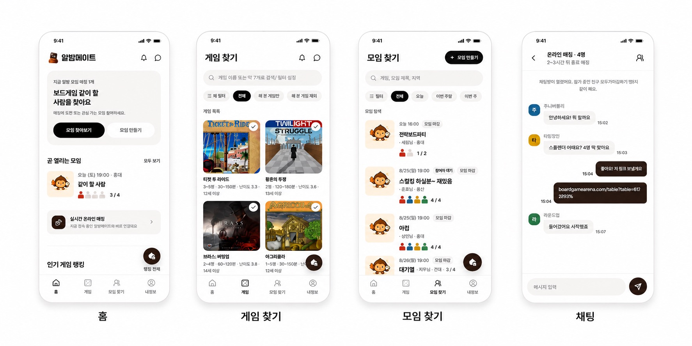
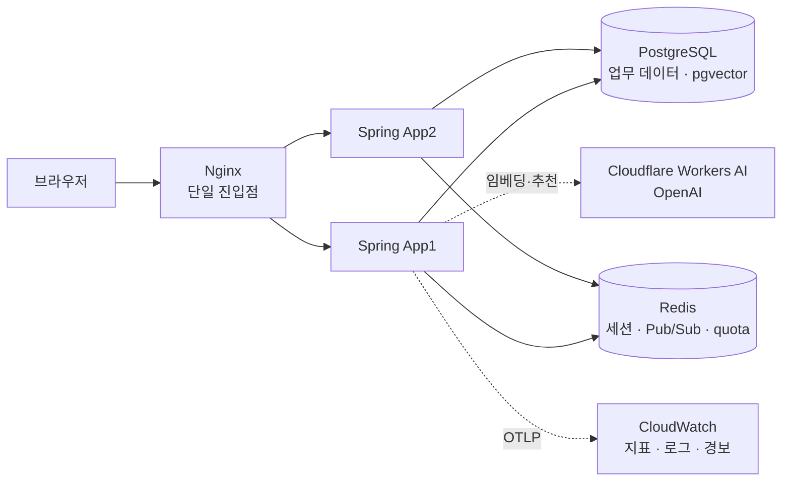

# 알밤메이트

> 원하는 게임과 모임 조건을 확인하고 함께할 사람을 찾아, 실제 보드게임 플레이까지 이어지도록 돕는 모임 매칭 서비스입니다.

[서비스 체험하기](https://bamsongiclub.cloud) · [핵심 경험](#핵심-경험) · [시스템 구성](#시스템-구성) · [대표 검증과 실측](#대표-검증과-실측) · [현재 제공 상태](#현재-제공-상태) · [로컬 실행과 테스트](#로컬-실행과-테스트)

<p align="center">
  
</p>

## 해결하려는 문제

보드게임을 하고 싶어도 함께할 사람, 플레이할 게임, 시간과 장소, 규칙을 설명할 사람을 한 번에 맞추기 어렵습니다. 모집 정보가 여러 곳에 흩어지면 초보·라이트 사용자는 자신에게 맞는 모임인지 판단하기도 어렵습니다.

알밤메이트는 게임이나 사람을 기준으로 모임을 찾고, 조건을 확인한 뒤 실제 참여까지 이어지는 한 흐름을 제공합니다.

## 핵심 경험

| 시작점 | 사용자 흐름 |
| --- | --- |
| 게임부터 찾기 | 게임 탐색 → 게임 상세 → 해당 게임의 방 → 참가 → 내 모임 |
| 사람부터 만나기 | 사람 중심 방 탐색 → 방 상세 → 참가 → 내 모임 |
| 방 만들기 | 게임 중심·사람 중심 선택 → 모임 정보 입력 → 방 생성 → 참가자 확인 → 종료 |
| AI에게 맡기기 | 대화로 조건 전달 → 후보 추천 확인 → 15분 초안 → 확인 후 방 생성 |
| 게임 의미로 찾기 | 자연어·오타를 포함한 검색 → 하이브리드 후보 → 게임 상세 → 해당 게임의 방 |
| 지금 바로 매칭 | 희망 인원 범위 등록 → 후보 파티 제안 → 30초 안에 응답 → 전원 수락 시 전용 채팅 |

뒤의 세 흐름은 현재 개발 중인 범위이며 각각 [AI 기능군](docs/p2/assistant.md), [의미 기반 검색](docs/p2/search.md#search-04), [실시간 파티 매칭](docs/p2/matching.md#match-01-실시간-파티-매칭)이 소유합니다.

## 시스템 구성

단일 Nginx 진입점 뒤에 같은 이미지의 Spring 인스턴스 두 대를 두고, 세션·실시간 전달·요청 제한은 Redis가, 업무 데이터와 벡터 색인은 PostgreSQL이 맡습니다.



모듈 책임과 허용된 의존 방향, 요청·복구 흐름은 [아키텍처](docs/ARCHITECTURE.md)가 소유하며 `ModuleArchitectureTest`가 구조를 검사합니다.

## 설계에서 지키는 핵심 불변식

- 인증·인가·CSRF와 현재 참가 관계는 서버의 요청 경계에서 다시 확인합니다. [API 계약](docs/API.md), [ADR-0003](docs/adr/auth/0003-p0-server-session-spring-security.md)
- 참가 정원, 중복 참가, 대기열과 상태 전이는 애플리케이션 검사만이 아니라 트랜잭션과 PostgreSQL 제약으로 함께 방어합니다. [ERD](docs/ERD.md), [ADR-0005](docs/adr/participation/0005-room-participation-optimistic-locking.md)
- 모임 변경과 알림 전달은 같은 트랜잭션 안에서 Outbox 이벤트를 기록하고 commit 이후 relay가 전달합니다. [아키텍처](docs/ARCHITECTURE.md#알림-relay복구정리), [ADR-0029](docs/adr/notification/0029-room-integration-event-transactional-outbox.md)
- 저장·비교 시각은 UTC로 통일하고, 스키마 변경은 전진 Flyway 마이그레이션과 PostgreSQL 검증을 함께 둡니다. [ADR-0008](docs/adr/platform/0008-flyway-database-migrations.md), [ADR-0009](docs/adr/platform/0009-utc-time-standard.md)

## 기술적 선택

| 문제 | 선택 | 검증 방식 |
| --- | --- | --- |
| 코드 구조 | 도메인 중심 모듈러 모놀리스 | 모듈 책임과 의존 방향을 [아키텍처](docs/ARCHITECTURE.md)에 고정하고 `ModuleArchitectureTest`로 검사합니다. |
| 업무 데이터 | PostgreSQL, Spring Data JPA, Flyway | H2 빠른 테스트와 PostgreSQL 18 Testcontainers 검증의 책임을 분리합니다. |
| 인증 | Spring Security 서버 세션 | 세션 쿠키·CSRF·로그아웃과 다중 인스턴스 공유 경계를 HTTP·로컬 통합 테스트로 검증합니다. |
| 실시간·비동기 전달 | WebSocket, Redis Pub/Sub, Transactional Outbox | 영속 이력을 정본으로 두고 전달 실패·재연결·relay 복구 경계를 독립적으로 검증합니다. |
| AI 대화·추천 | provider port와 fake·OpenAI adapter, Redis 일 quota와 호출당 고정 예약 비용 | payload allowlist와 quota·비용·usage 경계를 H2·Redis 계약 테스트로 검증합니다. |
| 의미 기반 검색 | Cloudflare Workers AI `@cf/baai/bge-m3`와 pgvector, sparse 후보 병렬 생성과 RRF 결합 | 승인 corpus·release·active index를 고정한 재현 가능한 evidence로 비교합니다. |
| 실시간 매칭 경합 | PostgreSQL claim 기반 제한 FIFO와 원자적 확정 | 다중 matcher 경합에서 중복 제안·부분 claim이 0건임을 동시성 테스트와 기준선 측정으로 확인합니다. |
| 운영 관측 | OpenTelemetry 5분 export와 CloudWatch alarm·dashboard | 저카디널리티 metric allowlist와 alarm query·복구 전이를 계약 테스트와 고정 SHA 실측으로 검증합니다. |

전체 선택 근거와 상태는 [ADR 인덱스](docs/adr/README.md)를 따릅니다.

## 대표 검증과 실측

아래 수치는 고정한 검증 릴리스와 fixture에서 얻은 결과입니다. 운영 SLO나 현재 서비스 전체의 용량으로 일반화하지 않습니다.

- 17만 행 게임 fixture의 검색 실험에서 임시 `pg_trgm` GIN 인덱스는 동일한 1 VU 조건의 p95를 `343.8ms`에서 `23.8ms`로 낮췄습니다. 이 수치는 후보 인덱스의 비교 근거이며 운영 스키마 반영 완료를 뜻하지 않습니다. [측정 보고서](docs/measurements/k6/yejin/keyword-search-capacity-2026-08-11.md)
- 시간 기반 방 상태 보정은 최대 10,000개 due ROOM fixture를 고정 시각·seed와 5회 실측으로 비교했고, 결과를 바탕으로 초기 후보 제한 100과 실행당 최대 batch 100을 정했습니다. 로컬 Testcontainers 기준선이며 운영 용량은 아닙니다. [ROOM-09 기준선](docs/measurements/room-09-bounded-processing-baseline.md)
- 지연·포화 관측은 고정 release의 임시 AWS에서 네 phase 시나리오로 Nginx·HTTP·Tomcat·Hikari·JVM 지표를 함께 수집해 지연과 포화의 원인 구간을 분리했고, 실측 뒤 스택을 철거했습니다. 임시 검증 배포의 결과이며 운영 SLO가 아닙니다. [OPS-02 측정](docs/measurements/k6/jiho/ops02-latency-saturation-2026-08-19.md)
- 의미 검색 Hybrid/RRF는 승인 1,000행 corpus와 active pgvector index, 실제 BGE-M3 query embedding을 고정해 후보 수 `K`를 비교했고, full sparse pool 상위 20개와의 일치율이 `K=200`에서 16~19개, `K=400`에서 19~20개임을 확인해 다음 재검토 후보를 `K=400`으로 기록했습니다. 같은 실행에서 40건 중 6건이 공통 6초 deadline에 걸려 관측한 parallel p95 `6,002.960ms`는 통과 근거가 아니라 후속 성능 검토 대상입니다. [SEARCH-04e evidence](docs/measurements/search-04e-hybrid-rrf-regression.md)
- 매칭 후보 claim은 1,000개 논리 시도를 세 measured round로 고정 측정해 중복 제안과 부분 claim이 0건임을 확인하고 `BASELINE_ACCEPTED`를 받았습니다. candidate claim 구간의 기준선이며 최종 확정·복구와 운영 성능은 별도 증거로 판정합니다. [MATCH-01 후보 탐색 측정 계약](docs/measurements/match-01-candidate-search-baseline-contract.md)

## 현재 제공 상태

1차 MVP와 2차 MVP는 완료 시점의 범위와 운영 제한사항을 [아카이브](docs/archive/README.md)에 동결했고, 현재 개발 단계는 3차 MVP입니다. 문서가 존재하거나 기술 결정이 승인됐다는 사실을 구현·검증·배포 완료와 같은 의미로 사용하지 않습니다.

| 구분 | 현재 상태 | 상세 근거 |
| --- | --- | --- |
| 1차 MVP | `v0.1.0` 범위의 백엔드 17개 API와 React 연동 완료 | [P0 완료 명세](docs/archive/p0/P0-spec.md), [API 계약](docs/API.md) |
| 2차 MVP | 필수 기능 계약·생산 코드·자동 검증 완료, 상시 운영 배포와 일부 실측은 미완료 | [P1 기능별 종료 상태](docs/archive/p1/README.md#기능별-종료-상태) |
| 3차 MVP | AI 모임 도우미, 의미 기반 게임 검색, 인기순 정렬, 채팅 목록·시스템 메시지, 운영 관측 다섯 갈래를 구현·자동 검증 완료. 실시간 파티 매칭은 구현과 부분 검증, AI 운영 배포와 게임 탐색 도우미는 선행 계약이 남아 미구현 | [P2 기능 상태 정본](docs/p2/README.md#기능별-현재-상태) |
| 운영 배포 | `develop` CI를 통과한 동일 SHA의 ARM64 이미지를 OIDC·SSM으로 AWS 4 EC2 스택에 자동 배포합니다. 단일 진입점과 미검증 백업 경계가 남아 있어 무중단 상시 운영 서비스로 판정하지 않습니다. | [ADR-0084](docs/adr/platform/0084-github-actions-develop-p1-continuous-deployment.md), [CD 배포 가이드](docs/guides/CD_DEPLOYMENT.md) |
| 로컬 검증 환경 | 프록시, Spring 2대, PostgreSQL과 Redis를 `compose.local.yml`로 실행 가능 | [로컬 개발 환경 실행](docs/guides/LOCAL_DEVELOPMENT.md) |
| 검증 실측 | 운영 관측 네 갈래는 고정 SHA 임시 AWS에서 실측·철거를 마쳤고, 검색·알림·ROOM·매칭은 고정 fixture 기준선을 보존했습니다. ROOM 최종 campaign은 matrix 25/25 `PASS`이지만 Mixed `INVALID`·Soak 미실행으로 release gate를 통과하지 않았습니다. `INVALID` 실행과 미측정 기능은 완료와 분리합니다. | [k6 측정 문서 규칙](docs/measurements/k6/README.md), [인증·알림 측정](docs/measurements/k6/jiho/README.md), [ROOM-09 측정](docs/measurements/room-09-bounded-processing-baseline.md) |

## 팀 — 밤송이클럽

| 팀원 | 주요 역할 |
| --- | --- |
| [@vanilalatte03](https://github.com/vanilalatte03) | 인증·사용자 / 알림·Outbox / 운영 관측·대시보드 / CI·AI 협업 체계 |
| [@beyejin](https://github.com/beyejin) | 게임 카탈로그·검색 / 의미 기반 게임 검색 / 소셜 로그인·계정 연결 / 인기 게임 랭킹 |
| [@gone09-sketch](https://github.com/gone09-sketch) | ROOM 생명주기·상태 보정 / 대기열·동시성 검증 / 실시간 파티 매칭 |
| [@silverThunder09](https://github.com/silverThunder09) | 채팅·WebSocket / 방 참가 / AI 모임 도우미 / 자동 배포 파이프라인 |

통합 테스트는 네 명이 함께 진행합니다.

## 로컬 실행과 테스트

저장소를 내려받고 10분 안에 첫 테스트를 통과시킬 수 있습니다. Java 21과 저장소의 Gradle Wrapper만 사용하며, 이 첫 테스트에는 Docker와 별도 PostgreSQL이 필요하지 않습니다.

Windows PowerShell:

```powershell
java --version
.\gradlew.bat test
```

macOS·Linux:

```sh
java --version
./gradlew test
```

`BUILD SUCCESSFUL` 또는 명령의 성공 종료를 확인하면 첫 검증이 끝납니다. 전체 화면을 실행하려면 [.env 준비와 로컬 Compose 실행](docs/guides/LOCAL_DEVELOPMENT.md)을, 반복 명령은 [프로젝트 명령](docs/COMMANDS.md)을 따릅니다.

## 문서 지도

| 알고 싶은 것 | 시작 문서 |
| --- | --- |
| 현재 구현·검증·배포·실측 상태 | [이 README의 현재 제공 상태](#현재-제공-상태), [P2 기능 상태 정본](docs/p2/README.md#기능별-현재-상태) |
| 제품 목표와 단계별 범위 | [PRD](docs/PRD.md), [P2 명세](docs/P2-spec.md) |
| 백엔드 구조와 코드 위치 | [아키텍처](docs/ARCHITECTURE.md) |
| 실행·테스트·포맷 명령 | [프로젝트 명령](docs/COMMANDS.md) |
| k6 부하테스트 시나리오와 실행 안내 | [Load Tests](load-tests/README.md) |
| HTTP·WebSocket과 저장 계약 | [API](docs/API.md), [ERD](docs/ERD.md) |
| 기술 선택과 변경 이유 | [ADR](docs/adr/README.md) |
| 최초 설정·운영·적재·문제 해결 | [프로젝트 가이드](docs/guides/README.md) |
| 코드 작성과 협업 방식 | [컨벤션](docs/CONVENTIONS.md) |

문서 저장소 내부의 전체 분류는 [문서 지도](docs/README.md)에서 찾을 수 있습니다.

1차·2차 MVP 구현 기록은 [문서 아카이브](docs/archive/README.md)에 동결했습니다. 새 구현 작업은 [AGENTS.md](AGENTS.md)의 라우팅과 현재 3차 MVP 정본에서 시작합니다.

> 문서 관리: 소유자 `밤송이클럽` · 최종 검증일 `2026-08-24` · 폐기 조건 `저장소가 아카이브되거나 별도 공개 제품 페이지가 대표 진입점으로 대체될 때`
