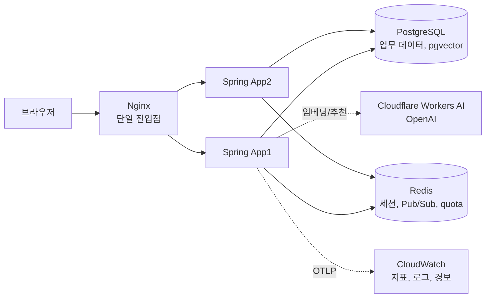

# 알밤메이트

> 원하는 게임과 모임 조건을 확인하고 함께할 사람을 찾아, 실제 보드게임 플레이까지 이어지도록 돕는 모임 매칭 서비스입니다.

[서비스 체험하기](https://bamsongiclub.cloud) | [핵심 경험](#핵심-경험) | [시스템 구성](#시스템-구성) | [팀과 담당 영역](#팀과-담당-영역) | [팀원별 대표 사례](#팀원별-대표-사례) | [현재 제공 상태](#현재-제공-상태) | [로컬 실행과 테스트](#로컬-실행과-테스트)

<p align="center">
  
</p>


- 채팅 부하 장애를 수정해 HTTP 500 `700~760건 → 0건`, 활성 방 응답 p95 `3,119~5,105ms → 36ms`
- 17만 건 게임 카탈로그에서 이름 부분일치 검색 p95 `3,034.1ms → 9.7ms`, 측정 뒤 마이그레이션까지 반영
- 독립 matcher 2개가 동시에 1,000회 경합해도 중복 제안과 부분 claim 모두 `0건`
- 알림 fan-out 9회에서 backlog, 실패, retry `0건`을 확인하고 Kafka, RabbitMQ를 도입하지 않기로 결정

## 해결하려는 문제

보드게임 모임은 함께할 사람, 플레이할 게임, 시간과 장소, 규칙을 설명할 사람을 한 번에 맞추기 어렵습니다. 모집 정보까지 여러 곳에 흩어지면 초보나 라이트 사용자는 자신에게 맞는 모임인지 판단하기도 어렵습니다.

알밤메이트는 게임이나 사람을 기준으로 모임을 찾고, 조건을 확인한 뒤 실제 참여까지 이어지는 한 흐름을 제공합니다.

## 핵심 경험

| 시작점 | 사용자 흐름 |
| --- | --- |
| 게임부터 찾기 | 게임 탐색 → 게임 상세 → 해당 게임의 방 → 참가 → 내 모임 |
| 사람부터 만나기 | 사람 중심 방 탐색 → 방 상세 → 참가 → 내 모임 |
| 방 만들기 | 모임 유형 선택 → 정보 입력 → 방 생성 → 참가자 확인 → 종료 |
| AI에게 맡기기 | 대화로 조건 전달 → 후보 추천 → 15분 초안 → 확인 후 방 생성 |
| 게임 의미로 찾기 | 자연어와 오타를 포함한 검색 → 하이브리드 후보 → 게임 상세 |
| 지금 바로 매칭 | 희망 인원 등록 → 파티 제안 → 30초 안에 응답 → 전원 수락 시 전용 채팅 |

AI 기능군과 의미 기반 검색은 구현과 자동 검증을 마쳤지만 운영 배포 범위가 남았습니다. 실시간 파티 매칭은 3차 MVP 종료 시점에 구현과 부분 검증까지 마쳤습니다. 기능별 정확한 상태는 [P2 기능 상태 정본](docs/p2/README.md#기능별-현재-상태)에서 확인할 수 있습니다.

## 시스템 구성

단일 Nginx 진입점 뒤에 같은 이미지의 Spring 인스턴스 두 대를 둡니다. Redis는 세션과 실시간 전달, 요청 제한을 맡고 PostgreSQL은 업무 데이터와 벡터 색인을 맡습니다.



모듈 책임과 의존 방향, 요청과 복구 흐름은 [아키텍처](docs/ARCHITECTURE.md)에 기록합니다. 주요 선택의 대안과 재검토 조건은 [ADR](docs/adr/README.md)에서 관리합니다.

## 팀과 담당 영역

| 팀원 | 주요 담당 |
| --- | --- |
| [@vanilalatte03](https://github.com/vanilalatte03) | 인증과 사용자 / 알림과 Outbox / 운영 관측과 대시보드 / CI와 AI 협업 체계 |
| [@beyejin](https://github.com/beyejin) | 게임 카탈로그와 검색 / 의미 기반 게임 검색 / 소셜 로그인과 계정 연결 / 인기 게임 랭킹 |
| [@gone09-sketch](https://github.com/gone09-sketch) | ROOM 생명주기와 상태 보정 / 대기열과 동시성 검증 / 실시간 파티 매칭 |
| [@silverThunder09](https://github.com/silverThunder09) | 채팅과 WebSocket / 방 참가 / AI 모임 도우미 / 자동 배포 파이프라인 |

기능과 측정을 주도한 팀원을 대표 담당으로 표시했습니다. 통합 테스트와 배포 검증은 네 명이 함께 진행합니다.

## 팀원별 대표 사례

아래 수치는 고정한 release와 fixture에서 얻은 결과입니다. 운영 SLO나 현재 서비스 전체 용량으로 일반화하지 않습니다.

### 채팅 부하의 HTTP 500을 제거했습니다

**대표 담당:** [@silverThunder09](https://github.com/silverThunder09)

- **문제:** 채팅 부하에서 HTTP 500이 700~760건 발생하고 활성 방 8개 응답 p95가 3,119~5,105ms까지 증가했습니다.
- **판단과 수정:** Redis 연결 팩토리를 세션 경로와 나머지 경로로 분리하고, 남은 연결 실패는 500 대신 503으로 응답하도록 바꿨습니다.
- **결과:** HTTP 500과 `RedisConnectionFailureException`이 모두 0건이 됐고, 활성 방 성공률은 100%, 응답 p95는 36ms가 됐습니다. 다른 release의 반복 측정에서도 500과 예외가 다시 0건이었습니다.
- **남은 경계:** 의도한 503과 원인을 규명하지 못한 WebSocket 연결 실패는 별도 문제로 남겼습니다. [수정 후 측정](docs/measurements/k6/eungi/chat-delivery-capacity-2026-08-12-after-607.md), [반복 측정](docs/measurements/k6/eungi/chat-delivery-capacity-2026-08-13-after-607-repeat.md)

### 17만 건 검색 병목을 측정하고 인덱스로 해결했습니다

**대표 담당:** [@beyejin](https://github.com/beyejin)

- **문제:** 전체 게임 카탈로그에서 이름 부분일치 검색 p95가 3,034.1ms로 측정됐습니다.
- **판단과 수정:** 같은 release와 fixture에서 `pg_trgm` GIN 인덱스를 켠 상태와 끈 상태를 비교했습니다. 결과를 확인한 뒤 `V26` Flyway 마이그레이션으로 반영했습니다.
- **결과:** 부분일치 검색 p95가 9.7ms, p99가 10.8ms로 줄었고 두 상태 모두 HTTP 실패는 0%였습니다.
- **남은 경계:** 인덱스 적용 뒤에도 혼합 부하의 전체 p95는 12,748.7ms였습니다. 이를 GIN으로 해결되는 문제로 포장하지 않고 별도 병목으로 분리했습니다. [인덱스 판단 근거](docs/measurements/k6/yejin/keyword-search-index-decision-2026-08-11.md)

### 다중 matcher 경합에서도 중복 제안을 막았습니다

**대표 담당:** [@gone09-sketch](https://github.com/gone09-sketch)

- **문제:** matcher가 여러 개 실행되면 하나의 대기 요청이 서로 다른 제안에 중복 배정되거나 참가자 일부만 전이될 수 있었습니다.
- **판단과 수정:** PostgreSQL `SELECT … FOR UPDATE SKIP LOCKED` 기반 claim과 같은 트랜잭션의 상태 전이를 적용했습니다.
- **결과:** 독립 matcher 2개가 각 500회씩 경합한 measured round 3회에서 제안 500개와 참가자 전이 1,000개가 정확히 일치했습니다. 중복 점유와 부분 claim은 모두 0건이었습니다.
- **남은 경계:** candidate claim p95 중앙값은 33.6ms, 최댓값은 36.4ms였습니다. 최종 수락과 Party 확정, 복구 성능은 이 결과로 대신하지 않습니다. [측정 계약](docs/measurements/match-01-candidate-search-baseline-contract.md), [측정 결과](docs/measurements/results/match-01/candidate-claim/candidate-claim-c017d2f52f6548dc85ab86fed0f0d668397a3fe3.json)

### 측정 결과를 근거로 메시지 브로커를 도입하지 않았습니다

**대표 담당:** [@vanilalatte03](https://github.com/vanilalatte03)

- **문제:** 알림 fan-out 증가에 대비해 Kafka나 RabbitMQ 같은 메시지 브로커가 필요한지 판단해야 했습니다.
- **판단과 수정:** PostgreSQL transactional outbox와 polling relay를 유지한 채 App 2대에서 수신자를 1명, 5명, 10명으로 늘리며 9회 측정했습니다.
- **결과:** server-side p95는 4.210~4.968초였고 최종 backlog, 실패, retry는 모두 0건이었습니다. 현재 검증 범위에서는 브로커를 도입할 근거가 없다고 판단했습니다.
- **남은 경계:** 지속 혼합 부하는 App cgroup OOM으로 유효한 경계를 만들지 못했습니다. relay 포화점은 미측정 상태이며 재검토 조건을 따로 남겼습니다. [알림 broker 판단서](docs/measurements/k6/jiho/notification-broker-decision-2026-08-11.md)

## 더 살펴볼 기술 판단

- 의미 검색의 6초 deadline을 통과 결과로 쓰지 않고 sparse 병목으로 분리한 뒤 p95를 `330.017ms → 4.547ms`로 낮췄습니다. [SEARCH-04e evidence](docs/measurements/search-04e-hybrid-rrf-regression.md)
- 참가 취소 critical section 개선 후보 두 개가 현행보다 느려 두 PR을 병합하지 않았습니다. [후보 비교 측정](docs/measurements/k6/jiwon/room-t1-critical-section-comparison-2026-08-21.md)
- 애플리케이션 지연과 DB pool 대기를 직접 주입하고 복구해 원인 구간을 분리했습니다. [OPS-02 측정](docs/measurements/k6/jiho/ops02-latency-saturation-2026-08-19.md)

## 핵심 설계 원칙

| 원칙 | 보장 방식 |
| --- | --- |
| 정원을 넘긴 참가는 커밋하지 않습니다. | 참가와 대기열 전이를 트랜잭션과 PostgreSQL 제약으로 보호합니다. |
| 하나의 대기 요청은 하나의 제안에만 속합니다. | PostgreSQL claim과 원자적 상태 전이로 중복 점유를 막습니다. |
| 클라이언트의 권한 판단을 신뢰하지 않습니다. | 인증, 인가, CSRF와 참가 관계를 서버 요청 경계에서 다시 검사합니다. |
| 커밋된 모임 변경에는 알림 이벤트 하나가 남습니다. | 같은 트랜잭션의 Outbox 기록과 commit 이후 relay를 사용합니다. |
| 모든 인스턴스가 같은 시각 판정을 내립니다. | 저장과 비교 시각을 UTC로 통일합니다. |

세부 불변식과 실패 및 복구 경계는 [아키텍처](docs/ARCHITECTURE.md), [API 계약](docs/API.md), [ERD](docs/ERD.md), [ADR](docs/adr/README.md)가 소유합니다.

## 현재 제공 상태

문서 작성, 구현, 자동 검증, 배포와 실측을 같은 완료 상태로 취급하지 않습니다.

| 구분 | 현재 상태 |
| --- | --- |
| 1차와 2차 MVP | 완료 시점의 범위와 제한사항을 [아카이브](docs/archive/README.md)에 동결했습니다. |
| 3차 MVP (종료) | AI 모임 도우미, 의미 기반 검색, 인기순 정렬, 채팅 목록과 시스템 메시지, 운영 관측을 구현하고 자동 검증했습니다. 실시간 파티 매칭은 구현과 부분 검증까지 마쳤습니다. |
| 미완료 범위 | AI 운영 배포와 게임 탐색 도우미는 미구현 상태로 3차 MVP 기간을 마무리했습니다. |
| 배포 | 같은 SHA의 ARM64 이미지를 OIDC와 SSM으로 AWS 4 EC2 스택에 자동 배포합니다. 무중단 상시 운영 서비스로 판정하지 않습니다. |
| 실측 | 고정 SHA와 fixture의 결과만 채택하며 `INVALID` 실행과 미측정 기능은 완료에서 제외합니다. |

기능별 현재 상태와 근거는 [P2 기능 상태 정본](docs/p2/README.md#기능별-현재-상태), 실측 판정 규칙은 [측정 문서](docs/measurements/README.md)를 따릅니다.

## 로컬 실행과 테스트

저장소를 내려받고 Java 21과 Gradle Wrapper로 첫 테스트를 실행할 수 있습니다. 이 테스트에는 Docker와 별도 PostgreSQL이 필요하지 않습니다.

Windows PowerShell:

```powershell
java --version
.\gradlew.bat test
```

macOS와 Linux:

```sh
java --version
./gradlew test
```

`BUILD SUCCESSFUL`이 표시되거나 명령이 성공으로 끝나면 첫 검증은 끝입니다. 전체 화면을 실행하려면 [.env 준비와 로컬 Compose 실행](docs/guides/LOCAL_DEVELOPMENT.md)을 참고하고, 자주 쓰는 명령은 [프로젝트 명령](docs/COMMANDS.md)에서 확인할 수 있습니다.

## 문서 지도

| 알고 싶은 것 | 시작 문서 |
| --- | --- |
| 현재 구현과 검증, 배포, 실측 상태 | [P2 기능 상태 정본](docs/p2/README.md#기능별-현재-상태) |
| 제품 목표와 단계별 범위 | [PRD](docs/PRD.md), [P2 명세](docs/P2-spec.md) |
| 백엔드 구조와 코드 위치 | [아키텍처](docs/ARCHITECTURE.md) |
| 실행과 테스트, 포맷 명령 | [프로젝트 명령](docs/COMMANDS.md) |
| 부하테스트 시나리오와 결과 | [Load Tests](load-tests/README.md), [측정 문서](docs/measurements/README.md) |
| HTTP와 WebSocket, 저장 계약 | [API](docs/API.md), [ERD](docs/ERD.md) |
| 기술 선택과 변경 이유 | [ADR](docs/adr/README.md) |
| 최초 설정과 운영, 적재, 문제 해결 | [프로젝트 가이드](docs/guides/README.md) |
| 코드 작성과 협업 방식 | [컨벤션](docs/CONVENTIONS.md) |

문서 저장소 내부의 전체 분류는 [문서 지도](docs/README.md)에서 찾을 수 있습니다.

> 문서 관리: 소유자 `밤송이클럽` | 최종 검증일 `2026-08-24` | 폐기 조건 `저장소가 아카이브되거나 별도 공개 제품 페이지가 대표 진입점으로 대체될 때`
