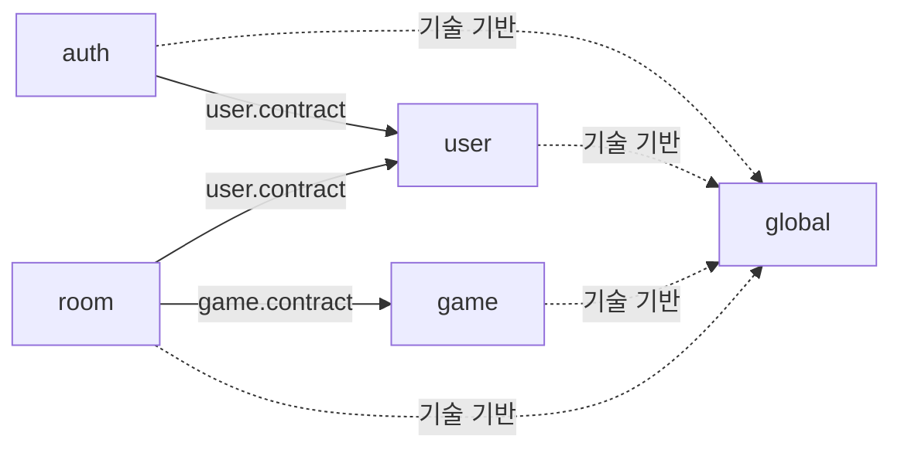
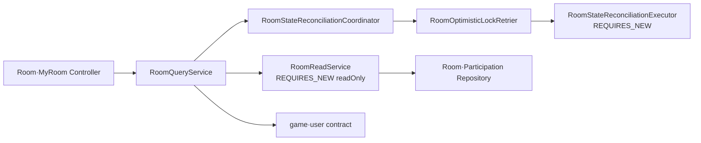
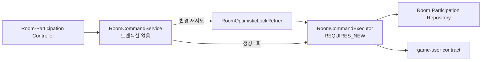

# Albam Mate Architecture

이 문서는 Albam Mate 백엔드 구현이 따라야 하는 모듈, 패키지, Interface와 주요 호출 흐름의 구조 정본이다. 구조 변경은 문서를 먼저 승인하고 후속 구현 이슈에서 코드를 이 정본에 맞춘다. 문서 승인 직후에는 적용 중인 후속 이슈가 있을 수 있으며, 각 이슈 완료 시 아래 구조 준수 기준을 검증한다.

- 모듈러 모놀리스 선택 근거: [ADR-0007](adr/platform/0007-domain-centered-modular-monolith.md)
- 낙관 락·상태 보정 트랜잭션 근거: [ADR-0005](adr/participation/0005-room-participation-optimistic-locking.md), [ADR-0012](adr/room/0012-room-request-boundary-state-reconciliation.md)
- 코드 배치·네이밍·트랜잭션 규칙: [CONVENTIONS](CONVENTIONS.md)
- 제품·HTTP·저장 계약: [P0 명세](P0-spec.md), [API 명세](API.md), [ERD](ERD.md)

## 설계 원칙

백엔드는 도메인 중심 모듈러 모놀리스로 구성한다. Controller와 Service의 외부 Interface를 작게 유지하고, 복잡한 구현과 트랜잭션 경계는 내부에 숨긴다.

- 하나의 Gradle 프로젝트와 Spring Boot 애플리케이션, 데이터베이스를 유지한다.
- `auth`, `user`, `game`, `room`을 논리적 업무 모듈로 유지한다.
- Controller는 메서드마다 만들지 않고 같은 HTTP 리소스와 변경 이유를 가진 요청을 묶는다.
- Controller가 호출하는 Service는 도메인별 소수의 애플리케이션 진입점으로 제한한다.
- 조회와 변경 Interface는 분리하지만 Entity, Repository와 데이터베이스까지 나누는 CQRS는 도입하지 않는다.
- 모듈 간 협력은 상대 모듈의 `contract`만 사용한다.
- 독립 트랜잭션과 재시도가 필요한 Coordinator·Executor 분리는 유지한다.
- `internal`, `reconciliation` 같은 추가 하위 패키지를 만들지 않고 패키지 접근 제한으로 내부 구현을 숨긴다.

이 구조는 작은 외부 Interface 뒤에 여러 유스케이스 구현을 숨기는 Deep Module과 Controller용 Facade, Command–Query Separation을 함께 적용한다.

## 모듈 관계



허용된 업무 모듈 의존 방향은 `auth → user`, `room → user`, `room → game`이다. 반대 방향의 직접 참조와 순환 의존은 허용하지 않는다.

`game`이 예정 모임 수를 필요로 할 때는 `game.contract.UpcomingRoomCountQuery`를 `room.service.RoomUpcomingRoomCountQuery`가 구현한다. 따라서 런타임 호출은 game에서 room으로 향해도 컴파일 시점 의존은 `room → game.contract`로 유지된다.

## 모듈 책임

| 모듈 | 책임 | 소유하지 않는 책임 |
| --- | --- | --- |
| `auth` | 회원가입·로그인·로그아웃·CSRF와 인증 요청 보호 | 사용자 프로필 HTTP 흐름 |
| `user` | 사용자 계정·자격증명·프로필·공개 사용자 조회와 `/api/users/me` | 세션 생성·폐기 |
| `game` | 게임 목록·검색·상세와 게임 요약 계약 | 방 데이터 직접 조회 |
| `room` | 방·참가 관계·정원·상태 전이·재시도·상태 보정 | 사용자·게임 내부 구현 |
| `global` | 공통 응답·예외·보안·설정·UTC 시간 기반 | 업무 Entity·DTO·규칙 |

참가 관계는 방의 정원과 상태 불변식을 같은 트랜잭션에서 변경하므로 별도 모듈이 아니라 `room`이 소유한다.

## 패키지 구조

아래 목록은 구조를 결정하는 Controller, Service, Contract와 영속성 파일을 고정한다. 세부 예외·검증·DTO 파일은 해당 도메인 폴더에 두되 HTTP 계약을 변경하지 않는다.

```text
cloud.bamsongi.albammate
├─ auth
│  ├─ controller
│  │  └─ AuthController.java
│  ├─ dto
│  │  ├─ CsrfTokenResponse.java
│  │  ├─ LoginRequest.java
│  │  ├─ SignupRequest.java
│  │  └─ UserSummary.java
│  ├─ exception
│  ├─ security
│  ├─ service
│  │  ├─ LoginCommand.java
│  │  ├─ LoginService.java
│  │  └─ SignupService.java
│  └─ validation
├─ user
│  ├─ contract
│  │  ├─ UserAccountService.java
│  │  ├─ UserQuery.java
│  │  └─ 모듈 간 계약 입·출력 값
│  ├─ controller
│  │  └─ UserProfileController.java
│  ├─ dto
│  │  ├─ UserProfileUpdateRequest.java
│  │  └─ UserProfileResponse.java
│  ├─ entity
│  │  └─ User.java
│  ├─ exception
│  ├─ repository
│  │  └─ UserRepository.java
│  ├─ service
│  │  ├─ UserAccountApplicationService.java
│  │  ├─ UserContractMapper.java
│  │  ├─ UserProfileService.java
│  │  └─ UserQueryService.java
│  └─ validation
│     ├─ NicknameValidator.java
│     └─ ValidNickname.java
├─ game
│  ├─ contract
│  │  ├─ GameQuery.java
│  │  ├─ GameSummary.java
│  │  └─ UpcomingRoomCountQuery.java
│  ├─ controller
│  │  └─ GameController.java
│  ├─ dto
│  ├─ entity
│  │  └─ Game.java
│  ├─ repository
│  │  ├─ GameListRow.java
│  │  └─ GameRepository.java
│  └─ service
│     └─ GameQueryService.java
├─ room
│  ├─ controller
│  │  ├─ MyRoomController.java
│  │  ├─ RoomController.java
│  │  ├─ RoomParticipationController.java
│  │  └─ RoomQueryParameterNameValidator.java
│  ├─ dto
│  ├─ entity
│  │  ├─ Participation.java
│  │  └─ Room.java
│  ├─ enums
│  ├─ repository
│  │  ├─ ParticipationRepository.java
│  │  └─ RoomRepository.java
│  ├─ service
│  │  ├─ RoomCommandExecutor.java
│  │  ├─ RoomCommandService.java
│  │  ├─ RoomOptimisticLockRetrier.java
│  │  ├─ RoomQueryService.java
│  │  ├─ RoomReadService.java
│  │  ├─ RoomStateReconciliationCoordinator.java
│  │  ├─ RoomStateReconciliationExecutor.java
│  │  └─ RoomUpcomingRoomCountQuery.java
│  ├─ RoomSchedulingConfiguration.java
│  └─ RoomStateReconciliationScheduler.java
└─ global
   ├─ config
   ├─ entity
   ├─ exception
   ├─ response
   ├─ security
   └─ time
```

`RoomReadService`, `RoomCommandExecutor`, `RoomOptimisticLockRetrier`, `RoomStateReconciliationExecutor`는 Controller가 직접 호출하지 않는 내부 구현이다. 별도 `internal` 패키지 대신 가능한 범위에서 package-private으로 제한한다.

## Controller Interface

Controller는 엔드포인트 수가 아니라 HTTP 리소스와 책임으로 나눈다.

| Controller | 담당 요청 | 주입받는 업무 Service |
| --- | --- | --- |
| `AuthController` | CSRF, 회원가입, 로그인, 로그아웃 | `SignupService`, `LoginService` |
| `UserProfileController` | 내 프로필 조회·수정 | `UserProfileService` |
| `GameController` | 게임 목록·상세 | `GameQueryService` |
| `RoomController` | 방 목록·상세·생성·수정·취소·종료 | `RoomQueryService`, `RoomCommandService` |
| `RoomParticipationController` | 방 참가·참가 취소 | `RoomCommandService` |
| `MyRoomController` | 내 모임 목록 | `RoomQueryService` |

`UserProfileController`는 인증 기능이 아니라 사용자 프로필 리소스를 다루므로 `AuthController`에 합치지 않고 `user/controller`에 둔다. API 경로와 응답 계약은 기존 `/api/users/me`를 유지한다.

Controller 이동 뒤 프로필 유스케이스의 다른 모듈 호출자가 없으므로 `UserProfileService`는 `user.contract`에 공개하지 않고 `user/service`의 구체 진입 Service로 둔다. 프로필 HTTP DTO는 `user.validation`의 검증 Adapter를 사용하고, 회원가입과 프로필의 닉네임 검증 Adapter는 각각의 입력 경계에서 `user.contract.UserNickname` 불변식에 위임한다.

`MyRoomController`는 URL에 `/users/me`가 포함돼도 방 목록과 참가 관계를 조회하므로 `room/controller`에 유지한다. URL 접두사가 아니라 데이터와 불변식의 소유 모듈을 기준으로 배치한다.

## Service Interface

| Service | 가시성 | 책임 |
| --- | --- | --- |
| `GameQueryService` | Controller·`GameQuery` 구현 | 게임 목록·상세·모듈 간 게임 요약 조회 |
| `RoomQueryService` | Controller 진입점 | 방 목록·상세·내 모임 조회 조정 |
| `RoomReadService` | room 내부 | 상태 보정 후 `REQUIRES_NEW` 읽기 |
| `RoomCommandService` | Controller 진입점 | 요청 시각 고정, 변경 유스케이스와 재시도 흐름 조정 |
| `RoomCommandExecutor` | room 내부 | 각 변경 시도의 `REQUIRES_NEW` 쓰기 |
| `RoomOptimisticLockRetrier` | room 내부 | 명령·상태 보정이 공유하는 최대 3회 낙관 락 재시도 정책 |
| `RoomStateReconciliationCoordinator` | room 내부·Scheduler | 상태 보정 재시도 조정 |
| `RoomStateReconciliationExecutor` | room 내부 | 상태 보정 시도의 `REQUIRES_NEW` 쓰기 |
| `RoomUpcomingRoomCountQuery` | `UpcomingRoomCountQuery` 구현 | 게임별 예정 모임 수 조회 |

game의 `@Service`는 1개, room의 `@Service`는 8개로 유지한다. 클래스 수 자체보다 Controller가 알아야 하는 Interface와 중복된 조정 로직을 줄이는 것이 중요하다.

## 트랜잭션 흐름

### 방 조회



`RoomQueryService`는 요청 시각을 한 번 얻고 상태 보정을 먼저 커밋한 다음 최신 상태를 읽어 응답을 조립한다. 보정 쓰기와 읽기 트랜잭션을 같은 메서드로 합치지 않는다.

### 방 변경



`RoomCommandService`는 요청 시각을 고정하고 `RoomOptimisticLockRetrier`를 통해 낙관 락 충돌만 최대 3회 재시도한다. 각 시도는 Spring Proxy를 거쳐 `RoomCommandExecutor`의 새 트랜잭션에서 실행한다. 생성은 재시도하지 않고 Executor를 한 번 호출한다. 상태 보정 Coordinator도 같은 Retrier를 사용해 재시도 횟수와 대상 예외를 한곳에서 유지한다.

`RoomCommandService`와 `RoomCommandExecutor`를 한 클래스에 합치면 self-invocation 때문에 `REQUIRES_NEW`가 적용되지 않을 수 있으므로 둘의 분리는 유지한다. 같은 이유로 상태 보정 Coordinator와 Executor도 합치지 않는다.

## Repository Projection과 DTO

`GameListRow`는 HTTP 응답 DTO가 아니라 게임 목록 쿼리가 선택한 열을 담는 Repository Projection이다. 따라서 `game.repository`에 유지한다.

`GameListItem`, `GameDetail`, `UserProfileResponse`처럼 외부 응답을 표현하는 타입은 각 모듈의 `dto`에 둔다. Entity와 Repository Projection을 Controller에서 직접 반환하지 않는다.

## 구조 검증

[ModuleArchitectureTest](../src/test/java/cloud/bamsongi/albammate/architecture/ModuleArchitectureTest.java)는 다음 구조 규칙을 검사한다.

- 업무 모듈 사이의 순환 의존 금지
- 다른 업무 모듈의 `contract` 외 내부 구현 참조 금지
- `auth → user`, `room → user·game` 외 업무 모듈 의존 금지
- `global`의 업무 모듈 의존 금지
- 생산 코드의 `@Autowired` 필드·생성자·메서드 주입 금지

Controller·Service 구성과 내부 클래스 수는 구조 테스트만으로 확인할 수 없으므로 아래 기준을 함께 사용한다.

## 구조 준수 기준

- 각 후속 구조 구현 이슈가 완료되면 그 이슈가 맡은 실제 파일과 의존 관계가 이 문서의 패키지 구조와 일치한다.
- Controller는 Repository·Entity와 내부 ReadService·Executor를 직접 참조하지 않는다.
- `RoomController`가 아는 업무 Service는 `RoomQueryService`, `RoomCommandService`뿐이다.
- game의 `@Service`는 1개, room의 `@Service`는 8개다.
- 낙관 락 재시도 테스트가 시도마다 새 트랜잭션을 검증한다.
- 상태 보정 후 조회 테스트가 보정 커밋 이후 최신 상태를 읽는 것을 검증한다.
- ModuleArchitectureTest와 관련 단위·통합 테스트가 통과한다.

## 트레이드오프

- 파일과 주입 의존성은 줄지만 `RoomQueryService`, `RoomCommandService`의 메서드 수는 늘어난다.
- 관련 유스케이스를 한곳에서 찾기 쉬워지는 대신 같은 Service를 여러 사람이 동시에 수정할 때 충돌 가능성이 커진다.
- 내부 클래스 단위 테스트 일부는 새 Interface 기준 테스트로 교체해야 한다.
- Executor와 상태 보정 클래스는 남기 때문에 모든 Service가 하나로 합쳐지지는 않는다. 이는 클래스 수보다 트랜잭션 정확성을 우선한 결과다.

## 문서 갱신 기준

- 모듈 책임, 패키지, Controller·Service Interface 또는 트랜잭션 흐름이 바뀌면 이 문서를 갱신한다.
- 중요한 구조 선택의 근거나 대안이 바뀌면 ADR을 추가하거나 기존 ADR을 대체한다.
- 코드 작성 규칙이 바뀌면 [CONVENTIONS](CONVENTIONS.md)를 수정한다.
- HTTP 또는 저장 계약이 바뀌면 각각 [API 명세](API.md)와 [ERD](ERD.md)를 수정한다.
