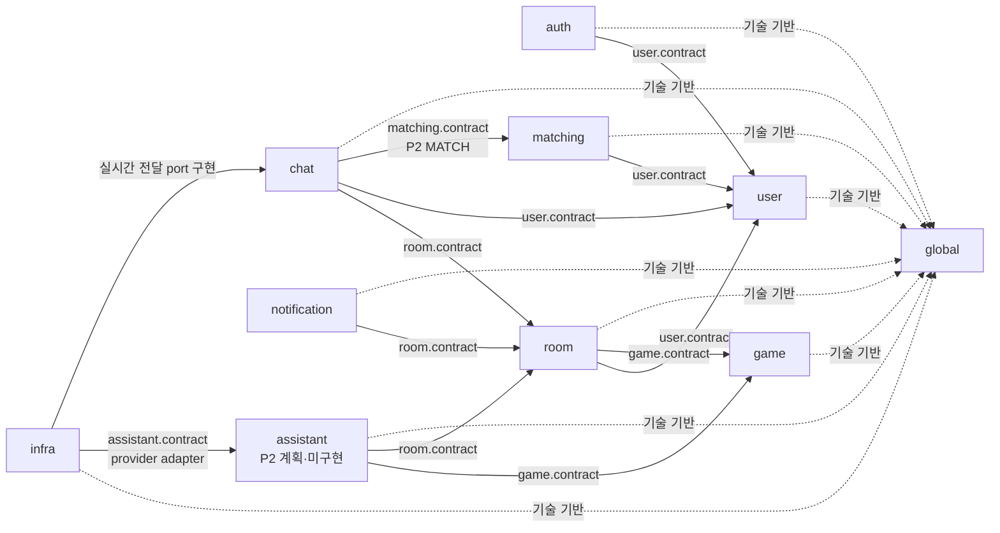
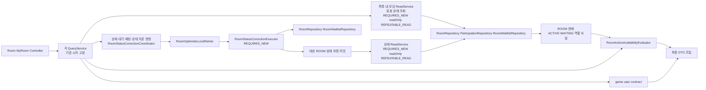
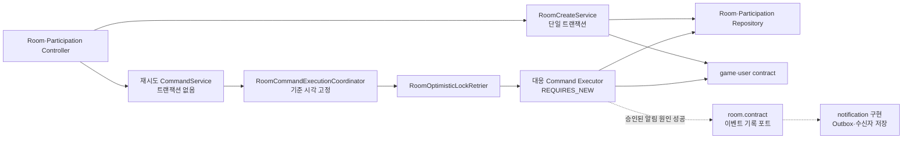
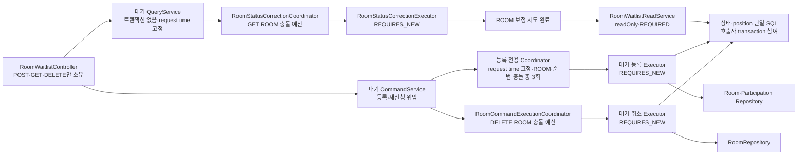
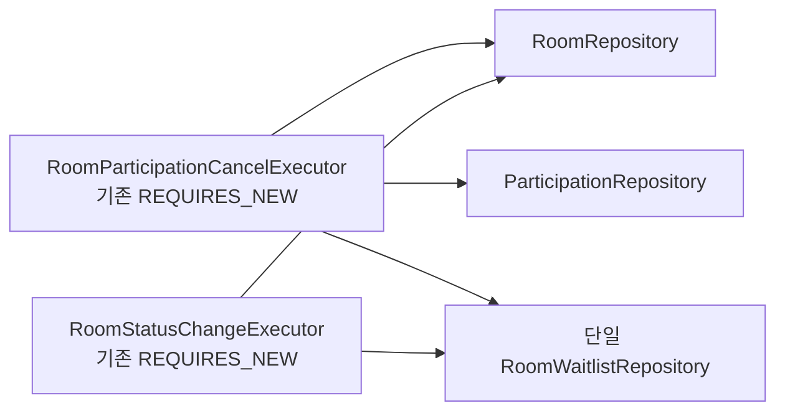
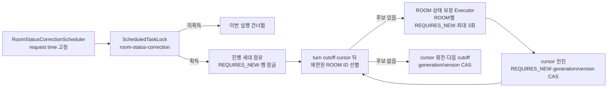
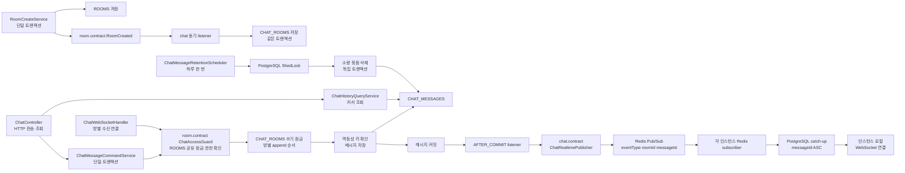
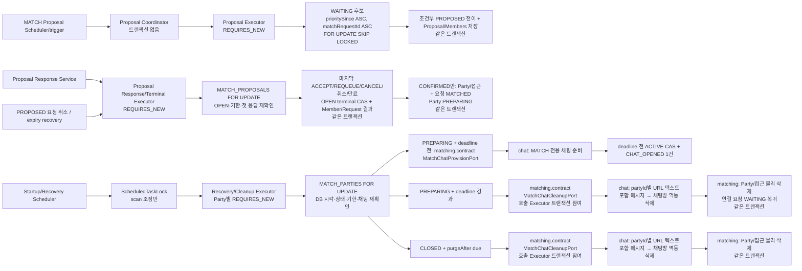
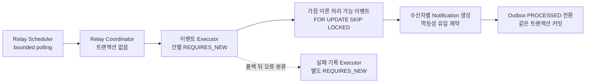

# Albam Mate Architecture

이 문서는 Albam Mate 백엔드 코드의 안정적인 구조 규칙을 설명하는 정본이다. 개별 파일·클래스·엔드포인트 목록은 관리하지 않으며, 같은 경계 안에서 기능을 추가하는 것만으로는 이 문서를 갱신하지 않는다.

본문에서 `후속` 또는 `필요 시 생성`으로 표시한 항목은 아직 만들지 않은 경계다. 모듈 관계 Mermaid와 모듈 책임 표는 현재 생산 코드 구조를 설명하되, 명시한 `P2 계획·미구현` 항목은 승인된 목표 구조일 뿐 현재 코드·구조 검사 규칙이 아니다. 기능별 절에는 구현된 P1 계약과 남은 운영값이 함께 있을 수 있다. P1 종료 상태는 [P1 기능 종료 상태](archive/p1/README.md#기능별-종료-상태), 새 P2 기능의 현재 상태는 [P2 기능 상태](p2/README.md#기능별-현재-상태)에서 확인한다.

- 모듈러 모놀리스 선택 근거: [ADR-0007](adr/platform/0007-domain-centered-modular-monolith.md)
- 낙관 락·저장 상태 보정·조회 snapshot 근거: [ADR-0005](adr/participation/0005-room-participation-optimistic-locking.md), [ADR-0055](adr/room/0055-room-query-effective-status-and-persistence-correction.md), [ADR-0056](adr/room/0056-postgresql-room-query-snapshot-without-global-pre-correction.md)
- 알림 통합 이벤트·Outbox·relay 근거: [ADR-0029](adr/notification/0029-room-integration-event-transactional-outbox.md), [ADR-0040](adr/notification/0040-postgresql-notification-relay-recovery-retention.md)
- 알림 표시 투영·조회·읽음 시각 근거: [ADR-0039](adr/notification/0039-notification-presentation-and-bulk-read-snapshot.md)
- P2 운영 관측 전송 근거: [ADR-0071](adr/platform/0071-p2-application-metrics-otlp-host-cloudwatch-agent.md), [ADR-0059](adr/platform/0059-p2-structured-stdout-cloudwatch-logs.md)
- P2 AI provider·동의·초안·확인형 Room·지역 경계: [ADR-0074](adr/platform/0074-p2-ai-provider-consent-and-operation-boundary.md), [ADR-0075](adr/room/0075-p2-ai-draft-confirmation-and-idempotent-room-command.md), [ADR-0076](adr/room/0076-p2-room-region-closed-set-and-compatibility.md)
- P2 MATCH 후보 선점·멱등성, 채팅 handoff·복구·보존, URL 텍스트 표현, 기준 측정 gate, 게임·플랫폼 없는 인원 범위 매칭: [ADR-0061](adr/matching/0061-postgresql-candidate-reservation-idempotency.md), [ADR-0062](adr/matching/0062-match-chat-handoff-recovery-retention.md), [ADR-0064](adr/matching/0064-match-chat-url-text-storage.md), [ADR-0063](adr/matching/0063-match-baseline-measurement-gate.md), [ADR-0077](adr/matching/0077-match-no-game-player-range.md)
- 코드 배치·네이밍·트랜잭션 규칙: [CONVENTIONS](CONVENTIONS.md)
- 제품·HTTP·저장 계약: [P2 명세](P2-spec.md), [P2 기능 문서](p2/README.md), [P1 종료 명세](archive/p1/README.md), [P0 완료 명세](archive/p0/P0-spec.md), [API 명세](API.md), [ERD](ERD.md)

## 이 문서를 읽는 법

| 알고 싶은 것 | 먼저 볼 절 |
| --- | --- |
| 어느 모듈이 책임지는가 | [모듈 관계](#모듈-관계), [모듈 책임](#모듈-책임) |
| 새 코드를 어디에 두는가 | [패키지 구조](#패키지-구조) |
| HTTP 요청이 어디로 들어가는가 | [Controller 진입점](#controller-interface) |
| Service·Coordinator·Executor를 왜 나누는가 | [Service 역할과 분리 기준](#service와-내부-협력자) |
| 조회·변경 트랜잭션이 어떻게 흐르는가 | [트랜잭션 흐름](#트랜잭션-흐름) |
| 변경할 때 무엇을 검사하고 문서를 갱신하는가 | [구조 검증](#구조-검증), [문서 갱신 기준](#문서-갱신-기준) |

현재 클래스와 파일을 찾을 때는 문서에 목록을 추가하지 않고 다음 소스 진입점을 사용한다.

- 전체 업무 코드: [운영 코드 루트](../src/main/java/cloud/bamsongi/albammate/)
- HTTP·WebSocket 진입점: [auth](../src/main/java/cloud/bamsongi/albammate/auth/controller/), [user](../src/main/java/cloud/bamsongi/albammate/user/controller/), [game](../src/main/java/cloud/bamsongi/albammate/game/controller/), [room](../src/main/java/cloud/bamsongi/albammate/room/controller/), [chat HTTP](../src/main/java/cloud/bamsongi/albammate/chat/controller/), [chat WebSocket](../src/main/java/cloud/bamsongi/albammate/chat/websocket/), [notification](../src/main/java/cloud/bamsongi/albammate/notification/controller/)
- 복잡한 ROOM 흐름: [query](../src/main/java/cloud/bamsongi/albammate/room/service/query/), [command](../src/main/java/cloud/bamsongi/albammate/room/service/command/), [statuscorrection](../src/main/java/cloud/bamsongi/albammate/room/statuscorrection/)
- 정확한 HTTP 경로와 응답: [API 인덱스](API.md#2-api-인덱스)

## 전체 구조

### 설계 원칙

백엔드는 도메인 중심 모듈러 모놀리스로 구성한다.

- 하나의 Gradle 프로젝트와 Spring Boot 애플리케이션, 데이터베이스를 유지한다.
- 같은 Spring Boot 애플리케이션을 여러 인스턴스로 실행하되 모든 인스턴스가 공용 PostgreSQL과 Redis를 사용한다. 채팅을 별도 서비스로 분리하지 않는다.
- `auth`, `user`, `game`, `room`과 P1의 `chat`·`notification`을 논리적 업무 모듈로 유지한다. P2 계획 `assistant`와 P2의 `matching`은 각각 AI-01~AI-03·MATCH-01의 별도 업무 모듈이며, `matching`의 저장 구조와 공개 계약은 생산 코드에 있다. OAuth 제공자 통신과 앱 세션 전환은 `auth`, 외부 신원 저장은 `user`가 소유한다.
- 조회와 상태 변경 유스케이스는 각각 `query`, `command`로 구분하지만 Entity, Repository와 데이터베이스까지 나누는 CQRS는 도입하지 않는다.
- 모듈 간 협력은 상대 모듈의 `contract`만 사용한다.
- 독립 트랜잭션과 재시도가 필요한 Coordinator·Executor 분리는 유지하며, 재시도마다 최신 Entity와 version을 다시 조회한다.
- 코드 수를 줄이기 위한 통합보다 책임, 트랜잭션과 실패 경계를 드러내는 구조를 우선한다.

### 모듈 관계

다음 화살표는 런타임 호출 순서가 아니라 컴파일 시점의 의존 방향을 나타낸다.

현재 허용된 업무 모듈 의존 방향은 `auth → user`, `room → user·game`, `chat → room.contract·user.contract`, `notification → room.contract`, `matching → user.contract`, `chat → matching.contract`, `assistant → game.contract·room.contract`, `infra → assistant.contract`이다. `assistant`는 `game`·`room`의 Entity·Repository와 `infra.ai`를 직접 참조하지 않고 공개 계약만 사용한다. `chat`은 `room`·`user`·`matching`의 Entity와 Repository를, `notification`은 `room`의 Entity와 Repository를, `matching`은 `user`의 Entity와 Repository를 직접 참조하지 않고 공개 계약만 사용한다. 이 금지는 타입 참조뿐 아니라 JPQL에서 다른 모듈의 Entity를 조인하는 경로에도 적용한다. `matching → chat` 직접 의존은 만들지 않으며 반대 방향의 직접 참조와 순환 의존은 허용하지 않는다.

런타임 호출 방향과 컴파일 의존 방향이 다를 수 있다. 예를 들어 `game`이 예정 모임 수를 조회할 때는 [`game.contract.UpcomingRoomCountQuery`](../src/main/java/cloud/bamsongi/albammate/game/contract/UpcomingRoomCountQuery.java)를 [`room.service.query.RoomUpcomingRoomCountQuery`](../src/main/java/cloud/bamsongi/albammate/room/service/query/RoomUpcomingRoomCountQuery.java)가 구현한다. 런타임 호출은 game에서 room으로 이어지지만, 컴파일 의존은 `room → game.contract`로 유지된다.

RANK-02의 외부·내부 인기 점수는 런타임 모듈 호출이 아니라 승인 manifest를 입력으로 하는 저장 배치가 만든다. `scripts/game-ranking`이 생성한 SQL이 `rooms`의 전체 `GAME_FOCUSED` 누적 집계를 파생 점수에 반영하고, 애플리케이션의 game 목록 조회는 `games.popularity_score`만 읽는다. 따라서 game 모듈은 room Entity·Repository를 직접 참조하지 않으며, 외부 BoardLife·BGG도 실행 중 호출하지 않는다.

업무 모듈이 외부 시스템에 요청하는 포트는 이를 소유한 `<module>/contract`에 둔다. `infra`는 이 포트를 구현하고 필요한 업무 모듈의 `contract`와 `global`만 참조한다. 현재 `infra`는 Redis 세션·실시간 전달·전송 제한 adapter와 PostgreSQL 스케줄 잠금 adapter를 제공한다. 업무 모듈은 Redis·ShedLock의 구체 구현을 직접 참조하지 않는다.

### 모듈 책임

| 모듈 또는 경계 | 책임 | 소유하지 않는 책임 |
| --- | --- | --- |
| `auth` | 회원가입·이메일·소셜 로그인·로그아웃·CSRF, OAuth 흐름과 인증 요청 보호 | 사용자·외부 신원 영속 구조, 사용자 프로필 HTTP 흐름 |
| `user` | 사용자 계정·비밀번호 자격증명·외부 신원 연결·프로필·공개 사용자 조회 | OAuth 제공자 통신, 세션 생성·폐기 |
| `game` | 게임 목록·검색·상세, RANK-02 저장 인기 점수와 게임 요약 계약 | 방 데이터 직접 조회 |
| `room` | 방·참가 관계·정원·상태 전이·재시도·상태 보정 | 사용자·게임 내부 구현 |
| `assistant` (P2 계획·미구현) | 외부 처리 동의·철회, 자연어 의도 추출 orchestration, 서버 후보 추천, 15분 초안·확인·멱등성 HTTP 흐름 | provider SDK·원문 보존, game·room Entity/Repository, 사용자 확인 없는 Room 변경 |
| `matching` (P2 일부 구현) | MATCH 요청·제안·응답·성공 파티·참가자 접근, 후보 선점·복구·멱등성·신고·차단. 현재 생산 코드는 저장 구조와 chat 접근 계약뿐이고 나머지는 P2 계획 | MATCH 채팅방·메시지·실시간 전달, 사용자 내부 구현 |
| `chat` (P1 구현, P2 MATCH 일부 구현) | P1 ROOM별 채팅방·메시지 저장, 이력 cursor 조회, 현재 관계자 접근 검증과 실시간 전달. P2에서는 `matching.contract`를 통해 MATCH 전용 채팅방·URL 텍스트를 포함한 메시지·실시간 전달만 담당하며, 현재 생산 코드는 그 저장 구조뿐이고 adapter·유스케이스는 P2 계획 | 방·참가·MATCH 요청·제안·응답·성공 파티·참가자 접근 Entity/Repository, 인증 세션 내부 구현 |
| `notification` (P1) | 웹 알림 조회·읽음, Outbox·수신자 스냅샷·알림 저장, relay·재시도·복구·보존 정리 | 방 상태 전이·수신자 재계산, 이메일·모바일 푸시·Web Push·SMS 전달 |
| `global` | 공통 응답·예외·보안·설정·UTC 시간 기반 | 업무 Entity·DTO·규칙 |
| `infra` (P1) | Redis 세션·채팅 fan-out과 PostgreSQL 스케줄 잠금 같은 기술 adapter | 업무 규칙·Entity·HTTP DTO |

참가 관계는 방의 정원과 상태 불변식을 같은 트랜잭션에서 변경하므로 별도 모듈이 아니라 `room`이 소유한다. URL 경로보다 데이터와 불변식을 소유한 모듈을 우선한다.

### P1 소셜 로그인 모듈 계약

> 아래 경계는 #328에서 승인됐으며 ADR-0042와 함께 구현 정본으로 사용한다. 구현·검증 상태는 [P1 기능 종료 상태](archive/p1/README.md#기능별-종료-상태)을 따른다.

`auth`는 설정된 OAuth client 등록, authorization·callback filter 경계, 제공자 응답의 공통 외부 신원·신뢰 가능한 선택 이메일 변환과 `CurrentUserPrincipal` 세션 전환을 소유한다. `user.contract`에 provider·subject·신뢰 조건을 통과한 선택 이메일·닉네임을 전달해 첫 로그인 또는 명시적 연결 결과를 받고 `user`의 Entity·Repository를 직접 참조하지 않는다.

`user`는 `USERS`와 `SOCIAL_ACCOUNTS`를 한 트랜잭션 경계에서 생성·조회·연결하고 두 유일 제약의 동시 요청 결과를 기존 연결로 수렴시킨다. 비로그인 첫 로그인에서는 신뢰 가능한 이메일만 기존 사용자 충돌 판정에 사용하고 자동 연결하지 않는다. 인증된 명시적 연결은 이메일 중복과 무관하게 현재 세션 사용자를 대상으로 처리한다. 기존 이메일 로그인용 자격증명 조회 계약은 `password_hash IS NULL`인 사용자를 반환하지 않아 `auth`가 미존재 계정과 같은 검증 경로를 유지하게 한다. OAuth code·token·secret은 두 모듈의 영속 계약에 포함하지 않는다.

`/api/auth/social/authorization/**`와 `/api/auth/social/callback/**`는 Spring Security filter가 소유하는 브라우저 리다이렉트 경로다. MVC 정책 대조 대상이 아니며 `SecurityConfig`의 정확한 matcher와 OAuth 흐름 테스트로 고정한다. 제공자 목록과 `/api/users/me/social-accounts/{provider}/link`는 Controller가 소유하므로 `ApiEndpointPolicyRegistry`에 등록한다.
### P1 알림 모듈 계약

> 현재 생산 코드·자동 검증·운영 상태는 [P1 기능 종료 상태의 `NOTI-01`~`NOTI-03`](archive/p1/README.md#기능별-종료-상태)을 따른다.

`notification`은 서비스 내 웹 알림 조회·읽음, Outbox·수신자 스냅샷·Notification 저장, relay·재시도·운영 복구·보존 정리를 소유한다. 방 상태 전이와 수신자 재계산, 이메일·모바일 푸시·Web Push·SMS 전달은 소유하지 않는다.

`room.contract`가 승인된 방 변경 이벤트와 기록 포트를 소유하고 `notification`이 포트를 구현한다. 최종 성공한 Room Command Executor가 런타임에 기록 포트를 호출하더라도 `room`은 자기 계약만 알고, 컴파일 의존은 `notification → room.contract`로 유지한다. `room`은 알림 문구·Outbox·relay·읽음 정책을 참조하지 않는다.

알림 코드는 `notification/service/query`, `notification/service/command`, `notification/relay`, `notification/recovery`, `notification/cleanup`의 책임 경계에 배치한다. `/api/users/me/notifications` 하위 조회·읽음은 URL 접두사가 아니라 데이터와 불변식 소유권에 따라 P1 `NotificationController`가 담당한다.

### P2 AI 기능군 모듈 계약 (승인된 계획·미구현)

> 이 절은 P2 `AI-01`~`AI-03`의 승인된 목표 구조다. `assistant` 모듈·`assistant.contract`·`infra.ai` adapter는 아직 존재하지 않으며, 현재 상태는 [P2 기능 상태](p2/README.md#기능별-현재-상태)로만 판정한다. 외부 provider와 Room 쓰기 권한은 분리하고, 사용자의 명시적 확인 전에는 Room·ChatRoom 상태 변경을 허용하지 않는다.

`assistant`는 AI-01의 동의·철회와 제품 흐름, AI-02의 자연어 추천, AI-03의 초안·확인 HTTP 경계와 `ASSISTANT_*` 저장 구조를 소유한다. 외부 provider SDK는 `infra.ai`만 참조하고, `game`·`room`의 Entity·Repository와 `DISCOVERY-01`의 `SEARCH-04` tool은 직접 참조하지 않는다.

AI-01~AI-03 협력 계약은 책임을 소유한 모듈의 `contract`에 둔다. provider 경계인 `AssistantIntentExtractor`와 후보 조회는 AI-02가 각각 `assistant.contract`와 `game.contract`를 통해 소유하고, 확인형 Room 생성은 AI-03이 `room.contract`를 통해 소유한다.

| 계약 | 소유 | 호출·구현 | 책임과 트랜잭션 경계 |
|---|---|---|---|
| `AssistantIntentExtractor` (AI-02) | `assistant.contract` | `assistant`의 추천 Service가 호출하고 `infra.ai`가 구현 | 현재 한 번의 사용자 문장과 서버가 허용한 schema만 provider에 전달해 `AssistantConditionSummary` 후보를 반환한다. 게임 조회·Room 쓰기·tool loop·원문 저장은 하지 않는다. 기본 구현은 deterministic fake provider다. |
| `AssistantGameCandidateQuery` (AI-02) | `game.contract` | `assistant`가 호출하고 `game`이 구현 | 카테고리·메커니즘·테마 배열은 각각 목록 안 `ANY`로 고정 결합하고, 이 셋과 난이도 상한·플레이 시간 상한·이미 확인된 총 인원·게임 선택은 서로 `AND`로 적용하며 내부 `RANK-01` 순서로 후보를 반환한다. 정렬 뒤 상위 10건만 반환하고 동점은 게임 ID 오름차순으로 끊으며 pagination은 제공하지 않는다. `assistant`는 game repository·catalog를 직접 읽지 않는다. |
| `AssistantRoomCreationCommand` (AI-03) | `room.contract` | `assistant`의 Confirm Executor가 호출하고 `room`이 구현 | 현재 인증 사용자 컨텍스트와 초안 입력을 받아 기존 Room 생성 불변식과 `RoomCreated → ChatRoom` 원자성을 적용하고 `roomId`·`chatRoomId` 생성 결과를 반환한다. 사용자 ID를 요청 body에서 받지 않는다. |

`AssistantRoomCreationCommand`는 `room`이 `chat` Entity·Repository를 직접 참조해 `chatRoomId`를 얻는 구조가 아니다. 확인형 command는 `room.contract`가 정의한 동기 `RoomCreated` handoff를 같은 트랜잭션에서 발행하고, `chat`의 listener가 `CHAT_ROOMS`를 저장한 뒤 생성된 ID를 handoff에 채운다. listener가 결과를 채우기 전에 실패하거나 ID가 없으면 command도 실패하고 Room·ChatRoom·초안 결과를 함께 롤백한다. 따라서 컴파일 의존은 `assistant → room.contract`와 `chat → room.contract`로 유지되며 `room → chat` 직접 의존은 생기지 않는다.

`AssistantIntentExtractor`는 버전이 지정된 `propose_game_room_intent` schema만 사용한다. `assistant`는 provider가 반환한 game ID·조건을 신뢰하지 않고 구조화 검증 뒤 `AssistantGameCandidateQuery`로 재조회한다. provider는 게임 후보·BGG 원문·prompt hash·Room command 권한을 받지 않는다.

### AI 기능군 처리·잠금 흐름

1. `AssistantController`가 세션·CSRF·동의·입력 형식을 확인한다. 추천의 외부 호출은 `assistant.service`가 quota·비용 예약과 PII/secret allowlist 검사를 통과한 뒤 시작한다.
2. 추천은 provider 호출과 후보 조회만 수행하고 Room·ChatRoom·초안을 만들지 않는다. provider 장애·schema 오류·Redis 비용 예약 실패는 명시적 오류로 끝내며 다른 model로 자동 전환하지 않는다.
3. AI-03의 모든 쓰기 Executor는 `USERS` 행 → `ASSISTANT_DRAFTS` 행 → `ASSISTANT_IDEMPOTENCY_RECORDS` 순서로만 잠근다. 이 순서는 MATCH 멱등성 Executor와 같은 원칙이며, 활성 초안 유일 제약을 잠금 순서나 삭제의 배타성 근거로 쓰지 않는다. 같은 사용자의 초안 생성·수정·확인이 동시에 들어와도 이 순서 때문에 교착 없이 직렬화된다.
4. `DraftCreate/PatchExecutor`는 `ASSISTANT_DRAFTS`를 사용자별 활성 하나로 유지하고, 초안 생성도 confirm과 같은 규칙으로 그 사용자의 만료된 `ASSISTANT_IDEMPOTENCY_RECORDS`를 같은 트랜잭션에서 삭제한다. `PatchExecutor`는 `ACTIVE` 초안만 수정한다. `region`은 네 지역 enum과 DB CHECK를 통과시키고 생략 시 호환 기본값 `홍대`를 적용한다.
5. `DraftConfirmExecutor`는 provider를 호출하지 않는다. 진입 전에 `ASSISTANT_NOT_ENABLED` gate를 fail-closed로 먼저 통과해야 하며, 비활성 상태에서는 아래 잠금·정리·재생을 수행하지 않는다. 위 순서로 `USERS` 행 → `ASSISTANT_DRAFTS` 행 → `ASSISTANT_IDEMPOTENCY_RECORDS`를 먼저 잠근 뒤, 같은 `operationTime`으로 만료를 확인해 `expiresAt <= operationTime`인 그 사용자의 기록을 batch purge 없이 모두 삭제한다. 그다음 `expiresAt > operationTime`인 같은 범위·같은 key의 저장 결과를 초안 상태·만료·동의·version·필수 `place` 확인보다 먼저 재생하고, 재생 대상이 없을 때만 그 확인들을 수행한 뒤 새 key를 별도 행으로 등록한다.
6. 확인 성공은 같은 트랜잭션에서 `AssistantRoomCreationCommand`를 호출해 Room과 ChatRoom을 만들고, 동기 handoff로 받은 `chatRoomId`를 포함한 초안·확인 결과 참조를 `CONFIRMED`로 커밋한다. handoff 또는 어느 저장 경계라도 실패하면 세 저장 경계를 함께 롤백한다. 같은 사용자·draft·operation의 같은 key 재시도는 결과를 반환하고 다른 key·오래된 version은 Room을 만들지 않는다.

`REVOKE`는 활성 초안을 `DISCARDED`로 만들고 이후 추천·초안·확인을 차단한다. `assistant`는 `room`의 Entity·Repository를 직접 잠그지 않으며, Room 생성의 잠금·참가·알림·ChatRoom 불변식은 `room.contract`와 Room 내부 Executor가 소유한다. `assistant → infra.ai` 직접 의존이나 provider 호출을 Room 트랜잭션 안에 넣는 구조는 허용하지 않는다.

### P2 MATCH 모듈 계약

> 이 절은 P2 MATCH의 승인된 구조다. `matching` 모듈·`matching.contract`·MATCH 전용 chat 저장 구조와 구조 검사는 존재한다. `user.contract` 조회와 `MatchPartyChatAccess` 확장은 [ADR-0067](adr/matching/0067-match-shared-contract-boundary.md)의 결정이며 [#801](https://github.com/bamsongi-club/albam-mate/issues/801)이 구현한다. 게임·플랫폼 없는 인원 범위 매칭과 그에 따른 공개 계약은 [ADR-0077](adr/matching/0077-match-no-game-player-range.md)와 [#835](https://github.com/bamsongi-club/albam-mate/issues/835)에 반영한다. 기능별 구현·검증 상태는 [P2 기능 상태](p2/README.md#기능별-현재-상태)로만 판정하고, 이 절의 계약 서술을 완료 증거로 읽지 않는다.

`matching`은 MATCH 요청·제안·응답, 성공 파티와 참가자 접근, 후보 선점·복구·멱등성·신고·차단을 소유한다. `chat`은 MATCH 전용 채팅방·URL 텍스트를 포함한 메시지·실시간 전달만 소유한다. P1 `ChatRoom`/`roomId`/ROOM 접근/30일 보존은 계속 ROOM 전용이며 MATCH로 확장하거나 재사용하지 않는다.

MATCH 협력 계약은 `matching.contract`가 소유한다.

| 계약 | 호출·구현 | 책임과 트랜잭션 경계 |
| --- | --- | --- |
| `MatchChatProvisionPort` | `matching`의 `PREPARING` Recovery Executor가 호출하고 `chat`이 구현 | `partyId`별로 MATCH 채팅방 하나를 멱등 준비한다. |
| `MatchChatSystemMessagePort` | `matching`이 Party 상태를 잠근 뒤 호출하고 `chat`이 구현 | `CHAT_OPENED`·`CLOSES_IN_ONE_HOUR` lifecycle 알림을 Party별로 멱등 저장한다. 호출한 Executor의 DB 트랜잭션에 참여하며, 이미 기록한 같은 이벤트는 성공으로 수렴한다. |
| `MatchChatCleanupPort` | `matching`의 Recovery/Cleanup Executor가 호출하고 `chat`이 구현 | `partyId`별 URL 텍스트를 포함한 MATCH 메시지를 먼저, 채팅방을 마지막에 멱등 정리한다. 호출한 Executor의 DB 트랜잭션에 참여하며 별도 커밋·독립 트랜잭션을 열지 않는다. 성공 반환은 해당 chat 데이터 정리가 완료됐다는 뜻이다. |
| `MatchPartyAccessQuery` | `chat`이 호출하고 `matching`이 구현 | 현재 Party 상태와 아직 명시적으로 나가지 않은 참가자 접근을 함께 확인해 `MatchPartyChatAccess`를 반환한다. |
| `MatchPartyChatWriteGuard` | `chat`의 URL 텍스트를 포함한 메시지 쓰기 Command가 호출하고 `matching`이 구현 | 호출자 트랜잭션에서 Party를 `FOR UPDATE`로 잠근 뒤 같은 `MatchPartyChatAccess` 판정을 적용한다. 성공 반환 뒤 caller가 같은 트랜잭션에서만 chat 데이터를 저장한다. |

`MatchPartyChatAccess`는 `matching.contract`가 소유하는 3-way 결과 타입이다. Party가 `ACTIVE`이고 아직 명시적으로 나가지 않은 현재 참가자면 `ALLOWED`, 현재 참가자인데 Party가 `PREPARING`이면 `NOT_ACTIVE`, 그 밖의 `CLOSED`·비참가자·이탈자·Party 미존재는 모두 `FORBIDDEN`이다. Party 존재 여부를 접근 권한이 없는 호출자에게 노출하지 않기 위해 미존재를 `FORBIDDEN`으로 흡수하므로, MATCH chat 경로는 `MATCH_PARTY_NOT_FOUND`를 반환하지 않는다. `NOT_ACTIVE → MATCH_CHAT_NOT_ACTIVE`, `FORBIDDEN → FORBIDDEN` 오류 매핑은 `matching`이 한 곳에서 소유하고 `chat`이 다시 판정하지 않는다.

따라서 런타임에는 양 모듈이 협력해도 컴파일 의존은 `chat → matching.contract`만 생긴다. `matching` Recovery/Cleanup Executor는 위 provision·SYSTEM message·cleanup port만 호출하며 chat Entity·Repository를 직접 참조하지 않는다. `matching → chat`이나 순환 의존은 생기지 않는다.

`matching`이 다른 업무 모듈에서 읽는 값은 그 모듈의 `contract`가 소유한다. MATCH 자체는 게임 카탈로그나 플랫폼 계약을 읽지 않는다.

| 계약 | 호출·구현 | 책임과 트랜잭션 경계 |
| --- | --- | --- |
| `user.contract`의 공개 프로필 조회 | `matching`·`chat`이 호출하고 `user`가 구현 | 닉네임과 공개 프로필 이미지만 단건·일괄로 반환한다. 없는 사용자 ID는 결과에서 제외하고 예외로 만들지 않으며, 이미지가 없으면 빈 값으로 표현한다. 이메일·비밀번호·세션·인증 정보와 사용자 Entity는 공개하지 않는다. |
| `user.contract`의 사용자 행 잠금 port | `matching`이 호출하고 `user`가 구현 | 호출자 트랜잭션에 참여해 입력 사용자 ID를 오름차순으로 `FOR UPDATE` 잠그고 실제 존재한 ID만 반환한다. 사용자 Entity를 반환하지 않으므로 잠금 경로로 개인정보가 새지 않는다. 잠금 뒤 표시용 값이 필요하면 같은 트랜잭션에서 공개 프로필 조회를 따로 호출한다. |

MATCH 요청은 사용자가 입력한 인원 범위 그대로 저장한다. 후보 선별은 연결된 요청들의 저장 범위 교집합을 계산하고, 실제 파티 인원은 그 교집합의 하한으로 고정한다. 게임 카탈로그나 플랫폼은 요청 등록·후보 선별·제안·성공 파티의 판정에 사용하지 않으며, 참가자 간 게임 선택은 성공 파티 채팅에서 이뤄진다.

`matching`이 MATCH 저장 구조와 공개 프로필을 함께 보여주는 목록을 만들 때는 자기 테이블만 조회해 사용자 ID를 얻은 뒤, 그 페이지의 ID를 모아 공개 프로필 일괄 조회를 한 번 호출해 응답을 조립한다. `matching`의 JPQL은 다른 모듈의 Entity를 조인하지 않는다.

Recovery/Cleanup Executor는 Party별 `REQUIRES_NEW`를 시작할 때 대상 `MATCH_PARTIES` 행을 `FOR UPDATE`로 잠근다. 잠금 뒤 PostgreSQL 시각으로 `operationTime`과 [제품이 정한 PREPARING 기한](p2/matching.md#성공-파티-채팅)에서 계산한 `prepareUntil`을 한 번 정하고 현재 `status`·MATCH 채팅 존재를 다시 읽는다. `operationTime < prepareUntil`인 아직 `PREPARING` Party만 provision을 시작할 수 있으며, `PREPARING → ACTIVE` 조건부 전이 직전에도 DB 시각이 deadline 전인지 다시 확인한다. 그 조건이 0건이거나 `operationTime >= prepareUntil`이면 채팅방 존재와 무관하게 실패 cleanup만 수행한다. 잠금 뒤 `ACTIVE`·`CLOSED`가 되었거나 Party가 없으면 no-op으로 끝내므로 provision과 stale cleanup이 같은 Party에 함께 적용되지 않는다.

`PREPARING` deadline을 넘긴 실패에서는 같은 Executor가 `MatchChatCleanupPort` 완료 뒤 Party·참가자 접근을 물리 삭제하고 연결 요청을 기존 `queuedAt`·`prioritySince` 그대로 `WAITING`으로 복귀시킨다. `CLOSED` Party의 `purgeAfter <= operationTime`에서도 같은 Executor가 port 완료 뒤 Party·참가자 접근을 물리 삭제한다. 두 기한의 제품 규칙은 [MATCH-01 성공 파티 채팅](p2/matching.md#성공-파티-채팅)이 소유한다. 두 경우 모두 port 정리와 matching lifecycle 변경은 같은 DB 트랜잭션에서 성공하거나 함께 롤백하므로 부분 완료를 사용자에게 노출하지 않는다.

`PREPARING` Party는 채팅방 행이 이미 있어도 메시지 조회·전송·실시간 구독 권한을 부여하지 않는다. `MatchPartyAccessQuery`가 `ALLOWED`를 반환한 뒤에만 기존 P1의 세션·Redis Pub/Sub·전송 제한 기술을 MATCH 전달에 재사용할 수 있다. 재접속·이벤트 유실의 정본은 같은 query가 읽는 PostgreSQL 현재 상태이며 실시간 신호는 정본이 아니다.

MATCH 사용자 메시지 쓰기는 chat Command가 연 트랜잭션에서 `MatchPartyChatWriteGuard`를 먼저 호출해 Party를 잠근 뒤 `MATCH_CHAT_ROOMS`를 잠그고 저장한다. MATCH의 쓰기 잠금 순서는 항상 `MATCH_PARTIES → MATCH_CHAT_ROOMS`다. 마지막 나가기·`closesAt` 예약 종료도 같은 Party 잠금을 먼저 얻으므로, close가 먼저 커밋되면 이후 쓰기는 거절되고 write가 먼저 커밋되면 URL 텍스트를 포함한 메시지는 close 전 상태에만 남는다. SYSTEM lifecycle 알림은 matching Executor가 Party 잠금과 `ACTIVE` 조건을 유지한 채 `MatchChatSystemMessagePort`를 호출해 같은 순서로 저장한다. 예약 종료 제품 규칙은 [MATCH-01 성공 파티 채팅](p2/matching.md#성공-파티-채팅)을 따른다.

### P2 CHAT-06 입장·퇴장 시스템 메시지 흐름 (계획·미구현)

> 이 절은 P2 `CHAT-06`의 승인된 목표 구조다. 아래 공개 계약과 listener는 아직 존재하지 않으며, 현재 상태는 [P2 기능 상태](p2/README.md#기능별-현재-상태)로만 판정한다. 제품 규칙은 [CHAT-06 명세](p2/chat.md#chat-06-입장퇴장-시스템-메시지), 저장 계약은 [ERD](ERD.md#chat-06-입장퇴장-시스템-메시지-저장-계약), 선택 이유는 [ADR-0078](adr/chat/0078-chat-system-message-storage-and-read-time-composition.md)이 소유한다.

`room`은 참가·참가 취소가 참가 관계를 실제로 전이시킨 사실만 발행하고 안내 문구·메시지 저장을 알지 않는다. `chat`은 그 사실을 `CHAT_MESSAGES`의 `SYSTEM` 행으로 저장하고 조회 시점에 문장을 조립한다. 컴파일 의존은 기존과 같은 `chat → room.contract`만 생기며 `room → chat` 직접 의존은 만들지 않는다.

| 계약 | 방향 | 책임 |
| --- | --- | --- |
| `room.contract.RoomParticipantChanged` | `room`이 발행하고 `chat`의 동기 listener가 처리 | 참가 확정·참가 취소 확정 한 건의 `roomId`, 대상 사용자 ID, 변경 종류와 업무 트랜잭션이 고정한 `occurredAt`을 전달한다. 상태를 전이시키지 못한 요청에서는 발행하지 않는다. |
| `user.contract`의 공개 프로필 조회 | `chat`이 호출하고 `user`가 구현 | 안내 대상의 현재 닉네임을 읽기 시점에 조회한다. 없는 사용자 ID는 결과에서 제외되며 `chat`이 고정된 대체 표시명으로 조립한다. |

`RoomParticipantChanged`는 기존 `RoomChangeEvent`와 별개의 계약이다. `RoomChangeEvent`는 알림 수신자 단위 사실이라 자동 승격이 일어난 참가 취소나 빈자리가 남지 않은 취소에서는 발행되지 않지만, `CHAT-06`은 전이가 일어난 모든 참가·참가 취소에 안내가 필요하다. 두 계약을 합치면 알림 수신자 규칙이 채팅 이력의 완결성을 결정하게 되므로 분리한다.

listener는 안내를 저장하기 전에 같은 트랜잭션에서 `CHAT_SYSTEM_MESSAGE_ACTIVATION` 전역 gate를 읽고, 활성화 시각 이후의 사건만 저장한다. 이 비교는 판정 트랜잭션이 고정한 PostgreSQL 시각으로 하며, 이벤트가 전달한 애플리케이션 `Clock` 기준 `occurredAt`을 gate 비교에 쓰지 않는다([시계 도메인 경계](ERD.md#chat-06-혼합-버전-배포활성화rollback-순서)). 인스턴스별 설정으로 이 판정을 대신하지 않으므로 순차 배포 구간에도 모든 인스턴스가 같은 결론에 이른다. listener는 동기이며 원인 Executor의 트랜잭션에 참여한다. 별도 커밋·독립 트랜잭션·`AFTER_COMMIT` 지연 저장을 하지 않으므로 참가 전이와 안내는 함께 커밋되거나 함께 롤백된다. 저장 실패는 참가 요청 자체의 실패로 전파하며 재시도 큐·보정 스케줄러를 두지 않는다.

잠금 순서는 기존 채팅 쓰기와 같은 `ROOMS → CHAT_ROOMS`다. 참가·참가 취소 Executor가 `ROOMS`를 갱신한 뒤 listener가 `CHAT_ROOMS`를 잠그고 `SYSTEM` 행을 append하므로, 사용자 메시지 저장 경로와 잠금 획득 순서가 같아 새로운 교착 조합을 만들지 않는다. 다만 참가·참가 취소가 이제 같은 방의 채팅방 append 잠금을 얻으므로, 메시지 전송과 새로 직렬화된다. 이는 방별 ID 순서를 지키기 위해 받아들이는 비용이며 관측 대상은 [CHAT-06 운영 측정](p2/chat.md#운영-측정)이 소유한다. 커밋 뒤 실시간 발행은 기존 `chat.contract.ChatRealtimePublisher`와 같은 `AFTER_COMMIT` 경로·같은 이벤트 타입을 사용하며 별도 채널을 만들지 않는다.

실시간 경로에서 응답을 조립하는 지점은 발행자가 아니다. `ChatMessageCommittedListener`는 `roomId`·`messageId` 신호만 발행하고, 그 신호를 받은 각 인스턴스의 `chat/websocket`이 PostgreSQL 행을 다시 읽어 응답을 만든다. 따라서 `SYSTEM` 행의 종류 구분·대상 프로필 조회·문장 조립은 이력 경로와 실시간 경로 **양쪽**에 있어야 한다.

행을 읽는 지점은 이력 경로의 `ChatMessageHistoryQueryService`와 실시간·catch-up 경로의 `ChatMessageDeliveryService` 둘이다. 두 경로는 종류 판정, `user.contract` 공개 프로필 일괄 조회, 대체 표시명 규칙과 문장 조립을 하나의 mapper로 공유한다. 조립 규칙을 경로별로 따로 구현하면 같은 행이 이력과 실시간에서 다른 문장으로 보일 수 있다. 현재 `ChatMessageDeliveryService`는 모든 행의 `senderUserId`를 필수로 일괄 조회하고 sender가 없으면 전달 실패를 기록한 뒤 WebSocket을 닫으므로, `sender_user_id`가 `NULL`인 `SYSTEM` 행을 이 경로가 먼저 다룰 수 있게 바꾸지 않으면 이력만 동작하고 실시간·catch-up은 실패한다. 이 변경은 `SYSTEM` 쓰기를 켜기 전에 모든 인스턴스에 배포돼 있어야 하며, 그 배포 순서는 [혼합 버전 배포·활성화·rollback 순서](ERD.md#chat-06-혼합-버전-배포활성화rollback-순서)가 소유한다.

```mermaid
flowchart LR
    partExecutor["RoomParticipationExecutor<br/>RoomParticipationCancelExecutor<br/>단일 트랜잭션"] --> roomWrite["ROOMS·PARTICIPATIONS 저장"]
    partExecutor --> changed["room.contract<br/>RoomParticipantChanged"]
    changed --> sysListener["chat 동기 listener"]
    sysListener --> appendLock["CHAT_ROOMS 쓰기 잠금"]
    appendLock --> sysRow["CHAT_MESSAGES SYSTEM 행 저장<br/>같은 트랜잭션"]
    sysRow --> committed["원인 트랜잭션 커밋"]
    committed --> afterCommit["ChatMessageCommittedListener<br/>AFTER_COMMIT"]
    afterCommit --> publishPort["chat.contract<br/>ChatRealtimePublisher<br/>roomId·messageId 신호만"]
    publishPort --> handler["각 인스턴스<br/>ChatWebSocketHandler"]
    handler --> delivery["ChatMessageDeliveryService<br/>PostgreSQL 행 재조회"]
    delivery --> compose
    historyQuery["ChatMessageHistoryQueryService<br/>커서 조회"] --> sysRow
    historyQuery --> compose
    compose["공통 SYSTEM 응답 mapper<br/>안내 문장 조립"] --> profile["user.contract<br/>공개 프로필 일괄 조회"]
```

한 응답 안의 같은 대상 사용자 ID는 한 번만 조회한다. 공개 프로필 조회 실패나 미존재는 이력 조회를 실패시키지 않고 대체 표시명으로 수렴한다. 안내 문장·닉네임·사용자 ID는 로그와 metric label에 남기지 않는다.

### 패키지 구조

패키지는 파일 목록이 아니라 책임 경계로 관리한다. 다음 패턴 안에서 클래스나 하위 구현을 추가할 때는 이 문서를 갱신하지 않는다.

| 경로 패턴 | 책임 |
| --- | --- |
| `<module>/contract` | 다른 모듈에 공개하는 호출 계약, 값 타입과 외부 포트 |
| `<module>/controller` | HTTP 요청·응답 경계 |
| `<module>/dto` | 해당 모듈의 HTTP 요청·응답 타입 |
| `<module>/entity`, `<module>/repository` | 영속 Aggregate와 저장·조회 계약 |
| `<module>/service` | 유스케이스와 트랜잭션 조정 |
| 기존 `<module>/exception`, `validation`, `security`, `enums` | 예외·입력 검증·보안·도메인 타입처럼 모듈 내부에서만 쓰는 보조 책임 |
| `auth/oauth2` | provider 등록·속성 변환, authorization·callback 성공·실패와 앱 세션 전환 |
| `room/service/query` | ROOM 조회 유스케이스와 조회 전용 내부 협력자 |
| `room/service/command` | ROOM 변경 유스케이스, Coordinator와 Executor |
| `room/enums` | ROOM Entity·DTO가 공유하는 방·참가 도메인 타입 |
| `room/statuscorrection` | 공통 단건 상태 보정과 Scheduler 전용 제한 선별·영속 진행 조정 |
| `assistant/contract` (P2 계획) | AI-02 `AssistantIntentExtractor` provider 협력 계약 |
| `game/contract` (P2 확장) | AI-02 `AssistantGameCandidateQuery` 후보 조회 계약 |
| `room/contract` (P2 확장) | AI-03 `AssistantRoomCreationCommand` 확인형 Room command와 ChatRoom 결과 handoff 계약 |
| `assistant/controller`, `assistant/dto` (P2 계획) | AI-01 동의·AI-02 추천·AI-03 초안·확인 HTTP 경계와 요청·응답 변환 |
| `assistant/entity`, `assistant/repository` (P2 계획) | AI-01 동의·AI-03 초안·확인 멱등성 저장 계약. provider 원문은 저장하지 않음 |
| `assistant/service` (P2 계획) | AI-01 요청 orchestration, AI-02 추천 Provider 경계, AI-03 초안 lifecycle·확인 Executor와 트랜잭션 조정 |
| `matching/contract` (P2) | MATCH chat provision·cleanup·access 공개 계약. `chat`이 구현 또는 호출한다. |
| `matching/service/query` (P2) | MATCH 조회 유스케이스와 `chat`에 공개하는 접근·쓰기 guard 판정 |
| `matching/service/command` (P2 계획) | MATCH 상태 변경, 후보 선점 Coordinator와 독립 Executor |
| `matching/recovery` (P2 계획) | 제안 기한·`PREPARING` 복구·종료 정리 Scheduler와 제한된 묶음 Executor |
| `chat/service` (P1) | 채팅방 접근, 메시지 저장·이력 조회 유스케이스 |
| `chat/websocket` (P1) | 방별 WebSocket handshake, 인스턴스 로컬 연결과 PostgreSQL 이력 복구 상태 |
| `chat/retention` (P1) | 최종 상태 메시지의 일일 만료 선별, 소량 묶음 삭제와 실패 계측 |
| `chat/system` (P2 계획) | `room.contract`의 참가 변경 사실을 받는 동기 listener와 입장·퇴장 안내 문장 조립 |
| `chat/match` (P2) | MATCH 채팅이 공유하는 메시지 종류·SYSTEM 이벤트 키 도메인 타입 |
| `chat/match/entity`, `chat/match/repository` (P2) | MATCH 전용 채팅방과 URL 텍스트를 포함한 메시지의 영속 구조 |
| `chat/match/adapter` (P2 계획) | `matching.contract`의 provision·SYSTEM message·cleanup port 구현 |
| `chat/match/service` (P2 계획) | `matching.contract`의 access·write guard 계약을 사용하는 MATCH 채팅 조회·저장 유스케이스 |
| `global/security/session` (P1) | 공용 서버 세션 설정과 세션 쿠키 공통 규칙 |
| `global/scheduling` (P1) | 업무 규칙을 모르는 클러스터 스케줄 잠금 port |
| `global` | 업무 의미가 없는 공통 기술 기반 |
| `infra/redis` (P1) | `chat.contract`의 실시간 발행·구독 port와 Spring Session Redis adapter |
| `infra/ai` (P2 계획) | AI-02 `assistant.contract.AssistantIntentExtractor`의 OpenAI·fake provider adapter. `assistant` 업무 규칙은 소유하지 않음 |
| `infra/scheduling` (P1) | PostgreSQL 시각과 `SHEDLOCK` 테이블을 사용하는 스케줄 잠금 adapter |

필요한 구현만 만들며 빈 폴더를 미리 생성하지 않는다. `contract`도 다른 모듈에 공개할 계약이나 `infra`가 구현할 포트가 생길 때만 추가한다. 표는 모든 모듈에 모든 패키지를 허용한다는 뜻이 아니다. 기존 패키지에 파일을 추가할 때는 갱신하지 않지만, 모듈에 새로운 최상위 책임 패키지를 만들 때는 이 절과 구조 검사를 함께 확인한다.

## 요청 처리 구조

### Controller Interface

여기서 Interface는 Java `interface` 선언이 아니라 외부 요청에 노출하는 HTTP·WebSocket 진입 경계를 뜻한다. 전체 Controller와 엔드포인트 목록은 코드와 [API 인덱스](API.md#2-api-인덱스)가 소유한다.

- Controller는 엔드포인트 수가 아니라 HTTP 리소스와 책임으로 나눈다.
- 각 엔드포인트는 하나의 유스케이스 Service에 업무 처리를 위임한다. 한 Controller가 여러 Service를 주입받는다는 이유만으로 Facade를 추가하지 않는다.
- Controller는 Request 검증, 인증 사용자 식별, Service 호출과 HTTP 응답 변환만 담당한다.
- Repository, ReadService, Executor와 상태 전이 규칙을 Controller에서 직접 사용하지 않는다.
- URL 접두사보다 데이터와 불변식을 소유한 모듈에 배치한다.

다음은 전체 목록이 아니라 모듈 소유권을 설명하는 대표 예시다.

| 요청 성격 | 배치 원칙 | 현재 예시 |
| --- | --- | --- |
| CSRF·가입·이메일 로그인·로그아웃·소셜 제공자 조회 | 인증 HTTP 경계이므로 `auth`가 소유 | `AuthController`, `SocialAuthController` |
| 소셜 계정 연결 시작 | 외부 인증 진입은 `auth`, 연결 저장은 `user.contract`로 위임 | `SocialAuthController` |
| 내 프로필 조회·수정 | 인증 기능이 아니라 사용자 리소스이므로 `user`가 소유 | `UserProfileController` |
| 방 조회·생성·상태 변경·참가 | 방과 참가 불변식을 다루므로 `room`이 소유 | `RoomController`, `RoomParticipationController` |
| 대기 등록·본인 상태 조회·대기 취소(P1) | 대기 리소스의 HTTP 경계를 분리하되 방·참가 불변식을 다루므로 `room`이 소유 | `RoomWaitlistController` |
| `/api/users/me/rooms` 조회 | URL에 `users`가 있어도 방과 참가 관계를 조회하므로 `room`이 소유 | `MyRoomController` |
| 방별 채팅 전송·이력 | 메시지와 채팅 접근 경계를 다루므로 `chat`이 소유 | `ChatMessageController` |
| 방별 실시간 구독 | WebSocket handshake와 현재 채팅 접근 경계를 다루므로 `chat`이 소유 | `ChatWebSocketHandshakeController` |

기존 책임 안에서 Controller나 엔드포인트를 추가하는 것은 아키텍처 변경이 아니다. Controller의 분리 기준이나 모듈 소유권이 바뀔 때만 이 절을 갱신한다.

### Service와 내부 협력자

유스케이스마다 필요한 Service는 소스 코드가 소유하며, 이 문서는 클래스 목록 대신 역할과 분리 조건을 정한다.

| 역할 | 책임과 경계 |
| --- | --- |
| Controller-facing Service | 하나의 유스케이스를 조정하고 Controller가 호출하는 진입점을 제공한다. |
| QueryService | 기준 시각을 고정하고 목록·내 모임에는 조회 유효 상태를 적용하며, 대상 ROOM 보정이 필요한 유스케이스는 보정 뒤 최신 상태를 읽어 응답을 조립한다. |
| ReadService | 목록·내 모임은 고정된 요청 시각의 유효 상태와 현재 관계 사실을, 대상 ROOM 보정 경로는 보정 뒤 최신 상태를 별도의 읽기 전용 트랜잭션에서 조회한다. |
| CommandService | 변경 유스케이스 입력을 받고 기준 시각·재시도 실행을 조정한다. |
| Command Executor | 독립 트랜잭션에서 최신 Entity 조회, 규칙 검증과 상태 변경을 수행한다. |
| Coordinator | 트랜잭션 밖에서 기준 시각, 실행 순서와 재시도를 조정한다. |
| Retrier | 낙관 락 충돌의 재시도·로그·오류 변환만 담당한다. |
| PART-04 대기 Query·Read·Command Service | `RoomWaitlistController`의 전용 진입점이다. Query는 트랜잭션 밖에서 상태 보정을 조정하고, Read는 보정 커밋 뒤 짧은 읽기 트랜잭션에서 본인의 최신 상태·동적 순번을 조회하며, Command는 등록·재신청과 취소 유스케이스를 조정한다. |
| PART-04 대기 등록 Coordinator | 트랜잭션 밖에서 고정 request time과 ROOM 충돌·정확한 대기 순번 UNIQUE 충돌의 단일 3회 예산을 관리한다. |
| 요청 경계 StatusCorrection Coordinator·Executor | 상세·상태 의존 명령·대기·채팅 접근이 대상 ROOM의 현재 저장 상태를 보정하도록 트랜잭션 밖 재시도 조정과 독립 트랜잭션 실행으로 나눈다. Scheduler 진행 상태나 ShedLock을 사용하지 않는다. |
| StatusCorrection Scheduler Coordinator | 공용 스케줄 잠금, 실행 세대 점유, 제한 후보 선별, ROOM별 실행과 cursor CAS를 장기 트랜잭션 없이 조정한다. |
| Integration Event Recorder | `room.contract`의 기록 포트를 구현하고 호출한 Room Command Executor의 트랜잭션에 참여해 Outbox 이벤트와 수신자 스냅샷만 저장한다. |
| Notification Relay Coordinator·Executor | polling과 최대 처리 수는 트랜잭션 밖에서 조정하고, 선점·Notification 생성·완료 전환은 이벤트별 독립 트랜잭션에서 수행한다. |
| Notification Recovery·Cleanup | 운영 명령 adapter와 Scheduler는 Repository를 직접 사용하지 않으며, application service·Executor가 제한된 묶음의 상태 전환과 물리 삭제 트랜잭션을 소유한다. |
| MATCH Proposal Coordinator·Executor (P2 계획) | Coordinator는 트랜잭션 밖에서 제한된 후보 처리만 조정한다. Executor는 `REQUIRES_NEW`에서 `FOR UPDATE SKIP LOCKED` 후보 선점, `WAITING → PROPOSED` 조건부 전이와 제안·회원 저장을 함께 커밋한다. |
| MATCH Proposal Response·Terminal Executor (P2 계획) | 응답, `PROPOSED` 요청 취소와 expiry의 종결 경합을 같은 `REQUIRES_NEW`에서 처리한다. Proposal 잠금·`OPEN → terminal` CAS 뒤 승자만 회원·요청·요청 멱등성 결과를 갱신하며, `CONFIRMED`면 성공 Party·참가자 접근·연결 요청 `MATCHED`·Party `PREPARING`을 원자적으로 확정한다. |
| MATCH Party Leave Executor (P2 계획) | 명시적 나가기에서 Party를 잠근 뒤 본인 접근만 종료하고, 남은 현재 접근이 0이면 `ACTIVE → CLOSED`를 같은 `REQUIRES_NEW`에서 확정한다. 연결 종료·서버 재시작은 이 command를 호출하지 않는다. |
| MATCH Recovery/Cleanup Scheduler·Coordinator·Executor (P2 계획) | Scheduler·Coordinator는 전역 스케줄 잠금과 제한된 후보 순회만 조정한다. 제안 기한 후보는 Proposal Response·Terminal Executor를 호출하고, `PREPARING` 복구·`CLOSED` 정리 Executor는 Party별 독립 `REQUIRES_NEW`를 소유한다. Party 잠금 뒤 DB 시각·상태·기한·채팅을 다시 판정해 deadline 전 provision·ACTIVE CAS, deadline 뒤 cleanup의 우선순위를 고정한다. `PREPARING` 실패와 `CLOSED` purge에서는 `MatchChatCleanupPort`가 그 트랜잭션에 참여한 뒤 matching lifecycle을 처리한다. |

클래스 가시성은 호출 범위에서 가장 좁게 둔다. 같은 패키지에서만 쓰는 ReadService·Executor·Coordinator는 package-private으로 두고, 다른 패키지에서 호출해야 하는 Coordinator와 Retrier만 `public`으로 공개한다. Spring Proxy가 트랜잭션을 적용하거나 다른 패키지에서 호출하는 진입 메서드는 클래스 가시성과 별개로 `public`일 수 있다.

Service, ReadService, Executor와 Coordinator를 이름이나 클래스 수만 보고 합치지 않는다. 트랜잭션, 재시도, 최신 상태 재조회 또는 여러 호출자가 공유하는 실행 순서가 실제 분리 근거다. 이 근거가 사라지거나 새 역할이 생길 때만 이 절을 갱신한다.

### 트랜잭션 흐름

#### 방 조회

> 목록·내 모임의 아래 유효 상태·snapshot 경계는 [#557](https://github.com/bamsongi-club/albam-mate/issues/557)의 [PR #574](https://github.com/bamsongi-club/albam-mate/pull/574)에서 생산 코드와 PostgreSQL 회귀로 반영됐다. 현재 구현·검증 상태는 [P1 기능 종료 상태](archive/p1/README.md#기능별-종료-상태)을 따른다.

방 조회는 [ADR-0055](adr/room/0055-room-query-effective-status-and-persistence-correction.md)의 조회 유효 상태·응답 조립·저장 상태 보정 책임과 [ADR-0056](adr/room/0056-postgresql-room-query-snapshot-without-global-pre-correction.md)의 snapshot 경계·유효 상태 반환 계약을 따른다.

`RoomStatusCorrectionExecutor`는 같은 `REQUIRES_NEW` 트랜잭션에서 ROOM 상태 전환과 시작 경계의 `WAITING → EXPIRED` 조건부 갱신을 수행한다. 둘 중 하나가 실패하면 같은 ROOM의 변경을 함께 롤백하며, 스케줄러 경로는 이 단건 Executor를 ROOM별로 호출한다.

공개 목록과 내 모임 QueryService는 기준 시각을 고정하고 전역 상태 보정 없이 ReadService로 유효 상태를 읽는다. 상세·상태 의존 명령·대기는 대상 ROOM 상태 보정이 커밋된 뒤 ReadService로 최신 저장 상태를 읽는다. ReadService는 별도의 `REQUIRES_NEW`, `readOnly = true` 트랜잭션을 사용한다.

채팅 HTTP 전송·이력 조회, WebSocket handshake와 연결 유지 중 전달 직전 검증은 `RoomChatAccessGuard.executeWithAccess`가 대상 ROOM 보정을 독립 `REQUIRES_NEW` 트랜잭션으로 끝낸 뒤, 현재 트랜잭션에서 ROOM의 `PESSIMISTIC_READ` 공유 잠금을 얻어 상태와 주최자·`ACTIVE` 참가 관계를 확인하고 후속 채팅 동작까지 같은 잠금 범위에 둔다. WebSocket의 주기 검증은 ROOM별 `correctRoomState`로 보정을 한 번 끝낸 뒤 각 연결에서 `verifyCurrentAccess`를 호출하며, 이 메서드도 같은 공유 잠금으로 현재 접근을 확인한다. 따라서 채팅 접근은 ReadService의 락 없는 snapshot 조회 경로가 아니다.

공개 목록·내 모임·상세 ReadService는 [ADR-0056](adr/room/0056-postgresql-room-query-snapshot-without-global-pre-correction.md)에 따라 `REPEATABLE_READ`에서 ROOM과 행동 가능성 판정에 필요한 현재 `ACTIVE`·`WAITING`·역할 사실을 같은 PostgreSQL 스냅샷으로 읽는다. 이 트랜잭션은 짧게 유지하며 `FOR UPDATE`·`FOR SHARE` 조회 락을 사용하지 않는다. 내 모임은 이미 조회한 주최자·현재 `ACTIVE` 관계를 사용하고 불필요한 WAITING 조회를 추가하지 않는다.

ROOM QueryService는 인증·주최자 관계와 ReadService가 반환한 사실을 하나의 `RoomActionAvailabilityEvaluator`에 전달한다. Game·User 조회와 최종 DTO 조립은 ROOM 스냅샷 트랜잭션 밖에서 수행하며, ROOM·참가·대기·Game·User를 하나의 거대한 projection으로 합치지 않는다.

#### 방 변경

재시도하는 방 변경은 [ADR-0005](adr/participation/0005-room-participation-optimistic-locking.md)의 낙관 락 규칙을 따른다.

Coordinator는 기준 시각을 고정하고 낙관 락 충돌만 재시도한다. 각 Executor 시도는 Spring Proxy를 거친 `REQUIRES_NEW` 트랜잭션에서 최신 Entity와 version을 다시 조회한다.

PART-04 대기 등록·재신청은 [ADR-0046](adr/participation/0046-room-waitlist-persistence-conditional-transition-retry.md)의 별도 조정 경계를 따른다.

`RoomWaitlistController`는 `POST /api/rooms/{roomId}/waitlist`, `GET /api/rooms/{roomId}/waitlist/me`, `DELETE /api/rooms/{roomId}/waitlist/me`만 소유한다. 인증 사용자·path·CSRF를 HTTP 경계에서 처리한 뒤 전용 Query·Command Service에 위임하며 Repository·Entity·Executor를 직접 사용하지 않는다.

대기 Query Service는 트랜잭션을 시작하지 않고 request time을 한 번 고정한 뒤 기존 `RoomStatusCorrectionCoordinator`의 단건 보정이 커밋될 때까지 기다린다. 보정 충돌이 기존 ROOM 재시도 예산을 소진하면 `409 ROOM_CONCURRENT_MODIFICATION`으로 종료하고 대기 상태를 읽지 않는다. 보정 완료 뒤 Spring Proxy를 거쳐 `RoomWaitlistReadService`를 호출한다. 이 ReadService의 호출 경계가 `readOnly = true`, `REQUIRED` 전파인 짧은 읽기 트랜잭션을 소유하고, `RoomWaitlistRepository`는 그 호출자 트랜잭션에 참여해 [PART-04 저장 정본](ERD.md#room_waitlists)의 상태·`position`을 한 SQL·한 데이터베이스 스냅샷으로 조회한다. 이 읽기 트랜잭션에는 Query Service·상태 보정 Coordinator·상태 보정 Executor를 포함하지 않으며, Repository는 별도 트랜잭션·조회 락·`SKIP LOCKED`를 열지 않는다. 구체적인 트랜잭션 애너테이션 부착 위치는 이 경계를 지키는 범위에서 #302의 구현 자유로 남긴다. 이 조회 경계가 시작 시각의 `WAITING → EXPIRED`를 직접 구현하지 않으며, 해당 전이를 상태 보정과 같은 일관성 경계에 연결하는 책임은 ROOM-09에 남긴다.

대기 Command Service는 등록·재신청을 PART-04 등록 전용 Coordinator에 위임한다. 대기 취소는 기존 `RoomCommandExecutionCoordinator`가 고정한 request time과 ROOM 충돌 예산으로 대기 취소 Executor를 호출한다. 취소 Executor는 한 `REQUIRES_NEW` 시도 안에서 ROOM을 먼저 보정하고 현재 `WAITING → CANCELED` 조건부 전이를 실행한다. 대기 취소 자체는 ROOM version을 강제로 claim하거나 sequence를 발급하지 않으며, 보정으로 발생한 ROOM 충돌의 예산 소진은 `409 ROOM_CONCURRENT_MODIFICATION`으로 반환한다. 등록 전용 Coordinator와 기존 ROOM 명령 Coordinator를 한 요청에 중첩하지 않는다.

PART-04 전용 Coordinator는 ROOM 낙관적 락·조건부 version claim 충돌과 정확한 `uq_room_waitlists_waiting_room_queue_order` 충돌만 최초 시도 포함 총 3회의 같은 예산으로 재시도한다. 기존 `RoomOptimisticLockRetrier`를 안에 중첩하거나 그 의미를 확장하지 않는다. 각 실패 시도는 전체 롤백하고 다음 시도에서 최신 업무 상태를 다시 읽으며, 최초에 고정한 같은 request time을 사용한다. PK·FK·CHECK·그 밖의 UNIQUE, 교착·직렬화·분류할 수 없는 DB 오류는 재시도하지 않고 내부 제약·SQL 정보를 숨긴 공통 500으로 변환한다. 최종 내부 오류의 정제된 `ERROR` 로그는 요청당 한 번만 남긴다.

PART-04 자동 처리는 새 공용 승격 계층을 만들지 않고 기존 ROOM 명령 Executor가 소유한다.

- `RoomParticipationCancelExecutor`가 기존 참가 취소와 현재 첫 `WAITING`의 조건부 승격, 승격 사용자의 참가 관계 생성·재활성화를 같은 트랜잭션에서 직접 조정한다.
- `RoomStatusChangeExecutor`가 ROOM 취소와 남은 현재 `WAITING → ROOM_CANCELED`를 같은 트랜잭션에서 직접 조정한다.
- 두 Executor는 #302의 단일 `RoomWaitlistRepository`를 직접 사용한다. 공용 승격 Service, 별도 자동 승격 collaborator와 중첩 재시도기를 추가하지 않으며 필요한 private helper만 둔다.
- 필요한 명시적 flush로 참가 취소 경로의 데이터베이스 변경 순서를 `ROOM → 기존 참가 취소 → 대기 승격 → 승격 참가 생성·재활성화`, ROOM 취소 경로를 `ROOM → 남은 WAITING 종료`로 고정한다. 어느 단계의 실패도 ROOM·Participation·Waitlist 변경을 함께 롤백한다.
- 시작 시각 경계의 `WAITING → EXPIRED` 실행은 [ROOM-09](archive/p1/room.md#room-09-시간-기반-room-상태-자동-전환의-대량-처리-고도화)가 소유한다. PART-04c Executor는 `now >= startsAt`이면 자동 승격이나 시작 경계 종료 쓰기를 남기지 않는다.

상태 의존 Command는 같은 트랜잭션에서 시간 기반 상태를 먼저 보정한 뒤 유스케이스 규칙을 적용한다. Query·Scheduler용 상태 보정 Coordinator는 호출하지 않는다.

시간 기반 상태 전이 규칙은 `Room` Entity의 단일 보정 메서드가 소유한다. statuscorrection Executor와 상태 의존 Command Executor는 이 메서드를 호출만 하며 전이 조건을 복제하지 않는다.

참가·재참가, 참가 취소와 방 취소의 최종 성공 Executor는 기존 `REQUIRES_NEW` 트랜잭션 안에서 `room.contract`의 기록 포트를 호출한다. 포트 구현은 새 트랜잭션을 열지 않고 호출자 트랜잭션에 반드시 참여해 원인 이벤트와 확정 수신자만 저장한다. Outbox 기록 실패, 업무 실패와 낙관 락 충돌 시도는 Room 변경과 함께 롤백된다. 방 취소 수신자는 같은 트랜잭션의 현재 `ACTIVE` 참가자로 고정하며 relay가 다시 계산하지 않는다. 수신자가 없는 방 취소는 Outbox 없이 방 변경만 커밋한다.

이 흐름은 기존 Command Coordinator·Retrier·Executor 경계를 바꾸지 않는다. 알림 원인이 아닌 방 수정·종료·자동 종료·상태 보정은 기록 포트를 호출하지 않으며, 재시도 밖에서 별도의 best-effort 이벤트를 만들지 않는다.

일괄 보정 대상 선별 쿼리는 전이 경계에서 파생된 후보 축소 조건이며 Entity의 전이 대상을 빠뜨리지 않아야 한다. 쿼리가 더 넓은 후보를 반환할 수 있지만 최종 전이 여부는 `Room` Entity가 판단한다. Entity의 전이 경계를 바꿀 때는 선별 쿼리와 경계 테스트를 함께 갱신한다.

재시도하지 않는 단일 트랜잭션 유스케이스에는 Coordinator와 Executor를 추가하지 않는다. 재시도가 필요할 때만 Spring Proxy가 독립 트랜잭션을 적용할 수 있도록 Service와 Executor를 분리한다.

#### ROOM 상태 보정 Scheduler 흐름

ROOM Scheduler는 병합된 [PR #366](https://github.com/bamsongi-club/albam-mate/pull/366)이 제공하는 `global/scheduling` port를 `room-status-correction` 이름으로 호출한다. `infra/scheduling`의 PostgreSQL adapter와 `SHEDLOCK` 스키마는 [#289](https://github.com/bamsongi-club/albam-mate/issues/289)가 소유하는 공용 기반이며 ROOM은 읽기 전용으로 사용한다. ROOM은 `ROOM_STATUS_CORRECTION_PROGRESS`와 업무 흐름만 소유한다.

실행 세대 점유는 진행 행을 잠근 짧은 트랜잭션에서 `execution_generation`과 `progress_version`을 증가시킨다. 이후 후보별 cursor 전진과 순회 회전은 그 실행 세대와 기대 version이 모두 일치할 때만 별도 짧은 트랜잭션으로 커밋한다. 임대가 만료된 이전 실행은 ROOM 하나를 중복 처리할 수 있지만 첫 CAS 거절 뒤 즉시 중단하므로 새 실행의 진척을 덮어쓰지 않는다.

cursor는 후보를 시도한 뒤에만 전진하며, ROOM 커밋과 cursor 커밋 사이의 장애는 재선별을 허용하는 at-least-once 경계다. 진행 상태 조회·CAS 자체의 장애나 CAS 거절 뒤에는 후속 ROOM을 처리하지 않는다. 제한 후보 선별과 각 ROOM 트랜잭션의 상태 전이·시작 경계 대기열 종료는 [ROOM-09](archive/p1/room.md#room-09-시간-기반-room-상태-자동-전환의-대량-처리-고도화)의 기능 규칙을 따르며 이 문서에서 별도 계약을 만들지 않는다.

상세·상태 의존 명령·대기·채팅 접근의 대상 ROOM 보정은 이 Scheduler Coordinator, `SHEDLOCK`, `ROOM_STATUS_CORRECTION_PROGRESS`를 호출하지 않는다. 공개 목록과 내 모임은 [ADR-0055](adr/room/0055-room-query-effective-status-and-persistence-correction.md)의 고정된 `requestTime` 유효 상태를 조회하며 전역 저장 보정을 수행하지 않는다. 대상 ROOM 보정 경로는 현재 상태·오류 계약을 독립적으로 유지하면서 같은 Entity 전이 규칙과 ROOM별 Executor 정책을 재사용한다.

#### 채팅 흐름

`V6__create_p1_chat_room_schema.sql`은 `CHAT_ROOMS` 테이블·제약만 생성하며 기존 `ROOMS`를 조회하거나 `CHAT_ROOMS` 행을 삽입·갱신하지 않는다. [#279의 최신 승인 테스트 계약](https://github.com/bamsongi-club/albam-mate/issues/279#issuecomment-5161788285)은 기존 ROOM backfill·상태별 초기화·ROOM 생성·상태 전환 경합·최종 보정·배포 절체를 [#281](https://github.com/bamsongi-club/albam-mate/issues/281)의 후속 범위로 분리한다. [ADR-0045](adr/chat/0045-chat-room-schema-and-backfill-boundary.md)은 production Flyway가 스키마만 준비하고 local profile의 `db/local/afterMigrate.sql` callback만 기존 ROOM을 상태별 보관 값으로 멱등 초기화하는 경계를 승인한다. production profile은 `db/local`을 로드하지 않으므로 일반 애플리케이션 기동과 Flyway 자동 실행에는 live ROOM 데이터 작업이 없다.

활성화 뒤 P1 채팅은 방 생성과 채팅방 생성을 한 트랜잭션으로 묶고, 메시지 전송·이력 조회는 `chat` 모듈이 소유한다. `RoomCreateService`는 `chat`을 직접 참조하지 않고 `room.contract.RoomCreated` 이벤트를 발행한다. `chat`의 동기 listener가 같은 트랜잭션에서 `CHAT_ROOMS`를 만들며, 실패하면 방 생성도 함께 롤백된다. `CANCELED`·`FINISHED` 전환도 `room.contract.RoomTerminalStateReached`를 발행하고 `chat`의 동기 listener가 같은 트랜잭션에서 `purge_after`를 설정한다.

채팅은 `room.contract`로 현재 주최자·`ACTIVE` 참가자와 방 상태를 확인하며 `room` Entity·Repository를 직접 참조하지 않는다.

메시지 저장 자체는 일반 `@Transactional` 하나에서 권한·상태, 멱등성 키와 저장을 처리한다. 사전 ROOM 상태 보정은 `RoomChatAccessGuard`를 통해 독립 `REQUIRES_NEW` 트랜잭션으로 끝내고, 메시지 저장 경로는 별도의 `REQUIRES_NEW`와 낙관 락 재시도를 사용하지 않는다. 잠금 순서는 `ROOMS` 다음 `CHAT_ROOMS`로 고정하고 메시지마다 `Room.version`을 올리지 않는다.

실시간 전달은 [ADR-0033](adr/chat/0033-postgresql-source-after-commit-delivery.md)에 따라 저장 커밋 뒤에만 수행하며 전달 실패가 저장을 롤백하지 않는다. Redis 신호는 `eventType`, `roomId`, `messageId`만 포함하고 메시지 본문 정본이 아니다. 구독 인스턴스는 로컬 연결별 마지막 전달 ID 이후의 PostgreSQL 이력을 조회한다. 이력·재연결의 `messageId` cursor는 승인된 [ADR-0031](adr/chat/0031-chat-history-cursor-pagination.md)을 따른다.

방이 최종 상태가 되면 일반 사용자 접근은 즉시 차단하고, 메시지는 [ADR-0049](adr/chat/0049-chat-message-retention-lock-section-boundary.md)에 따라 30일 뒤 일일 스케줄러가 소량 묶음으로 삭제한다. 모든 인스턴스가 스케줄을 등록하지만 [ADR-0038](adr/platform/0038-multi-instance-session-and-scheduler-coordination.md)의 PostgreSQL ShedLock을 얻은 하나만 작업을 실행한다. 잠금 트랜잭션과 각 삭제 묶음의 독립 트랜잭션은 결합하지 않는다.

#### P2 MATCH 제안·채팅 복구 흐름 (계획·미구현)

> 아래 Coordinator·Executor·Scheduler는 승인된 목표 경계이며 아직 생산 코드와 운영 작업이 없다. `matching`의 패키지 경계는 이미 구조 검사에 등록돼 있으나, 이 절의 실행 경계가 구현됐다는 뜻은 아니다. P1 `CHAT_ROOMS` 흐름을 바꾸지 않는다.

- Proposal Executor는 인원 범위가 겹치는 후보를 `(prioritySince ASC, matchRequestId ASC)`로 `FOR UPDATE SKIP LOCKED` 선점한다. `WAITING → PROPOSED` 조건부 전이, Proposal·Member 저장은 같은 `REQUIRES_NEW`에서 성공하거나 함께 롤백한다. `ScheduledTaskLock`은 이 업무 claim을 대신하지 않는다.
- MATCH 요청 생성과 제안 응답의 `Idempotency-Key` 기록·결과 메타데이터는 각 Command Executor의 같은 트랜잭션에 저장한다. 같은 user·key·canonical 의미면 연결된 현재 상태를 반환하고, 다른 operation·path·body action은 충돌이다. 취소·차단·차단 해제에는 key를 요구하지 않는다.
- 멱등성 Command Executor는 operation별 잠금 순서를 고정한다. `MATCH_REQUEST_CREATE`는 PostgreSQL `operationTime`을 고정한 뒤 대상 `USERS` 행 → `MATCH_IDEMPOTENCY_RECORDS` 순서로, `MATCH_PROPOSAL_RESPONSE`는 `MATCH_PROPOSALS` 행 → 제안 회원의 모든 `USERS` 행 `id ASC` → 해당 멱등성 기록 순서로 잠근다. Proposal을 기다리는 경로가 사용자·멱등성 행을 먼저 보유하지 않으므로 두 command 순서가 교착을 만들지 않는다. `expiresAt > operationTime`이면 같은 canonical 의미는 저장 결과를 재사용하고 다른 의미는 `IDEMPOTENCY_KEY_CONFLICT`로 끝낸다. `expiresAt <= operationTime`이면 batch purge를 기다리지 않고 같은 트랜잭션에서 기존 row의 의미·결과·`createdAt`·`expiresAt`를 새 명령으로 원자 교체한다. 만료 row를 삭제하는 Cleanup은 요청 생성과 같은 사용자 → 멱등성 기록 순서와 만료 재확인을 사용한다.
- 신고 Command Executor는 `operationTime`을 고정한 뒤 reporter·reported 두 `USERS` 행을 `id ASC`로 잠그고 `MATCH_REPORTS`를 읽는다. `purgeAfter > operationTime`이면 사유·접수 시각을 바꾸지 않고 기존 receipt를 `alreadyReceived = true`로 반환한다. `purgeAfter <= operationTime`이면 지연 purge 여부와 관계없이 같은 신고자·피신고자 row를 새 사유·접수 시각·`purgeAfter`로 원자 교체해 새 접수로 반환한다. 신고 Cleanup도 같은 사용자 잠금 순서와 만료 조건을 재확인하며, Party-scoped `participantRef` 해석은 해당 Party 접근 관계 안에서만 수행한다.
- Proposal Response/Terminal Executor는 모든 응답, `PROPOSED` 요청 취소, expiry recovery에서 `MATCH_PROPOSALS` 행을 먼저 `FOR UPDATE`로 잠근 뒤 제안 회원의 `USERS` 행을 `id ASC`로 잠그고, 응답에 필요한 멱등성 기록을 마지막에 잠근다. 마지막 `ACCEPT`·`REQUEUE`·`CANCEL`·취소·만료는 한 `OPEN → terminal` 조건부 전이만 경쟁하며, 승자만 회원·요청·Party·요청 멱등성 결과를 하나의 `REQUIRES_NEW`에서 바꾼다. `OPEN`이 아니거나 기한 뒤 도착한 패자는 상태를 다시 전이하지 않는다. 저장 순서는 [ERD의 MATCH 저장 경계](ERD.md#p2-match-저장-경계)를, 이 전이와 결과별 요청 상태는 이 아키텍처 절을 정본으로 삼는다.
- MATCH 요청 생성과 `CONFIRMED` finalization은 관련 `USERS` 행을 `userId ASC`로 잠근 뒤 활성 MATCH 요청과 `PREPARING`·아직 명시적으로 나가지 않은 `ACTIVE` Party 소속을 함께 판정한다. 따라서 새 요청 생성과 all-accept finalization의 경합도 한 사용자에게 두 현재 상태를 만들지 않는다. `CONFIRMED` finalization은 Party·참가자 접근·연결 요청 `MATCHED`·Party `PREPARING`을 하나의 `REQUIRES_NEW`에서 만든다. 채팅 provisioning은 그 이후 `matching.contract.MatchChatProvisionPort`를 통해 idempotent하게 실행한다. `chat`은 `partyId` 유일 채팅방을 만들거나 기존 방을 반환할 뿐 MATCH Entity·Repository를 참조하지 않는다.
- startup과 모든 인스턴스의 recovery Scheduler는 `PREPARING`과 `ACTIVE` lifecycle due를 다시 선별한다. `ScheduledTaskLock`은 scan 조정만 하므로 Party별 Executor는 먼저 Party 행을 `FOR UPDATE`로 잠근 뒤 DB 시각·상태·준비 시각·`closesAt`·채팅을 재확인한다. lock 뒤 deadline 전인 `PREPARING`만 기존 MATCH 채팅으로 `ACTIVE`에 수렴하거나 provision을 시작할 수 있고, `ACTIVE` Party는 `closesAt <= operationTime`이거나 `closeNoticeAt <= operationTime < closesAt`이면서 해당 `CLOSES_IN_ONE_HOUR`가 없을 때만 lifecycle due로 처리한다. [제품이 정한 사전 알림 시각](p2/matching.md#성공-파티-채팅)에서 계산한 `closeNoticeAt` 구간의 미생성 event는 멱등 저장하고, `operationTime >= closesAt`이면 `ACTIVE → CLOSED`를 확정한다. 각 조건은 전이·메시지 저장 직전에 다시 확인하고, 이미 event가 있거나 조기 `CLOSED`이거나 상태가 바뀌었으면 no-op으로 처리한다. `ACTIVE` due 처리도 재기동 뒤 같은 `idx_match_parties_active_due`로 다시 선별하며, 잠금 뒤 상태가 바뀌었거나 Party가 없으면 no-op이다. port 정리나 이후 matching lifecycle 변경이 실패하면 모두 롤백해 partial chat·Party·접근 또는 재대기 완료를 남기지 않는다.
- `ACTIVE` Party의 명시적 나가기는 Party 잠금 안에서 본인 접근을 끝내고 남은 현재 접근을 다시 센다. 마지막 사용자의 나가기 또는 `closesAt` 도달 중 먼저 확정된 하나만 `ACTIVE → CLOSED`로 전이한다. 연결 종료·서버 재시작은 나가기가 아니므로 재접속 권한을 보존한다. `ACTIVE → CLOSED` 전이는 즉시 `MatchPartyAccessQuery`의 메시지·실시간 접근을 거절한다. URL 텍스트를 포함한 메시지 쓰기도 같은 Party 잠금 뒤 현재 접근을 다시 검증하므로 close 커밋 뒤 새 저장을 성공시키지 않는다. chat WebSocket은 메시지 전달 전과 관계 변경 뒤 이 query를 다시 확인해 이미 연결된 사용자도 접근을 잃으면 종료한다. cleanup Executor는 `purgeAfter <= operationTime`인 Party를 같은 `REQUIRES_NEW`에서 `MatchChatCleanupPort` 완료 후 참가자 접근과 함께 물리 삭제한다. `purgeAfter`의 제품 규칙은 [MATCH-01 성공 파티 채팅](p2/matching.md#성공-파티-채팅)을 따른다. port 정리 실패 시 Party·접근을 먼저 삭제하지 않으며 함께 롤백한다. `PREPARING`도 일반 사용자 메시지 접근을 허용하지 않는다.
- chat은 Party가 `ACTIVE`로 확정된 뒤 `CHAT_OPENED`, `closeNoticeAt`에 도달해도 아직 `ACTIVE`인 경우 `CLOSES_IN_ONE_HOUR` SYSTEM 메시지를 matching Executor의 Party 잠금 안에서 저장한다. 같은 방·이벤트 키의 유일 제약과 conflict-as-exists 처리로 재시작·재시도·겹친 scheduler도 각 lifecycle 알림 한 건으로 수렴하며, 조기 `CLOSED` Party에는 사전 종료 알림을 새로 만들지 않는다.
- 재접속과 이벤트 유실은 한 번의 서버 상태 조회로 복구한다. P1 Redis Pub/Sub·세션·전송 제한은 `ACTIVE` 뒤 전달에만 재사용하며, Redis business lock은 MATCH 후보·응답·복구 정합성에 도입하지 않는다.

#### P2 MATCH 현재 상태 snapshot (계획·미구현)

`GET /api/matches/current`는 만료 보정과 읽기 snapshot을 서로 다른 경계로 고정한다. Query Coordinator는 due `OPEN` Proposal을 Proposal Terminal/expiry Executor에, `PREPARING` deadline 초과 Party를 Recovery/Cleanup Executor에, `ACTIVE` lifecycle 미처리 due Party를 Party lifecycle Executor에 위임하고, 해당 Executor가 최신 상태를 확정한 뒤에만 읽기를 시작한다. `CLOSES_IN_ONE_HOUR`가 이미 존재하는 종료 전 `ACTIVE` Party는 due가 아니므로 정상 snapshot으로 반환한다. 조회가 보정을 대신해 상태를 추정하거나, 만료된 행을 단순히 `null`로 숨기지 않는다.

최종 CurrentState ReadService는 `REQUIRES_NEW`, `readOnly`, PostgreSQL `REPEATABLE_READ` 트랜잭션을 시작한다. 첫 업무 조회 전에 `transaction_timestamp()`를 한 번 평가한 `operationTime`을 고정하고, 하나의 SQL snapshot에서 사용자 요청·열린 제안·Party·현재 참가자 접근·채팅 handoff를 함께 읽는다. 같은 snapshot에서 `respondBy <= operationTime`인 `OPEN` Proposal, `prepareUntil <= operationTime`인 `PREPARING` Party, `closesAt <= operationTime`인 `ACTIVE` Party 또는 `closeNoticeAt <= operationTime < closesAt` 구간에서 `CLOSES_IN_ONE_HOUR`가 없는 `ACTIVE` Party가 보이면 응답을 조합하지 않고 read transaction을 rollback한다. Query Coordinator가 해당 Terminal/Recovery/Party lifecycle Executor를 호출한 뒤 새 `REPEATABLE_READ` snapshot을 다시 열어 미처리 due 행이 없는 결과만 반환한다. 이 재시도는 최대 3회로 제한하고 계속 미처리 due 상태가 관찰되면 `MATCH_CURRENT_STATE_NOT_STABLE`로 종료한다. 요청과 Party가 동시에 살아 있는 것처럼 보이면 우선순위로 하나를 고르지 않고 정합성 위반으로 처리한다. `operationTime` 이후 커밋된 변경은 다음 조회에서만 보이며, 실시간 이벤트와 서로 다른 조회 시각을 합쳐 응답하지 않는다. `prepareUntil`·`closeNoticeAt`·`closesAt`의 제품 시간 규칙은 [MATCH-01 성공 파티 채팅](p2/matching.md#성공-파티-채팅)을 따른다.

`WAITING`·`PROPOSED`·`PAUSED`는 요청 사실과 같은 snapshot의 제안 사실로, `PREPARING`·`ACTIVE`는 성공 Party와 접근 관계로 판정한다. `PREPARING`에는 채팅 경로를 조합하지 않고, `ACTIVE`에서만 `MatchPartyAccessQuery`가 반환한 접근 관계와 chat handoff를 조합한다. 이 경계가 API의 `CurrentMatchStateResponse.operationTime`과 만료 상태 처리 정본이며, ERD는 해당 실행 순서를 다시 정의하지 않는다.

#### P2 MATCH 기준 측정 gate (계획·미구현)

candidate claim transaction baseline의 fixture·round·통계·결과 채택은 [MATCH-01 후보 탐색 baseline 측정 계약](measurements/match-01-candidate-search-baseline-contract.md)만 소유한다. candidate claim과 최종 상태 정합성 증거를 분리하는 선택 이유는 [ADR-0065](adr/matching/0065-match-candidate-claim-baseline-scope.md), baseline 전 수치 목표·Redis 업무 락을 채택하지 않는 결정은 [ADR-0063](adr/matching/0063-match-baseline-measurement-gate.md)을 따른다.

#### 다중 인스턴스 실행

공용 세션과 스케줄 실행 조정의 기술 결정은 [ADR-0038](adr/platform/0038-multi-instance-session-and-scheduler-coordination.md)이 소유하고, 실행 프로필·로컬 검증 경계는 [ADR-0052](adr/platform/0052-local-profile-multi-instance-default.md)가 소유한다.

`local`은 로컬 프록시, Spring 애플리케이션 두 대, 공용 PostgreSQL과 Redis로 구성하는 기본 개발·데모·P1 검증 환경이다. 단일 서버 실행은 지원 범위에 두지 않는다. P1 AWS 검증 토폴로지에서는 App1 EC2의 Nginx가 고정 Spring EC2 두 대에 요청을 분산하고 모든 Spring이 자체 운영 PostgreSQL EC2와 Redis EC2를 공유한다. 네 EC2는 모두 public subnet의 `t4g.micro`에서 시작하며, 인터넷 인바운드는 App1의 TCP `80`만 기본 허용하고 인증서와 TLS 설정을 준비한 뒤 선택적으로 TCP `443`을 연다. ALB·ASG·NAT Gateway는 사용하지 않는다. Terraform은 AWS 리소스와 SSM inventory를 만들고, cloud-init은 최초 부팅 준비를, Ansible은 SSH 없이 Docker와 공통 호스트 설정을 맡는다. 상세 선택과 ADR-0038의 부분 대체 범위는 [승인된 ADR-0051](adr/platform/0051-p1-self-managed-aws-infrastructure.md)이 소유하며, 승인 사실은 운영 배포 완료를 뜻하지 않는다. 배포·실측 상태는 [P1 기능별 종료 상태](archive/p1/README.md#기능별-종료-상태)의 `배포 상태`와 `실측 상태` 열을 따른다.

App1과 `local` Nginx는 Spring의 유일한 신뢰 프록시다. HTTP와 WebSocket proxy는 외부 `Forwarded`를 upstream 전달 전에 제거하고, 외부 `X-Forwarded-For`를 이어 붙이거나 신뢰하지 않고 버린 뒤 Nginx가 직접 관찰한 `$remote_addr`로 덮어쓴다. 따라서 Spring의 인증 요청 제한은 클라이언트가 위조한 전달 헤더가 아니라 실제 Nginx 연결 주소를 사용한다.

- `JSESSIONID`의 인증 상태는 Spring Session Redis에 저장한다. HTTP 요청과 WebSocket handshake가 다른 인스턴스에 도달해도 동일 세션을 사용하며 Nginx의 특정 upstream 고정에 정합성을 의존하지 않는다.
- 하나의 Redis를 Spring Session, 채팅 Pub/Sub, 인증 요청 제한과 사용자·방 단위 전송 제한에 사용하되 key prefix, TTL과 channel namespace를 분리한다.
- 인증 요청 제한은 회원가입·로그인 IP 이동 창, 로그인 실패 이동 창과 동일 이메일·IP 로그인 검증 gate를 Lua 원자 연산으로 처리한다. Redis 등록부는 signup·login을 원격 IP 하나로, 실패 bucket·gate를 이메일·IP 하나로 합쳐 논리 주체별 최대 10000개를 관리한다. Lua는 Redis 서버 시각으로 만료된 등록을 회수하고 기존 member 확인·상한 판정·물리 상태 처리·남은 TTL score 갱신을 한 번에 수행한다. 포화 시 기존 주체는 429 규칙을 유지하고 새 주체만 503으로 거절한다. gauge는 family별 등록부 수/상한을 기록하며 다중 인스턴스 관측값은 `max`로 집계하고, 새 관측이 한 window 동안 없으면 `0`으로 복귀한다. counter는 고정 family·reason(`capacity_saturated`, `redis_unavailable`)만 기록한다. gate에는 소유 토큰과 유한 TTL을 사용해 만료 뒤 이전 소유자가 새 gate를 해제하지 못하게 한다. 전송 제한의 사용자·방 bucket 값과 429·503 응답 경계는 [API 전송 제한 계약](API.md#전송-제한-계약)과 [CHAT-04 정본](archive/p1/chatting.md#chat-04-채팅-안전운영)을 따른다.
- 세션 TTL은 30분이며, `local`과 `production` Redis 세션은 `SecurityJacksonModules`와 `CurrentUserPrincipal` mixin을 적용한 JSON으로 직렬화한다. namespace는 각각 `albam-mate:local:session`, `albam-mate:production:session`이다. 인증·전송 rate limit key는 각각 `albam-mate:local:ratelimit`, `albam-mate:production:ratelimit` 아래에서 논리적으로 분리하고, 채팅 이벤트 channel은 `albam-mate:{env}:chat:events`다.
- `test`·`postgresTest`는 같은 Spring Session 쿠키·필터 경계와 인증 요청 제한에서 인메모리 저장소를 사용한다. Redis 저장소는 `local`과 `production`에 적용하며, 해당 Redis가 필요할 때 인메모리 구현으로 자동 fallback하지 않는다. 인증 요청 제한 Redis를 확인할 수 없으면 회원가입·로그인은 사용자 조회·생성과 비밀번호 해시 전에 `503 SERVICE_UNAVAILABLE`을 반환하며 `Retry-After`를 포함하지 않는다. 채팅의 세션·전송 제한 503 경계는 API 정본을 따른다.
- 각 인스턴스는 자신에게 연결된 WebSocket만 메모리에 보관한다. Redis subscriber는 `chat.contract`의 수신 port를 호출하고 구체 Redis 타입을 `chat`에 노출하지 않는다.
- 참가 취소·방 최종 상태 신호는 해당 방의 로컬 연결이 현재 권한을 다시 확인하게 하고, 세션 만료 이벤트는 해당 연결을 종료하는 빠른 정리 경로로 사용한다. 신호와 이벤트는 권한 회수의 근거가 아니며, 메시지 전달 직전에 PostgreSQL의 현재 관계·상태와 공용 세션의 현재 유효성을 함께 확인한다. 관계·상태가 유효하지 않거나 세션이 만료됐거나 확인에 실패하면 메시지를 전달하지 않고 연결을 종료한다.
- Redis Pub/Sub 누락·중복·순서 역전은 다음 신호 또는 PostgreSQL `messageId` catch-up으로 복구한다. 커밋 뒤 Redis 발행·구독 실패는 메시지 저장 결과를 롤백하거나 삭제하지 않는다.
- 방·참가 동시성은 공용 PostgreSQL의 기존 `Room.version` 낙관 락과 제한 재시도를 유지한다. 다중 인스턴스라는 이유로 Redis 분산 락으로 교체하지 않는다.
- 방 상태 보정과 채팅 만료 삭제는 모든 인스턴스에 등록하되 Spring Scheduler와 PostgreSQL ShedLock으로 한 실행만 조정한다. 잠금은 업무 트랜잭션과 분리하고 작업 본문은 재실행되어도 같은 결과로 수렴시킨다.
- Quartz 클러스터, Outbox, Redis Streams, RabbitMQ와 Kafka는 P1에 도입하지 않는다.
- 실제 AWS App1 Nginx의 WebSocket Upgrade·다중 upstream·장애 처리, 고정 EC2 수동 교체와 운영 Redis의 HA·TLS·접근 제어·비밀·비용 검증은 후속 OPS다. 이 미검증은 `local` 기반 P1 채팅 구현을 막지 않는다.

#### P2 운영 관측 경계 (후속 구현)

P2 운영 관측의 기능 규칙과 완료 기준은 [운영 관측 명세](p2/monitoring.md), 화면·경고·비용·배포 검증 정책은 [대시보드 정책](p2/dashboard.md), metric·log inventory와 운영 상태 전이·runbook은 [운영 관측 런북](guides/MONITORING_OPERATIONS.md)이 소유한다. 아래 전송 경계는 승인됐지만 아직 생산 배포에서 검증하지 않았으며, 현재 상태는 [P2 기능 상태](p2/README.md#기능별-현재-상태)를 따른다.

- Spring 애플리케이션은 [ADR-0071](adr/platform/0071-p2-application-metrics-otlp-host-cloudwatch-agent.md)에 따라 Micrometer metric을 OTLP HTTP로 같은 EC2의 host CloudWatch Agent에 보낸다. Spring container의 `127.0.0.1`을 host loopback으로 해석하지 않고, 외부에 publish하지 않은 동일 호스트 전용 Docker bridge와 host 방화벽으로 수신자를 해당 Spring container에 제한한다.
- App1·App2는 각자 자신의 host Agent만 사용한다. Agent·CloudWatch 장애는 사용자 요청과 업무 트랜잭션을 실패시키지 않고 마지막 수집 시각과 관측 공백으로 드러낸다. 애플리케이션은 CloudWatch SDK나 다른 host Agent fallback을 사용하지 않는다.
- production Spring은 [ADR-0059](adr/platform/0059-p2-structured-stdout-cloudwatch-logs.md)에 따라 같은 Spring Boot Logstash 한 줄 JSON event를 stdout과 bind-mounted Agent 전용 rolling file에 함께 기록한다. Docker `json-file`과 전용 file은 각각 10MB × 5개로 sink별 최대 50MB, 두 sink 합계는 Spring container별 최대 100MB 이내로 제한 회전한다. host 전체 용량은 Spring container 수에 따른 이 합계와 다른 container·host log를 별도로 더해 산정한다. host Agent는 Docker daemon 전용 내부 파일이 아니라 전용 file의 허용 event만 CloudWatch Logs에 14일 보존한다.
- metric·log 수집기는 제품 모듈이나 업무 데이터 정본이 아니다. 도메인 코드는 안정된 meter·event와 금지 데이터 경계를 소유하고, bridge·Agent·CloudWatch·dashboard·alarm은 인프라 adapter와 별도 인프라 저장소가 소유한다.

현재 develop에는 Actuator·Micrometer meter와 production management endpoint, Docker 로그 회전 기반이 있지만 OTLP registry·Agent receiver·구조화 console·중앙 filter·retention·dashboard·alarm 구현은 없다. ADR·아키텍처 문서가 존재한다는 사실을 구현·배포·실측 완료로 해석하지 않는다.

#### 기준 시각과 재시도

하나의 유스케이스 실행은 하나의 기준 시각만 사용한다.

| 실행 유형 | 기준 시각 결정 위치 |
| --- | --- |
| 재시도하는 Command | Command Coordinator |
| Query | 각 QueryService 실행 시작 지점 |
| Scheduler | 스케줄 실행 시작 지점 |
| Notification 목록·미확인 개수의 만료 판정 | `NotificationQueryService`의 메서드별 독립 읽기 트랜잭션에서 고정한 PostgreSQL `transaction_timestamp()` |
| Outbox 최초·재시도·수동 재처리 `availableAt`과 relay due·oldest 판정 | 각 DB 쓰기·조회가 PostgreSQL에서 한 번 고정한 `operationTime` |
| Notification 기록 | relay 이벤트 Executor가 PostgreSQL에서 한 번 조회한 `operationTime` |
| Notification 단건·일괄 읽음 | 읽음 SQL 내부에서 한 번 평가한 PostgreSQL `clock_timestamp()` |
| Notification·Outbox cleanup due 판정 | cleanup Executor가 batch 트랜잭션 안에서 한 번 조회한 PostgreSQL `clock_timestamp()` |
| Executor·Entity | 시각을 생성하지 않고 전달받아 사용 |

- 모든 재시도는 최초에 고정한 같은 `Instant`를 사용한다.
- Executor와 Entity는 `Instant.now()`를 직접 호출하지 않는다.
- Notification 조회 `queryTime`, Outbox·Notification의 `recordedAt`과 Notification의 `readAt`은 [ADR-0039](adr/notification/0039-notification-presentation-and-bulk-read-snapshot.md)에 따라 PostgreSQL 시각을 사용한다. `queryTime`은 읽기 트랜잭션의 `transaction_timestamp()`, 기록·읽음 작업 시각은 SQL에서 고정한 `clock_timestamp()`다. 애플리케이션 `Clock`의 업무 시각인 `occurredAt`·`createdAt`과는 상대 순서를 보장하지 않는다.
- Retrier는 [ADR-0005](adr/participation/0005-room-participation-optimistic-locking.md)가 정한 대상 예외·상한·로그·재시도 전 hook과 소진 오류 변환을 관리한다.
- PART-04 대기 등록은 [ADR-0046](adr/participation/0046-room-waitlist-persistence-conditional-transition-retry.md)에 따라 전용 Coordinator가 ROOM 충돌과 정확한 대기 순번 UNIQUE 충돌의 단일 3회 예산을 직접 관리하며, 기존 Retrier와 재시도기를 중첩하지 않는다.
- 각 시도에는 필요한 Aggregate만 조회하고 Request DTO와 최초 기준 시각은 재사용한다.
- 재시도 안에서 비멱등 외부 부수효과를 실행하지 않는다.
- 재시도 로그로 충돌과 소진을 추적하며, 충돌이 빈번하면 특정 방에 쓰기가 집중되는 hot spot으로 보고 별도 동시성 전략을 검토한다.

#### 알림 relay·복구·정리

> 이 절은 P1 아키텍처 계약이다. 현재 생산 코드·자동 검증·운영 상태는 [P1 기능 종료 상태의 `NOTI-01`~`NOTI-03`](archive/p1/README.md#기능별-종료-상태)을 따른다.

알림 생성은 원인 업무 커밋 뒤 모든 애플리케이션 인스턴스가 실행하는 PostgreSQL polling relay가 담당한다.

이 절은 모듈·트랜잭션 책임과 호출 흐름만 소유한다. relay 주기·처리 상한·재시도·보존·복구·cleanup의 현재 수치는 [알림 운영 파라미터 정본](guides/NOTIFICATION_OPERATIONS.md#현재-운영-파라미터-정본), 결정 이유는 [ADR-0040](adr/notification/0040-postgresql-notification-relay-recovery-retention.md), 저장 필드·제약은 [ERD의 P1 알림 저장 계약](ERD.md#p1-알림-저장-계약)을 따른다. 이 문서에는 운영 수치나 아직 ERD에 반영되지 않은 물리 구조를 다시 정의하지 않는다.

- Coordinator는 batch 전체 트랜잭션이나 무제한 drain loop를 만들지 않고 이벤트마다 Spring Proxy를 거쳐 Executor를 호출한다.
- 이벤트 Executor는 SQL의 `MATERIALIZED operation` CTE에서 PostgreSQL `clock_timestamp()`를 한 번 고정하고 `availableAt`이 그 `operationTime` 이하인 이벤트를 `SKIP LOCKED`로 한 건 선점한다. Notification 생성과 `PROCESSED` 전환은 함께 커밋하거나 함께 롤백한다.
- 이벤트 Executor는 PostgreSQL `clock_timestamp()`를 한 번 조회해 `operationTime`으로 고정하고 같은 이벤트에서 새로 만드는 모든 Notification의 `recordedAt`에 전달한다. 알림 목록·페이지 count와 미확인 개수는 각 QueryService가 소유한 짧은 읽기 트랜잭션의 `transaction_timestamp()`로 만료를 판정하며, 단건·일괄 읽음 SQL은 내부에서 `clock_timestamp()`를 한 번 평가한 `operationTime`을 `readAt`과 만료 판정에 사용한다.
- 처리 트랜잭션이 롤백되면 Coordinator가 별도 독립 트랜잭션으로 PostgreSQL `operationTime`을 고정해 재시도 `availableAt` 또는 `FAILED` 상태를 조건부 기록한다. 이미 다른 worker가 `PROCESSED`로 끝낸 이벤트를 뒤늦은 실패 기록이 덮어쓰지 않는다.
- relay 트랜잭션에는 외부 네트워크 호출을 넣지 않는다. 재시도 간격·상한과 상태별 보존 수치는 [운영 파라미터 정본](guides/NOTIFICATION_OPERATIONS.md#현재-운영-파라미터-정본)을 따른다.

운영 복구와 정리는 relay 처리와 패키지·진입점을 분리한다.

- `notification/recovery`의 일회성 운영 명령 adapter는 트랜잭션을 시작하거나 Repository·직접 SQL을 사용하지 않고 `NotificationOutboxRecoveryService`에 위임한다. Service는 `OPS_MAX_EVENT_IDS` 이하의 `FAILED` 이벤트 ID를 오름차순 정규화하고 하나의 `ORDER BY id FOR UPDATE` 조회로 잠근 뒤 전체 검증하여 재처리 대기 또는 폐기로 전환하는 짧은 상태 변경 트랜잭션을 소유한다. 공개 HTTP API는 두지 않는다.
- `notification/cleanup`의 Scheduler·Coordinator는 트랜잭션 밖에서 실행 주기와 bounded 반복만 조정하고 만료 판정 시각을 만들지 않는다. Executor는 각 batch 독립 트랜잭션 안에서 PostgreSQL `clock_timestamp()`를 한 번 조회해 `measurementTime`으로 고정하고, due 선점·삭제 조건과 완료·실패 로그에 같은 값을 사용한다. 한 트랜잭션에서 전체 보존 데이터를 비우지 않는다.
- cleanup은 `PROCESSED`·`DISCARDED` Outbox의 `cleanupAt`과 Notification의 `expiresAt`만 사용한다. `PENDING`, `RETRY_WAIT`, `FAILED` 이벤트는 자동 삭제하지 않는다. 각 시각을 계산하는 보존 파라미터는 운영 정본이 소유한다.

## 유지 규칙

### 공통화 경계

여러 유스케이스에서 실패 의미와 실행 방식이 동일한 정책만 공통화한다.

- 기존 ROOM 명령의 낙관 락 재시도 정책
- Command의 기준 시각 고정과 재시도 실행 순서. 서로 다른 실패 원인이 같은 예산을 공유해야 하는 PART-04 대기 등록은 승인 ADR의 전용 Coordinator 경계를 따른다.
- 대상 ROOM 보정 경로와 Scheduler가 공유하는 자동 상태 보정
- 여러 유스케이스에 동일하게 적용되는 Entity 불변식

다음 책임은 클래스 수를 줄이기 위해 합치지 않는다.

- 유스케이스별 Service와 Executor
- 참가·취소·수정·종료의 업무 규칙
- 권한 검증과 오류 우선순위
- API별 Request·Response DTO
- 모든 Command를 모은 Facade
- 트랜잭션 추상 부모 클래스
- 클래스 수 감축 자체를 위한 통합

### Repository Projection과 DTO

Repository Projection은 쿼리가 선택한 열을 담는 저장소 계층 타입이며 `repository`에 둔다. HTTP 응답을 표현하는 타입은 각 모듈의 `dto`에 둔다. Entity와 Repository Projection을 Controller에서 직접 반환하지 않는다.

예를 들어 `GameCategoryOptionRow`, `GameThemeSummaryRow`는 Repository Projection이고, `GameListItem`, `GameDetail`, `UserProfileResponse`는 외부 응답 DTO다. 이 예시와 같은 타입이 추가되는 것만으로는 문서를 갱신하지 않는다.

### 구조 검증

[ModuleArchitectureTest](../src/test/java/cloud/bamsongi/albammate/architecture/ModuleArchitectureTest.java)는 현재 다음 구조 규칙을 검사한다.

- 업무 모듈 사이의 순환 의존 금지
- 다른 업무 모듈의 `contract` 외 내부 구현 참조 금지
- `auth → user`, `room → user·game`, `notification → room.contract`, `chat → room.contract·user.contract·matching.contract`, `matching → user.contract`만 허용하며 `matching → game`은 금지
- `global`의 업무 모듈 의존 금지
- 생산 코드의 `@Autowired` 필드·생성자·메서드 주입 금지
- ROOM 코드를 `contract`를 포함해 이 문서가 허용한 패키지에만 배치
- Chat 코드를 이 문서가 허용한 패키지에만 배치
- MATCH 코드를 이 문서가 허용한 패키지에만 배치하고, `matching → chat` 직접 참조와 `chat → matching.contract` 밖 참조를 금지
- P1 Notification 코드를 조회·변경·relay·recovery·cleanup 책임에 맞는 허용 패키지에만 배치
- Retrier 직접 사용자를 `RoomCommandExecutionCoordinator`, `RoomStatusCorrectionCoordinator`로 제한
- `infra`가 업무 모듈의 `contract` 밖 내부 구현에 의존하지 않는다.
- 업무 모듈이 `infra`의 구체 구현을 참조하지 않는다.

P2 MATCH의 허용 의존 방향과 `matching`·`chat` 패키지 경계는 이 구조 검사에 등록돼 있다. MATCH 기능 구현에서 새 최상위 책임 패키지를 만들면 이 절의 패키지 표와 구조 검사의 허용 목록을 같은 변경에서 함께 갱신한다. 여러 기능 이슈가 같은 허용 목록을 각자 고치면 충돌하므로, MATCH 공통 계약 구현 이슈([#801](https://github.com/bamsongi-club/albam-mate/issues/801))가 필요한 등록을 한 번에 소유한다. 구조 검사는 타입 참조만 검출하므로 JPQL이 다른 모듈 Entity를 조인하는 경로는 계약 테스트와 리뷰로 확인한다. P1 CHAT의 허용 패키지와 `CHAT_ROOMS` 계약을 MATCH 구현의 완료 증거로 해석하지 않는다.

`notification` 모듈의 현재 구현·검증 여부는 [P1 기능 종료 상태](archive/p1/README.md#기능별-종료-상태)으로 판정한다. 구조 테스트에 모듈·허용 의존·패키지 규칙을 먼저 등록하거나 빈 패키지를 추가한 사실만으로 생산 코드·자동 검증 상태를 완료로 바꾸지 않는다. ADR-0029·ADR-0039·ADR-0040의 트랜잭션·잠금·복구·정리·표시·읽음 결정은 요구된 생산 코드와 PostgreSQL 검증 증거를 모두 갖춰야 한다.

트랜잭션과 상태 보정은 다음 테스트에서 구현 규칙을 확인할 수 있다.

- 재시도와 소진: [RoomOptimisticLockRetrierTest](../src/test/java/cloud/bamsongi/albammate/room/service/RoomOptimisticLockRetrierTest.java)
- 동일 기준 시각과 상태 보정 재시도: [RoomStatusCorrectionCoordinatorTest](../src/test/java/cloud/bamsongi/albammate/room/statuscorrection/RoomStatusCorrectionCoordinatorTest.java)
- 상태 보정 독립 트랜잭션: [RoomStatusCorrectionExecutorTest](../src/test/java/cloud/bamsongi/albammate/room/statuscorrection/RoomStatusCorrectionExecutorTest.java)
- 보정 뒤 최신 상태 조회: [ROOM query 테스트](../src/test/java/cloud/bamsongi/albammate/room/service/query/)
- 일괄 보정 후보 선별: [RoomRepositoryTest](../src/test/java/cloud/bamsongi/albammate/room/repository/RoomRepositoryTest.java)

파일 개수가 아니라 변경한 책임, 의존 방향과 트랜잭션 경계를 문서와 테스트에 대조한다.

### 트레이드오프

- 유스케이스별 Service를 유지하므로 클래스 수는 줄지 않지만, 정확한 목록은 소스 코드가 소유해 문서 갱신 부담을 늘리지 않는다.
- query·command·statuscorrection 하위 패키지가 늘지만 한 유스케이스의 Service와 내부 협력자를 가까이 찾을 수 있다.
- notification의 relay·recovery·cleanup 패키지가 늘지만 자동 처리, 운영자 조치와 보존 정리의 진입점·트랜잭션을 서로 격리한다.
- 파일 소유권이 분리되어 병렬 작업 충돌이 줄어드는 대신 여러 유스케이스에 걸친 변경은 여러 파일을 수정해야 한다.
- 문서가 모든 클래스를 일대일로 설명하지 않는 대신 소스 진입점과 자동 검증으로 현재 구현을 확인한다.

### 문서 갱신 기준

같은 아키텍처 안에서 기능을 추가하는 일과 아키텍처 자체를 바꾸는 일을 구분한다.

| 변경 | 이 문서 갱신 | 함께 확인할 정본 |
| --- | --- | --- |
| 기존 책임·패키지 안에 클래스나 파일 추가·삭제 | 하지 않음 | 코드와 테스트 |
| 기존 Controller 책임 안에 엔드포인트 추가 | 하지 않음 | [API 명세](API.md), 기능 명세 |
| 기존 역할 패턴으로 Service·ReadService·Executor 추가 | 하지 않음 | 코드와 트랜잭션 테스트 |
| 모듈 책임, 공개 `contract` 소유권 또는 의존 방향 변경 | 필요 | ADR, ModuleArchitectureTest |
| 기존 패턴으로 설명할 수 없는 패키지 책임 추가 | 필요 | [CONVENTIONS](CONVENTIONS.md), ModuleArchitectureTest |
| Controller 분리 기준 또는 모듈 소유권 변경 | 필요 | [API 명세](API.md), Controller 테스트 |
| 트랜잭션·재시도·상태 보정 흐름 변경 | 필요 | ADR, 관련 단위·통합 테스트 |
| 구조 규칙의 자동 검증 상태 변경 | 필요 | ModuleArchitectureTest, CI |

중요한 구조 선택의 근거나 대안이 바뀌면 ADR을 추가하거나 기존 ADR을 대체한다. 코드 작성 규칙은 [CONVENTIONS](CONVENTIONS.md), HTTP 계약은 [API 명세](API.md), 저장 계약은 [ERD](ERD.md)가 각각 소유한다.

> 문서 관리: 소유자 `밤송이클럽 백엔드 팀` · 최종 검증일 `2026-08-18` · 폐기 조건 `모듈러 모놀리스 구조를 더 이상 사용하지 않거나 후속 아키텍처 정본이 승인될 때`
