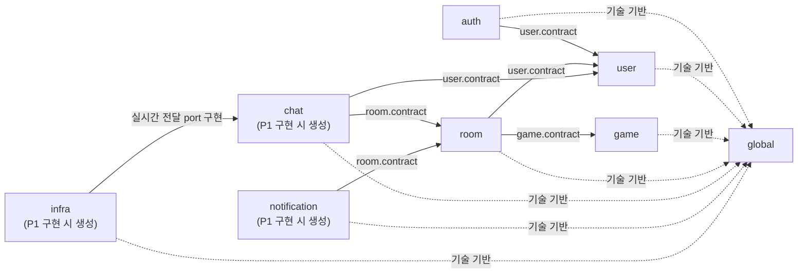
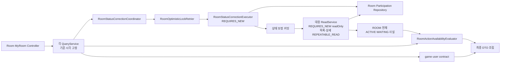
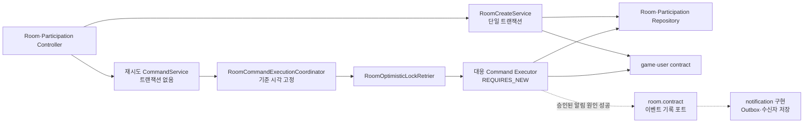
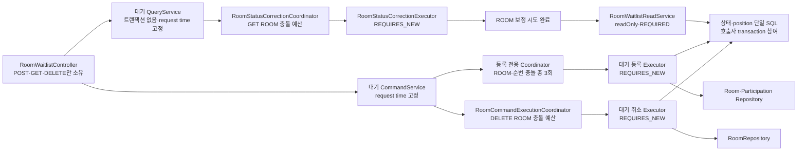
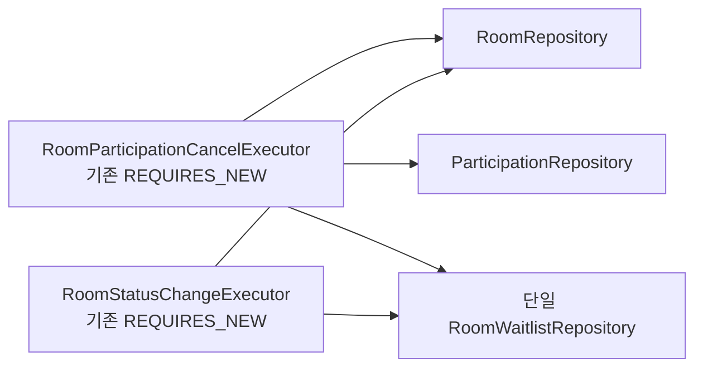
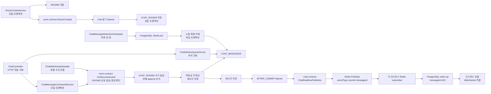
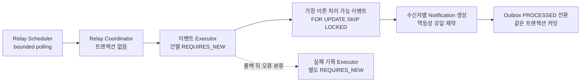

# Albam Mate Architecture

이 문서는 Albam Mate 백엔드 코드의 안정적인 구조 규칙을 설명하는 정본이다. 개별 파일·클래스·엔드포인트 목록은 관리하지 않으며, 같은 경계 안에서 기능을 추가하는 것만으로는 이 문서를 갱신하지 않는다.

본문에서 `후속`, `P1 구현 시 생성` 또는 `필요 시 생성`으로 표시한 항목은 승인된 경계이지만 아직 생성되거나 자동 검증되지 않은 상태다. 그 밖의 내용은 현재 구현이 따라야 하는 구조다. 기능별 구현·검증 상태는 [README의 현재 개발 상태](../README.md#현재-개발-상태)에서 확인한다.

- 모듈러 모놀리스 선택 근거: [ADR-0007](adr/platform/0007-domain-centered-modular-monolith.md)
- 낙관 락·상태 보정 트랜잭션 근거: [ADR-0005](adr/participation/0005-room-participation-optimistic-locking.md), [ADR-0012](adr/room/0012-room-request-boundary-state-reconciliation.md)
- 알림 통합 이벤트·Outbox·relay 근거: [ADR-0029](adr/notification/0029-room-integration-event-transactional-outbox.md), [ADR-0040](adr/notification/0040-postgresql-notification-relay-recovery-retention.md)
- 알림 표시 투영·조회·읽음 시각 근거: [ADR-0039](adr/notification/0039-notification-presentation-and-bulk-read-snapshot.md)
- 코드 배치·네이밍·트랜잭션 규칙: [CONVENTIONS](CONVENTIONS.md)
- 제품·HTTP·저장 계약: [P1 명세](P1-spec.md), [P1 기능 문서](p1/README.md), [P0 완료 명세](archive/p0/P0-spec.md), [API 명세](API.md), [ERD](ERD.md)

## 이 문서를 읽는 법

| 알고 싶은 것 | 먼저 볼 절 |
| --- | --- |
| 어느 모듈이 책임지는가 | [모듈 관계](#모듈-관계), [모듈 책임](#모듈-책임) |
| 새 코드를 어디에 두는가 | [패키지 구조](#패키지-구조) |
| HTTP 요청이 어디로 들어가는가 | [Controller 진입점](#controller-interface) |
| Service·Coordinator·Executor를 왜 나누는가 | [Service 역할과 분리 기준](#service와-내부-협력자) |
| 조회·변경 트랜잭션이 어떻게 흐르는가 | [트랜잭션 흐름](#트랜잭션-흐름) |
| 변경할 때 무엇을 검사하고 문서를 갱신하는가 | [구조 검증](#구조-검증), [문서 갱신 기준](#문서-갱신-기준) |

현재 클래스와 파일을 찾을 때는 문서에 목록을 추가하지 않고 다음 소스 진입점을 사용한다.

- 전체 업무 코드: [운영 코드 루트](../src/main/java/cloud/bamsongi/albammate/)
- HTTP 진입점: [auth](../src/main/java/cloud/bamsongi/albammate/auth/controller/), [user](../src/main/java/cloud/bamsongi/albammate/user/controller/), [game](../src/main/java/cloud/bamsongi/albammate/game/controller/), [room](../src/main/java/cloud/bamsongi/albammate/room/controller/), `chat` (P1 구현 시 생성)
- 복잡한 ROOM 흐름: [query](../src/main/java/cloud/bamsongi/albammate/room/service/query/), [command](../src/main/java/cloud/bamsongi/albammate/room/service/command/), [statuscorrection](../src/main/java/cloud/bamsongi/albammate/room/statuscorrection/)
- 정확한 HTTP 경로와 응답: [API 인덱스](API.md#2-api-인덱스)

## 전체 구조

### 설계 원칙

백엔드는 도메인 중심 모듈러 모놀리스로 구성한다.

- 하나의 Gradle 프로젝트와 Spring Boot 애플리케이션, 데이터베이스를 유지한다.
- 같은 Spring Boot 애플리케이션을 여러 인스턴스로 실행하되 모든 인스턴스가 공용 PostgreSQL과 Redis를 사용한다. 채팅을 별도 서비스로 분리하지 않는다.
- `auth`, `user`, `game`, `room`과 P1의 `chat`·`notification`을 논리적 업무 모듈로 유지한다. OAuth 제공자 통신과 앱 세션 전환은 `auth`, 외부 신원 저장은 `user`가 소유한다.
- 조회와 상태 변경 유스케이스는 각각 `query`, `command`로 구분하지만 Entity, Repository와 데이터베이스까지 나누는 CQRS는 도입하지 않는다.
- 모듈 간 협력은 상대 모듈의 `contract`만 사용한다.
- 독립 트랜잭션과 재시도가 필요한 Coordinator·Executor 분리는 유지하며, 재시도마다 최신 Entity와 version을 다시 조회한다.
- 코드 수를 줄이기 위한 통합보다 책임, 트랜잭션과 실패 경계를 드러내는 구조를 우선한다.

### 모듈 관계

다음 화살표는 런타임 호출 순서가 아니라 컴파일 시점의 의존 방향을 나타낸다.

허용된 업무 모듈 의존 방향은 `auth → user`, `room → user·game`, `chat → room.contract·user.contract`, `notification → room.contract`이다. `chat`은 `room`·`user`의 Entity와 Repository를, `notification`은 `room`의 Entity와 Repository를 직접 참조하지 않고 공개 계약만 사용한다. 반대 방향의 직접 참조와 순환 의존은 허용하지 않는다.

런타임 호출 방향과 컴파일 의존 방향이 다를 수 있다. 예를 들어 `game`이 예정 모임 수를 조회할 때는 [`game.contract.UpcomingRoomCountQuery`](../src/main/java/cloud/bamsongi/albammate/game/contract/UpcomingRoomCountQuery.java)를 [`room.service.query.RoomUpcomingRoomCountQuery`](../src/main/java/cloud/bamsongi/albammate/room/service/query/RoomUpcomingRoomCountQuery.java)가 구현한다. 런타임 호출은 game에서 room으로 이어지지만, 컴파일 의존은 `room → game.contract`로 유지된다.

업무 모듈이 외부 시스템에 요청하는 포트는 이를 소유한 `<module>/contract`에 둔다. `infra`는 이 포트를 구현하고 필요한 업무 모듈의 `contract`와 `global`만 참조한다. P1은 Redis 실시간 전달 adapter와 PostgreSQL 스케줄 잠금 adapter를 위해 `infra`를 생성한다. 업무 모듈은 Redis·ShedLock의 구체 구현을 직접 참조하지 않는다.

### 모듈 책임

| 모듈 또는 경계 | 책임 | 소유하지 않는 책임 |
| --- | --- | --- |
| `auth` | 회원가입·이메일·소셜 로그인·로그아웃·CSRF, OAuth 흐름과 인증 요청 보호 | 사용자·외부 신원 영속 구조, 사용자 프로필 HTTP 흐름 |
| `user` | 사용자 계정·비밀번호 자격증명·외부 신원 연결·프로필·공개 사용자 조회 | OAuth 제공자 통신, 세션 생성·폐기 |
| `game` | 게임 목록·검색·상세와 게임 요약 계약 | 방 데이터 직접 조회 |
| `room` | 방·참가 관계·정원·상태 전이·재시도·상태 보정 | 사용자·게임 내부 구현 |
| `chat` (P1) | 방별 채팅방·메시지 저장, 이력 커서 조회, 현재 관계자 접근 검증, 실시간 전달 경계 | 방·참가 Entity/Repository, 인증 세션 내부 구현, 온라인 자동 매칭 |
| `notification` (P1) | 웹 알림 조회·읽음, Outbox·수신자 스냅샷·알림 저장, relay·재시도·복구·보존 정리 | 방 상태 전이·수신자 재계산, 이메일·모바일 푸시·Web Push·SMS 전달 |
| `global` | 공통 응답·예외·보안·설정·UTC 시간 기반 | 업무 Entity·DTO·규칙 |
| `infra` (P1) | Redis 세션·채팅 fan-out과 PostgreSQL 스케줄 잠금 같은 기술 adapter | 업무 규칙·Entity·HTTP DTO |

참가 관계는 방의 정원과 상태 불변식을 같은 트랜잭션에서 변경하므로 별도 모듈이 아니라 `room`이 소유한다. URL 경로보다 데이터와 불변식을 소유한 모듈을 우선한다.

### P1 소셜 로그인 모듈 계약

> 아래 경계는 #328에서 승인됐으며 ADR-0042와 함께 구현 정본으로 사용한다. 구현·검증 상태는 [P1 기능 상태 정본](p1/README.md#기능별-현재-상태)을 따른다.

`auth`는 설정된 OAuth client 등록, authorization·callback filter 경계, 제공자 응답의 공통 외부 신원·신뢰 가능한 선택 이메일 변환과 `CurrentUserPrincipal` 세션 전환을 소유한다. `user.contract`에 provider·subject·신뢰 조건을 통과한 선택 이메일·닉네임을 전달해 첫 로그인 또는 명시적 연결 결과를 받고 `user`의 Entity·Repository를 직접 참조하지 않는다.

`user`는 `USERS`와 `SOCIAL_ACCOUNTS`를 한 트랜잭션 경계에서 생성·조회·연결하고 두 유일 제약의 동시 요청 결과를 기존 연결로 수렴시킨다. 비로그인 첫 로그인에서는 신뢰 가능한 이메일만 기존 사용자 충돌 판정에 사용하고 자동 연결하지 않는다. 인증된 명시적 연결은 이메일 중복과 무관하게 현재 세션 사용자를 대상으로 처리한다. 기존 이메일 로그인용 자격증명 조회 계약은 `password_hash IS NULL`인 사용자를 반환하지 않아 `auth`가 미존재 계정과 같은 검증 경로를 유지하게 한다. OAuth code·token·secret은 두 모듈의 영속 계약에 포함하지 않는다.

`/api/auth/social/authorization/**`와 `/api/auth/social/callback/**`는 Spring Security filter가 소유하는 브라우저 리다이렉트 경로다. MVC 정책 대조 대상이 아니며 `SecurityConfig`의 정확한 matcher와 OAuth 흐름 테스트로 고정한다. 제공자 목록과 `/api/users/me/social-accounts/{provider}/link`는 Controller가 소유하므로 `ApiEndpointPolicyRegistry`에 등록한다.
### P1 알림 모듈 계약

> 현재 생산 코드·자동 검증·운영 상태는 [P1 기능 상태 정본의 `NOTI-01`~`NOTI-03`](p1/README.md#기능별-현재-상태)을 따른다.

`notification`은 서비스 내 웹 알림 조회·읽음, Outbox·수신자 스냅샷·Notification 저장, relay·재시도·운영 복구·보존 정리를 소유한다. 방 상태 전이와 수신자 재계산, 이메일·모바일 푸시·Web Push·SMS 전달은 소유하지 않는다.

`room.contract`가 승인된 방 변경 이벤트와 기록 포트를 소유하고 `notification`이 포트를 구현한다. 최종 성공한 Room Command Executor가 런타임에 기록 포트를 호출하더라도 `room`은 자기 계약만 알고, 컴파일 의존은 `notification → room.contract`로 유지한다. `room`은 알림 문구·Outbox·relay·읽음 정책을 참조하지 않는다.

알림 코드는 `notification/service/query`, `notification/service/command`, `notification/relay`, `notification/recovery`, `notification/cleanup`의 책임 경계에 배치한다. `/api/users/me/notifications` 하위 조회·읽음은 URL 접두사가 아니라 데이터와 불변식 소유권에 따라 P1 `NotificationController`가 담당한다.

### 패키지 구조

패키지는 파일 목록이 아니라 책임 경계로 관리한다. 다음 패턴 안에서 클래스나 하위 구현을 추가할 때는 이 문서를 갱신하지 않는다.

| 경로 패턴 | 책임 |
| --- | --- |
| `<module>/contract` | 다른 모듈에 공개하는 호출 계약, 값 타입과 외부 포트 |
| `<module>/controller` | HTTP 요청·응답 경계 |
| `<module>/dto` | 해당 모듈의 HTTP 요청·응답 타입 |
| `<module>/entity`, `<module>/repository` | 영속 Aggregate와 저장·조회 계약 |
| `<module>/service` | 유스케이스와 트랜잭션 조정 |
| 기존 `<module>/exception`, `validation`, `security`, `enums` | 예외·입력 검증·보안·도메인 타입처럼 모듈 내부에서만 쓰는 보조 책임 |
| `auth/oauth2` | provider 등록·속성 변환, authorization·callback 성공·실패와 앱 세션 전환 |
| `room/service/query` | ROOM 조회 유스케이스와 조회 전용 내부 협력자 |
| `room/service/command` | ROOM 변경 유스케이스, Coordinator와 Executor |
| `room/enums` | ROOM Entity·DTO가 공유하는 방·참가 도메인 타입 |
| `room/statuscorrection` | Query·Scheduler가 공유하는 자동 상태 보정 |
| `chat/service` (P1) | 채팅방 접근, 메시지 저장·이력 조회 유스케이스 |
| `chat/websocket` (P1) | 방별 WebSocket handshake, 인스턴스 로컬 연결과 PostgreSQL 이력 복구 상태 |
| `chat/retention` (P1) | 최종 상태 메시지의 일일 만료 선별, 소량 묶음 삭제와 실패 계측 |
| `global/security/session` (P1) | 공용 서버 세션 설정과 세션 쿠키 공통 규칙 |
| `global/scheduling` (P1) | 업무 규칙을 모르는 클러스터 스케줄 잠금 port |
| `global` | 업무 의미가 없는 공통 기술 기반 |
| `infra/redis` (P1) | `chat.contract`의 실시간 발행·구독 port와 Spring Session Redis adapter |
| `infra/scheduling` (P1) | PostgreSQL 시각과 `SHEDLOCK` 테이블을 사용하는 스케줄 잠금 adapter |

필요한 구현만 만들며 빈 폴더를 미리 생성하지 않는다. `contract`도 다른 모듈에 공개할 계약이나 `infra`가 구현할 포트가 생길 때만 추가한다. 표는 모든 모듈에 모든 패키지를 허용한다는 뜻이 아니다. 기존 패키지에 파일을 추가할 때는 갱신하지 않지만, 모듈에 새로운 최상위 책임 패키지를 만들 때는 이 절과 구조 검사를 함께 확인한다.

## 요청 처리 구조

### Controller Interface

여기서 Interface는 Java `interface` 선언이 아니라 외부 요청에 노출하는 HTTP·WebSocket 진입 경계를 뜻한다. 전체 Controller와 엔드포인트 목록은 코드와 [API 인덱스](API.md#2-api-인덱스)가 소유한다.

- Controller는 엔드포인트 수가 아니라 HTTP 리소스와 책임으로 나눈다.
- 각 엔드포인트는 하나의 유스케이스 Service에 업무 처리를 위임한다. 한 Controller가 여러 Service를 주입받는다는 이유만으로 Facade를 추가하지 않는다.
- Controller는 Request 검증, 인증 사용자 식별, Service 호출과 HTTP 응답 변환만 담당한다.
- Repository, ReadService, Executor와 상태 전이 규칙을 Controller에서 직접 사용하지 않는다.
- URL 접두사보다 데이터와 불변식을 소유한 모듈에 배치한다.

다음은 전체 목록이 아니라 모듈 소유권을 설명하는 대표 예시다.

| 요청 성격 | 배치 원칙 | 현재 예시 |
| --- | --- | --- |
| CSRF·가입·이메일 로그인·로그아웃·소셜 제공자 조회 | 인증 HTTP 경계이므로 `auth`가 소유 | `AuthController`, `SocialAuthController` |
| 소셜 계정 연결 시작 | 외부 인증 진입은 `auth`, 연결 저장은 `user.contract`로 위임 | `SocialAuthController` |
| 내 프로필 조회·수정 | 인증 기능이 아니라 사용자 리소스이므로 `user`가 소유 | `UserProfileController` |
| 방 조회·생성·상태 변경·참가 | 방과 참가 불변식을 다루므로 `room`이 소유 | `RoomController`, `RoomParticipationController` |
| 대기 등록·본인 상태 조회·대기 취소(P1) | 대기 리소스의 HTTP 경계를 분리하되 방·참가 불변식을 다루므로 `room`이 소유 | `RoomWaitlistController` |
| `/api/users/me/rooms` 조회 | URL에 `users`가 있어도 방과 참가 관계를 조회하므로 `room`이 소유 | `MyRoomController` |
| 방별 채팅 전송·이력·실시간 구독 | 메시지와 채팅 접근 경계를 다루므로 `chat`이 소유 | P1 구현 시 생성 |

기존 책임 안에서 Controller나 엔드포인트를 추가하는 것은 아키텍처 변경이 아니다. Controller의 분리 기준이나 모듈 소유권이 바뀔 때만 이 절을 갱신한다.

### Service와 내부 협력자

유스케이스마다 필요한 Service는 소스 코드가 소유하며, 이 문서는 클래스 목록 대신 역할과 분리 조건을 정한다.

| 역할 | 책임과 경계 |
| --- | --- |
| Controller-facing Service | 하나의 유스케이스를 조정하고 Controller가 호출하는 진입점을 제공한다. |
| QueryService | 기준 시각을 고정하고 필요하면 상태 보정을 완료한 뒤 최신 상태를 읽어 응답을 조립한다. |
| ReadService | 상태 보정 커밋 뒤 별도의 읽기 전용 트랜잭션에서 최신 상태를 조회한다. |
| CommandService | 변경 유스케이스 입력을 받고 기준 시각·재시도 실행을 조정한다. |
| Command Executor | 독립 트랜잭션에서 최신 Entity 조회, 규칙 검증과 상태 변경을 수행한다. |
| Coordinator | 트랜잭션 밖에서 기준 시각, 실행 순서와 재시도를 조정한다. |
| Retrier | 낙관 락 충돌의 재시도·로그·오류 변환만 담당한다. |
| PART-04 대기 Query·Read·Command Service | `RoomWaitlistController`의 전용 진입점이다. Query는 트랜잭션 밖에서 상태 보정을 조정하고, Read는 보정 커밋 뒤 짧은 읽기 트랜잭션에서 본인의 최신 상태·동적 순번을 조회하며, Command는 등록·재신청과 취소 유스케이스를 조정한다. |
| PART-04 대기 등록 Coordinator | 트랜잭션 밖에서 고정 request time과 ROOM 충돌·정확한 대기 순번 UNIQUE 충돌의 단일 3회 예산을 관리한다. |
| StatusCorrection Coordinator·Executor | Query·Scheduler가 공유하는 자동 상태 보정을 트랜잭션 밖 조정과 독립 트랜잭션 실행으로 나눈다. |
| Integration Event Recorder | `room.contract`의 기록 포트를 구현하고 호출한 Room Command Executor의 트랜잭션에 참여해 Outbox 이벤트와 수신자 스냅샷만 저장한다. |
| Notification Relay Coordinator·Executor | polling과 최대 처리 수는 트랜잭션 밖에서 조정하고, 선점·Notification 생성·완료 전환은 이벤트별 독립 트랜잭션에서 수행한다. |
| Notification Recovery·Cleanup | 운영 명령 adapter와 Scheduler는 Repository를 직접 사용하지 않으며, application service·Executor가 제한된 묶음의 상태 전환과 물리 삭제 트랜잭션을 소유한다. |

클래스 가시성은 호출 범위에서 가장 좁게 둔다. 같은 패키지에서만 쓰는 ReadService·Executor·Coordinator는 package-private으로 두고, 다른 패키지에서 호출해야 하는 Coordinator와 Retrier만 `public`으로 공개한다. Spring Proxy가 트랜잭션을 적용하거나 다른 패키지에서 호출하는 진입 메서드는 클래스 가시성과 별개로 `public`일 수 있다.

Service, ReadService, Executor와 Coordinator를 이름이나 클래스 수만 보고 합치지 않는다. 트랜잭션, 재시도, 최신 상태 재조회 또는 여러 호출자가 공유하는 실행 순서가 실제 분리 근거다. 이 근거가 사라지거나 새 역할이 생길 때만 이 절을 갱신한다.

### 트랜잭션 흐름

#### 방 조회

방 조회는 [ADR-0012](adr/room/0012-room-request-boundary-state-reconciliation.md)의 요청 경계 상태 보정 규칙을 따른다.

QueryService는 기준 시각을 고정하고 상태 보정 커밋을 기다린 뒤 ReadService로 최신 상태를 읽는다. ReadService는 별도의 `REQUIRES_NEW`, `readOnly = true` 트랜잭션을 사용한다.

ROOM-08의 목록·상세 ReadService는 [ADR-0041](adr/room/0041-postgresql-room-query-consistent-snapshot.md)에 따라 `REPEATABLE_READ`를 추가하고, ROOM과 행동 가능성 판정에 필요한 현재 `ACTIVE`·`WAITING` 사실만 같은 PostgreSQL 스냅샷에서 읽는다. 이 트랜잭션은 짧게 유지하며 `FOR UPDATE`·`FOR SHARE` 조회 락을 사용하지 않는다. 내 모임 조회는 이미 조회한 주최자·현재 `ACTIVE` 관계를 사용하고 ROOM-08만을 위한 WAITING 조회를 추가하지 않는다.

ROOM QueryService는 인증·주최자 관계와 ReadService가 반환한 사실을 하나의 `RoomActionAvailabilityEvaluator`에 전달한다. Game·User 조회와 최종 DTO 조립은 ROOM 스냅샷 트랜잭션 밖에서 수행하며, ROOM·참가·대기·Game·User를 하나의 거대한 projection으로 합치지 않는다.

#### 방 변경

재시도하는 방 변경은 [ADR-0005](adr/participation/0005-room-participation-optimistic-locking.md)의 낙관 락 규칙을 따른다.

Coordinator는 기준 시각을 고정하고 낙관 락 충돌만 재시도한다. 각 Executor 시도는 Spring Proxy를 거친 `REQUIRES_NEW` 트랜잭션에서 최신 Entity와 version을 다시 조회한다.

PART-04 대기 등록·재신청은 [ADR-0046](adr/participation/0046-room-waitlist-persistence-conditional-transition-retry.md)의 별도 조정 경계를 따른다.

`RoomWaitlistController`는 `POST /api/rooms/{roomId}/waitlist`, `GET /api/rooms/{roomId}/waitlist/me`, `DELETE /api/rooms/{roomId}/waitlist/me`만 소유한다. 인증 사용자·path·CSRF를 HTTP 경계에서 처리한 뒤 전용 Query·Command Service에 위임하며 Repository·Entity·Executor를 직접 사용하지 않는다.

대기 Query Service는 트랜잭션을 시작하지 않고 request time을 한 번 고정한 뒤 기존 `RoomStatusCorrectionCoordinator`의 단건 보정이 커밋될 때까지 기다린다. 보정 충돌이 기존 ROOM 재시도 예산을 소진하면 `409 ROOM_CONCURRENT_MODIFICATION`으로 종료하고 대기 상태를 읽지 않는다. 보정 완료 뒤 Spring Proxy를 거쳐 `RoomWaitlistReadService`를 호출한다. 이 ReadService의 호출 경계가 `readOnly = true`, `REQUIRED` 전파인 짧은 읽기 트랜잭션을 소유하고, `RoomWaitlistRepository`는 그 호출자 트랜잭션에 참여해 [PART-04 저장 정본](ERD.md#room_waitlists)의 상태·`position`을 한 SQL·한 데이터베이스 스냅샷으로 조회한다. 이 읽기 트랜잭션에는 Query Service·상태 보정 Coordinator·상태 보정 Executor를 포함하지 않으며, Repository는 별도 트랜잭션·조회 락·`SKIP LOCKED`를 열지 않는다. 구체적인 트랜잭션 애너테이션 부착 위치는 이 경계를 지키는 범위에서 #302의 구현 자유로 남긴다. 이 조회 경계가 시작 시각의 `WAITING → EXPIRED`를 직접 구현하지 않으며, 해당 전이를 상태 보정과 같은 일관성 경계에 연결하는 책임은 ROOM-09에 남긴다.

대기 Command Service는 등록·재신청을 PART-04 등록 전용 Coordinator에 위임한다. 대기 취소는 기존 `RoomCommandExecutionCoordinator`가 고정한 request time과 ROOM 충돌 예산으로 대기 취소 Executor를 호출한다. 취소 Executor는 한 `REQUIRES_NEW` 시도 안에서 ROOM을 먼저 보정하고 현재 `WAITING → CANCELED` 조건부 전이를 실행한다. 대기 취소 자체는 ROOM version을 강제로 claim하거나 sequence를 발급하지 않으며, 보정으로 발생한 ROOM 충돌의 예산 소진은 `409 ROOM_CONCURRENT_MODIFICATION`으로 반환한다. 등록 전용 Coordinator와 기존 ROOM 명령 Coordinator를 한 요청에 중첩하지 않는다.

PART-04 전용 Coordinator는 ROOM 낙관적 락·조건부 version claim 충돌과 정확한 `uq_room_waitlists_waiting_room_queue_order` 충돌만 최초 시도 포함 총 3회의 같은 예산으로 재시도한다. 기존 `RoomOptimisticLockRetrier`를 안에 중첩하거나 그 의미를 확장하지 않는다. 각 실패 시도는 전체 롤백하고 다음 시도에서 최신 업무 상태를 다시 읽으며, 최초에 고정한 같은 request time을 사용한다. PK·FK·CHECK·그 밖의 UNIQUE, 교착·직렬화·분류할 수 없는 DB 오류는 재시도하지 않고 내부 제약·SQL 정보를 숨긴 공통 500으로 변환한다. 최종 내부 오류의 정제된 `ERROR` 로그는 요청당 한 번만 남긴다.

PART-04 자동 처리는 새 공용 승격 계층을 만들지 않고 기존 ROOM 명령 Executor가 소유한다.

- `RoomParticipationCancelExecutor`가 기존 참가 취소와 현재 첫 `WAITING`의 조건부 승격, 승격 사용자의 참가 관계 생성·재활성화를 같은 트랜잭션에서 직접 조정한다.
- `RoomStatusChangeExecutor`가 ROOM 취소와 남은 현재 `WAITING → ROOM_CANCELED`를 같은 트랜잭션에서 직접 조정한다.
- 두 Executor는 #302의 단일 `RoomWaitlistRepository`를 직접 사용한다. 공용 승격 Service, 별도 자동 승격 collaborator와 중첩 재시도기를 추가하지 않으며 필요한 private helper만 둔다.
- 필요한 명시적 flush로 참가 취소 경로의 데이터베이스 변경 순서를 `ROOM → 기존 참가 취소 → 대기 승격 → 승격 참가 생성·재활성화`, ROOM 취소 경로를 `ROOM → 남은 WAITING 종료`로 고정한다. 어느 단계의 실패도 ROOM·Participation·Waitlist 변경을 함께 롤백한다.
- 시작 시각 경계의 `WAITING → EXPIRED` 실행은 [ROOM-09](p1/room.md#room-09-시간-기반-room-상태-자동-전환의-대량-처리-고도화)가 소유한다. PART-04c Executor는 `now >= startsAt`이면 자동 승격이나 시작 경계 종료 쓰기를 남기지 않는다.

상태 의존 Command는 같은 트랜잭션에서 시간 기반 상태를 먼저 보정한 뒤 유스케이스 규칙을 적용한다. Query·Scheduler용 상태 보정 Coordinator는 호출하지 않는다.

시간 기반 상태 전이 규칙은 `Room` Entity의 단일 보정 메서드가 소유한다. statuscorrection Executor와 상태 의존 Command Executor는 이 메서드를 호출만 하며 전이 조건을 복제하지 않는다.

참가·재참가, 참가 취소와 방 취소의 최종 성공 Executor는 기존 `REQUIRES_NEW` 트랜잭션 안에서 `room.contract`의 기록 포트를 호출한다. 포트 구현은 새 트랜잭션을 열지 않고 호출자 트랜잭션에 반드시 참여해 원인 이벤트와 확정 수신자만 저장한다. Outbox 기록 실패, 업무 실패와 낙관 락 충돌 시도는 Room 변경과 함께 롤백된다. 방 취소 수신자는 같은 트랜잭션의 현재 `ACTIVE` 참가자로 고정하며 relay가 다시 계산하지 않는다. 수신자가 없는 방 취소는 Outbox 없이 방 변경만 커밋한다.

이 흐름은 기존 Command Coordinator·Retrier·Executor 경계를 바꾸지 않는다. 알림 원인이 아닌 방 수정·종료·자동 종료·상태 보정은 기록 포트를 호출하지 않으며, 재시도 밖에서 별도의 best-effort 이벤트를 만들지 않는다.

일괄 보정 대상 선별 쿼리는 전이 경계에서 파생된 후보 축소 조건이며 Entity의 전이 대상을 빠뜨리지 않아야 한다. 쿼리가 더 넓은 후보를 반환할 수 있지만 최종 전이 여부는 `Room` Entity가 판단한다. Entity의 전이 경계를 바꿀 때는 선별 쿼리와 경계 테스트를 함께 갱신한다.

재시도하지 않는 단일 트랜잭션 유스케이스에는 Coordinator와 Executor를 추가하지 않는다. 재시도가 필요할 때만 Spring Proxy가 독립 트랜잭션을 적용할 수 있도록 Service와 Executor를 분리한다.

#### 채팅 흐름

`V6__create_p1_chat_room_schema.sql`은 `CHAT_ROOMS` 테이블·제약만 생성하며 기존 `ROOMS`를 조회하거나 `CHAT_ROOMS` 행을 삽입·갱신하지 않는다. [#279의 최신 승인 테스트 계약](https://github.com/bamsongi-club/albam-mate/issues/279#issuecomment-5161788285)은 기존 ROOM backfill·상태별 초기화·ROOM 생성·상태 전환 경합·최종 보정·배포 절체를 [#281](https://github.com/bamsongi-club/albam-mate/issues/281)의 후속 범위로 분리한다. [ADR-0045](adr/chat/0045-chat-room-schema-and-backfill-boundary.md)은 이를 명시적 one-shot/maintenance 작업으로 수행하는 경계를 제안하며 팀 채택 전에는 승인된 실행 계약이 아니다. 현재 일반 애플리케이션 기동과 Flyway 자동 실행에는 기존 ROOM 데이터 작업이 없다.

활성화 뒤 P1 채팅은 방 생성과 채팅방 생성을 한 트랜잭션으로 묶고, 메시지 전송·이력 조회는 `chat` 모듈이 소유한다. `RoomCreateService`는 `chat`을 직접 참조하지 않고 `room.contract.RoomCreated` 이벤트를 발행한다. `chat`의 동기 listener가 같은 트랜잭션에서 `CHAT_ROOMS`를 만들며, 실패하면 방 생성도 함께 롤백된다. `CANCELED`·`FINISHED` 전환도 `room.contract.RoomTerminalStateReached`를 발행하고 `chat`의 동기 listener가 같은 트랜잭션에서 `purge_after`를 설정한다.

채팅은 `room.contract`로 현재 주최자·`ACTIVE` 참가자와 방 상태를 확인하며 `room` Entity·Repository를 직접 참조하지 않는다.

메시지 전송은 일반 `@Transactional` 하나에서 권한·상태, 멱등성 키와 저장을 처리한다. `REQUIRES_NEW`와 낙관 락 재시도를 사용하지 않는다. 잠금 순서는 `ROOMS` 다음 `CHAT_ROOMS`로 고정하고 메시지마다 `Room.version`을 올리지 않는다.

실시간 전달은 [ADR-0033](adr/chat/0033-postgresql-source-after-commit-delivery.md)에 따라 저장 커밋 뒤에만 수행하며 전달 실패가 저장을 롤백하지 않는다. Redis 신호는 `eventType`, `roomId`, `messageId`만 포함하고 메시지 본문 정본이 아니다. 구독 인스턴스는 로컬 연결별 마지막 전달 ID 이후의 PostgreSQL 이력을 조회한다. 이력·재연결의 `messageId` cursor는 승인된 [ADR-0031](adr/chat/0031-chat-history-cursor-pagination.md)을 따른다.

방이 최종 상태가 되면 일반 사용자 접근은 즉시 차단하고, 메시지는 [ADR-0034](adr/chat/0034-chat-message-retention-and-deletion.md)에 따라 30일 뒤 일일 스케줄러가 소량 묶음으로 삭제한다. 모든 인스턴스가 스케줄을 등록하지만 [ADR-0038](adr/platform/0038-multi-instance-session-and-scheduler-coordination.md)의 PostgreSQL ShedLock을 얻은 하나만 작업을 실행한다. 잠금 트랜잭션과 각 삭제 묶음의 독립 트랜잭션은 결합하지 않는다.

#### 다중 인스턴스 실행

공용 세션과 스케줄 실행 조정의 기술 결정은 [ADR-0038](adr/platform/0038-multi-instance-session-and-scheduler-coordination.md)이 소유한다.

`local-single`은 인메모리 세션·fan-out을 허용하는 빠른 단일 서버 개발 프로필이다. P1 필수 검증 환경인 `local-multi`는 로컬 프록시, Spring 애플리케이션 두 대, 공용 PostgreSQL과 Redis로 구성한다. 목표 운영 토폴로지에서는 ALB가 ASG 애플리케이션 인스턴스로 요청을 분산하고 모든 인스턴스가 공용 RDS PostgreSQL과 Redis를 사용한다. 이 목표는 현재 운영 배포 완료를 뜻하지 않으며, 배포·실측 상태는 [P1 기능별 상태 정본](p1/README.md#기능별-현재-상태)의 `운영 배포·실측` 열을 따른다.

- `JSESSIONID`의 인증 상태는 Spring Session Redis에 저장한다. HTTP 요청과 WebSocket handshake가 다른 인스턴스에 도달해도 동일 세션을 사용하며 ALB stickiness에 정합성을 의존하지 않는다.
- 하나의 Redis를 Spring Session, 채팅 Pub/Sub과 사용자·방 단위 rate limit에 사용하되 key prefix, TTL과 channel namespace를 분리한다.
- 전송 제한의 사용자·방 bucket 값과 429·503 응답 경계는 [API 전송 제한 계약](API.md#전송-제한-계약)과 [CHAT-04 정본](p1/chatting.md#chat-04-채팅-안전운영)을 따른다. 공용 Redis의 Spring Session·채팅 Pub/Sub·전송 제한 간 key prefix·TTL·channel namespace는 [ADR-0038](adr/platform/0038-multi-instance-session-and-scheduler-coordination.md)에 따라 논리적으로 분리한다. 정확한 물리 key·channel namespace는 후속 구현 이슈에서 확정하며 이 문서에서 정하지 않는다.
- `local-multi`와 `prod`는 Redis 장애 시 인메모리 구현으로 자동 fallback하지 않는다. 세션·rate limit을 확인할 수 없을 때 `503 SERVICE_UNAVAILABLE`을 반환하는 현재 범위는 API 정본의 채팅 API 세 엔드포인트로 한정한다. 로그인·로그아웃과 그 밖의 세션 사용 엔드포인트의 오류 계약은 적용 엔드포인트를 명시한 별도 계약 변경 전까지 확정하지 않는다.
- 각 인스턴스는 자신에게 연결된 WebSocket만 메모리에 보관한다. Redis subscriber는 `chat.contract`의 수신 port를 호출하고 구체 Redis 타입을 `chat`에 노출하지 않는다.
- 참가 취소·방 최종 상태 신호는 해당 방의 로컬 연결이 현재 권한을 다시 확인하게 하고, 세션 만료 이벤트는 해당 연결을 종료하는 빠른 정리 경로로 사용한다. 신호와 이벤트는 권한 회수의 근거가 아니며, 메시지 전달 직전에 PostgreSQL의 현재 관계·상태와 공용 세션의 현재 유효성을 함께 확인한다. 관계·상태가 유효하지 않거나 세션이 만료됐거나 확인에 실패하면 메시지를 전달하지 않고 연결을 종료한다.
- Redis Pub/Sub 누락·중복·순서 역전은 다음 신호 또는 PostgreSQL `messageId` catch-up으로 복구한다. 커밋 뒤 Redis 발행·구독 실패는 메시지 저장 결과를 롤백하거나 삭제하지 않는다.
- 방·참가 동시성은 공용 PostgreSQL의 기존 `Room.version` 낙관 락과 제한 재시도를 유지한다. 다중 인스턴스라는 이유로 Redis 분산 락으로 교체하지 않는다.
- 방 상태 보정과 채팅 만료 삭제는 모든 인스턴스에 등록하되 Spring Scheduler와 PostgreSQL ShedLock으로 한 실행만 조정한다. 잠금은 업무 트랜잭션과 분리하고 작업 본문은 재실행되어도 같은 결과로 수렴시킨다.
- Quartz 클러스터, Outbox, Redis Streams, RabbitMQ와 Kafka는 P1에 도입하지 않는다.
- 실제 AWS의 WebSocket Upgrade, scale-out, 인스턴스 교체·draining과 운영 Redis 제품·HA·TLS·접근 제어·비밀·비용 검증은 후속 OPS다. 이 미검증은 `local-multi` 기반 P1 채팅 구현을 막지 않는다.

#### 기준 시각과 재시도

하나의 유스케이스 실행은 하나의 기준 시각만 사용한다.

| 실행 유형 | 기준 시각 결정 위치 |
| --- | --- |
| 재시도하는 Command | Command Coordinator |
| Query | 각 QueryService 실행 시작 지점 |
| Scheduler | 스케줄 실행 시작 지점 |
| Notification 목록·미확인 개수의 만료 판정 | 각 QueryService 읽기 트랜잭션의 PostgreSQL `transaction_timestamp()` |
| Outbox 최초·재시도·수동 재처리 `availableAt`과 relay due·oldest 판정 | 각 DB 쓰기·조회가 PostgreSQL에서 한 번 고정한 `operationTime` |
| Notification 기록 | relay 이벤트 Executor가 PostgreSQL에서 한 번 조회한 `operationTime` |
| Notification 단건·일괄 읽음 | 읽음 SQL 내부에서 한 번 평가한 PostgreSQL `clock_timestamp()` |
| Notification·Outbox cleanup due 판정 | cleanup Executor가 batch 트랜잭션 안에서 한 번 조회한 PostgreSQL `clock_timestamp()` |
| Executor·Entity | 시각을 생성하지 않고 전달받아 사용 |

- 모든 재시도는 최초에 고정한 같은 `Instant`를 사용한다.
- Executor와 Entity는 `Instant.now()`를 직접 호출하지 않는다.
- Notification 조회 `queryTime`, Outbox·Notification의 `recordedAt`과 Notification의 `readAt`은 [ADR-0039](adr/notification/0039-notification-presentation-and-bulk-read-snapshot.md)에 따라 PostgreSQL 시각을 사용한다. `queryTime`은 읽기 트랜잭션의 `transaction_timestamp()`, 기록·읽음 작업 시각은 SQL에서 고정한 `clock_timestamp()`다. 애플리케이션 `Clock`의 업무 시각인 `occurredAt`·`createdAt`과는 상대 순서를 보장하지 않는다.
- Retrier는 [ADR-0005](adr/participation/0005-room-participation-optimistic-locking.md)가 정한 대상 예외·상한·로그·재시도 전 hook과 소진 오류 변환을 관리한다.
- PART-04 대기 등록은 [ADR-0046](adr/participation/0046-room-waitlist-persistence-conditional-transition-retry.md)에 따라 전용 Coordinator가 ROOM 충돌과 정확한 대기 순번 UNIQUE 충돌의 단일 3회 예산을 직접 관리하며, 기존 Retrier와 재시도기를 중첩하지 않는다.
- 각 시도에는 필요한 Aggregate만 조회하고 Request DTO와 최초 기준 시각은 재사용한다.
- 재시도 안에서 비멱등 외부 부수효과를 실행하지 않는다.
- 재시도 로그로 충돌과 소진을 추적하며, 충돌이 빈번하면 특정 방에 쓰기가 집중되는 hot spot으로 보고 별도 동시성 전략을 검토한다.

#### 알림 relay·복구·정리

> 이 절은 P1 아키텍처 계약이다. 현재 생산 코드·자동 검증·운영 상태는 [P1 기능 상태 정본의 `NOTI-01`~`NOTI-03`](p1/README.md#기능별-현재-상태)을 따른다.

알림 생성은 원인 업무 커밋 뒤 모든 애플리케이션 인스턴스가 실행하는 PostgreSQL polling relay가 담당한다.

이 절은 모듈·트랜잭션 책임과 호출 흐름만 소유한다. relay 주기·처리 상한·재시도·보존·복구·cleanup의 현재 수치는 [알림 운영 파라미터 정본](guides/NOTIFICATION_OPERATIONS.md#현재-운영-파라미터-정본), 결정 이유는 [ADR-0040](adr/notification/0040-postgresql-notification-relay-recovery-retention.md), 저장 필드·제약은 [ERD의 P1 알림 저장 계약](ERD.md#p1-알림-저장-계약)을 따른다. 이 문서에는 운영 수치나 아직 ERD에 반영되지 않은 물리 구조를 다시 정의하지 않는다.

- Coordinator는 batch 전체 트랜잭션이나 무제한 drain loop를 만들지 않고 이벤트마다 Spring Proxy를 거쳐 Executor를 호출한다.
- 이벤트 Executor는 SQL의 `MATERIALIZED operation` CTE에서 PostgreSQL `clock_timestamp()`를 한 번 고정하고 `availableAt`이 그 `operationTime` 이하인 이벤트를 `SKIP LOCKED`로 한 건 선점한다. Notification 생성과 `PROCESSED` 전환은 함께 커밋하거나 함께 롤백한다.
- 이벤트 Executor는 PostgreSQL `clock_timestamp()`를 한 번 조회해 `operationTime`으로 고정하고 같은 이벤트에서 새로 만드는 모든 Notification의 `recordedAt`에 전달한다. 알림 목록·페이지 count와 미확인 개수는 각 QueryService가 소유한 짧은 읽기 트랜잭션의 `transaction_timestamp()`로 만료를 판정하며, 단건·일괄 읽음 SQL은 내부에서 `clock_timestamp()`를 한 번 평가한 `operationTime`을 `readAt`과 만료 판정에 사용한다.
- 처리 트랜잭션이 롤백되면 Coordinator가 별도 독립 트랜잭션으로 PostgreSQL `operationTime`을 고정해 재시도 `availableAt` 또는 `FAILED` 상태를 조건부 기록한다. 이미 다른 worker가 `PROCESSED`로 끝낸 이벤트를 뒤늦은 실패 기록이 덮어쓰지 않는다.
- relay 트랜잭션에는 외부 네트워크 호출을 넣지 않는다. 재시도 간격·상한과 상태별 보존 수치는 [운영 파라미터 정본](guides/NOTIFICATION_OPERATIONS.md#현재-운영-파라미터-정본)을 따른다.

운영 복구와 정리는 relay 처리와 패키지·진입점을 분리한다.

- `notification/recovery`의 일회성 운영 명령 adapter는 트랜잭션을 시작하거나 Repository·직접 SQL을 사용하지 않고 `NotificationOutboxRecoveryService`에 위임한다. Service는 `OPS_MAX_EVENT_IDS` 이하의 `FAILED` 이벤트 ID를 오름차순 정규화하고 하나의 `ORDER BY id FOR UPDATE` 조회로 잠근 뒤 전체 검증하여 재처리 대기 또는 폐기로 전환하는 짧은 상태 변경 트랜잭션을 소유한다. 공개 HTTP API는 두지 않는다.
- `notification/cleanup`의 Scheduler·Coordinator는 트랜잭션 밖에서 실행 주기와 bounded 반복만 조정하고 만료 판정 시각을 만들지 않는다. Executor는 각 batch 독립 트랜잭션 안에서 PostgreSQL `clock_timestamp()`를 한 번 조회해 `measurementTime`으로 고정하고, due 선점·삭제 조건과 완료·실패 로그에 같은 값을 사용한다. 한 트랜잭션에서 전체 보존 데이터를 비우지 않는다.
- cleanup은 `PROCESSED`·`DISCARDED` Outbox의 `cleanupAt`과 Notification의 `expiresAt`만 사용한다. `PENDING`, `RETRY_WAIT`, `FAILED` 이벤트는 자동 삭제하지 않는다. 각 시각을 계산하는 보존 파라미터는 운영 정본이 소유한다.

## 유지 규칙

### 공통화 경계

여러 유스케이스에서 실패 의미와 실행 방식이 동일한 정책만 공통화한다.

- 기존 ROOM 명령의 낙관 락 재시도 정책
- Command의 기준 시각 고정과 재시도 실행 순서. 서로 다른 실패 원인이 같은 예산을 공유해야 하는 PART-04 대기 등록은 승인 ADR의 전용 Coordinator 경계를 따른다.
- 조회와 Scheduler가 공유하는 자동 상태 보정
- 여러 유스케이스에 동일하게 적용되는 Entity 불변식

다음 책임은 클래스 수를 줄이기 위해 합치지 않는다.

- 유스케이스별 Service와 Executor
- 참가·취소·수정·종료의 업무 규칙
- 권한 검증과 오류 우선순위
- API별 Request·Response DTO
- 모든 Command를 모은 Facade
- 트랜잭션 추상 부모 클래스
- 클래스 수 감축 자체를 위한 통합

### Repository Projection과 DTO

Repository Projection은 쿼리가 선택한 열을 담는 저장소 계층 타입이며 `repository`에 둔다. HTTP 응답을 표현하는 타입은 각 모듈의 `dto`에 둔다. Entity와 Repository Projection을 Controller에서 직접 반환하지 않는다.

예를 들어 `GameListRow`는 Repository Projection이고, `GameListItem`, `GameDetail`, `UserProfileResponse`는 외부 응답 DTO다. 이 예시와 같은 타입이 추가되는 것만으로는 문서를 갱신하지 않는다.

### 구조 검증

[ModuleArchitectureTest](../src/test/java/cloud/bamsongi/albammate/architecture/ModuleArchitectureTest.java)는 현재 다음 구조 규칙을 검사한다.

- 업무 모듈 사이의 순환 의존 금지
- 다른 업무 모듈의 `contract` 외 내부 구현 참조 금지
- `auth → user`, `room → user·game`, `notification → room.contract`, `chat → room.contract·user.contract` 외 현재 업무 모듈 의존 금지
- `global`의 업무 모듈 의존 금지
- 생산 코드의 `@Autowired` 필드·생성자·메서드 주입 금지
- ROOM 코드를 `contract`를 포함해 이 문서가 허용한 패키지에만 배치
- Chat 코드를 `entity`·`repository` 허용 패키지에만 배치
- P1 Notification 코드를 조회·변경·relay·recovery·cleanup 책임에 맞는 허용 패키지에만 배치
- Retrier 직접 사용자를 `RoomCommandExecutionCoordinator`, `RoomStatusCorrectionCoordinator`로 제한

현재 `infra` 패키지가 없으므로 다음 규칙은 P1 구현 시 같은 변경에서 ArchUnit으로 추가하고 위의 현재 목록으로 옮긴다.

- `infra`가 업무 모듈의 `contract` 밖 내부 구현에 의존하지 않는다.
- 업무 모듈이 `infra`의 구체 구현을 참조하지 않는다.

`notification` 모듈의 현재 구현·검증 여부는 [P1 기능 상태 정본](p1/README.md#기능별-현재-상태)으로 판정한다. 구조 테스트에 모듈·허용 의존·패키지 규칙을 먼저 등록하거나 빈 패키지를 추가한 사실만으로 생산 코드·자동 검증 상태를 완료로 바꾸지 않는다. ADR-0029·ADR-0039·ADR-0040의 트랜잭션·잠금·복구·정리·표시·읽음 결정은 요구된 생산 코드와 PostgreSQL 검증 증거를 모두 갖춰야 한다.

트랜잭션과 상태 보정은 다음 테스트에서 구현 규칙을 확인할 수 있다.

- 재시도와 소진: [RoomOptimisticLockRetrierTest](../src/test/java/cloud/bamsongi/albammate/room/service/RoomOptimisticLockRetrierTest.java)
- 동일 기준 시각과 상태 보정 재시도: [RoomStatusCorrectionCoordinatorTest](../src/test/java/cloud/bamsongi/albammate/room/statuscorrection/RoomStatusCorrectionCoordinatorTest.java)
- 상태 보정 독립 트랜잭션: [RoomStatusCorrectionExecutorTest](../src/test/java/cloud/bamsongi/albammate/room/statuscorrection/RoomStatusCorrectionExecutorTest.java)
- 보정 뒤 최신 상태 조회: [ROOM query 테스트](../src/test/java/cloud/bamsongi/albammate/room/service/query/)
- 일괄 보정 후보 선별: [RoomRepositoryTest](../src/test/java/cloud/bamsongi/albammate/room/repository/RoomRepositoryTest.java)

파일 개수가 아니라 변경한 책임, 의존 방향과 트랜잭션 경계를 문서와 테스트에 대조한다.

### 트레이드오프

- 유스케이스별 Service를 유지하므로 클래스 수는 줄지 않지만, 정확한 목록은 소스 코드가 소유해 문서 갱신 부담을 늘리지 않는다.
- query·command·statuscorrection 하위 패키지가 늘지만 한 유스케이스의 Service와 내부 협력자를 가까이 찾을 수 있다.
- notification의 relay·recovery·cleanup 패키지가 늘지만 자동 처리, 운영자 조치와 보존 정리의 진입점·트랜잭션을 서로 격리한다.
- 파일 소유권이 분리되어 병렬 작업 충돌이 줄어드는 대신 여러 유스케이스에 걸친 변경은 여러 파일을 수정해야 한다.
- 문서가 모든 클래스를 일대일로 설명하지 않는 대신 소스 진입점과 자동 검증으로 현재 구현을 확인한다.

### 문서 갱신 기준

같은 아키텍처 안에서 기능을 추가하는 일과 아키텍처 자체를 바꾸는 일을 구분한다.

| 변경 | 이 문서 갱신 | 함께 확인할 정본 |
| --- | --- | --- |
| 기존 책임·패키지 안에 클래스나 파일 추가·삭제 | 하지 않음 | 코드와 테스트 |
| 기존 Controller 책임 안에 엔드포인트 추가 | 하지 않음 | [API 명세](API.md), 기능 명세 |
| 기존 역할 패턴으로 Service·ReadService·Executor 추가 | 하지 않음 | 코드와 트랜잭션 테스트 |
| 모듈 책임, 공개 `contract` 소유권 또는 의존 방향 변경 | 필요 | ADR, ModuleArchitectureTest |
| 기존 패턴으로 설명할 수 없는 패키지 책임 추가 | 필요 | [CONVENTIONS](CONVENTIONS.md), ModuleArchitectureTest |
| Controller 분리 기준 또는 모듈 소유권 변경 | 필요 | [API 명세](API.md), Controller 테스트 |
| 트랜잭션·재시도·상태 보정 흐름 변경 | 필요 | ADR, 관련 단위·통합 테스트 |
| 구조 규칙의 자동 검증 상태 변경 | 필요 | ModuleArchitectureTest, CI |

중요한 구조 선택의 근거나 대안이 바뀌면 ADR을 추가하거나 기존 ADR을 대체한다. 코드 작성 규칙은 [CONVENTIONS](CONVENTIONS.md), HTTP 계약은 [API 명세](API.md), 저장 계약은 [ERD](ERD.md)가 각각 소유한다.
