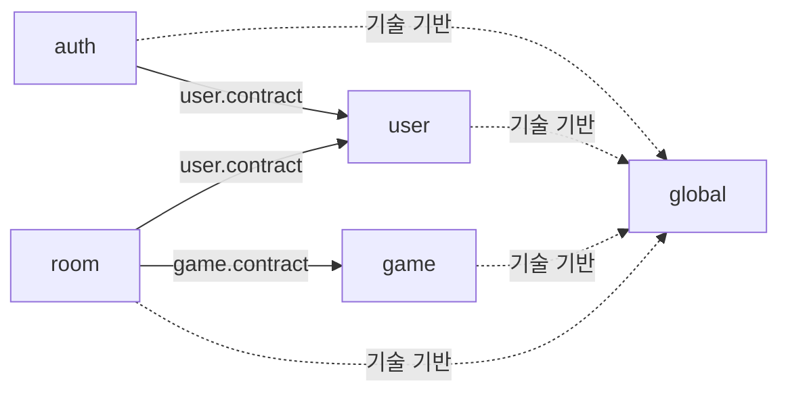

# Albam Mate Architecture

이 문서는 Albam Mate 백엔드 구현이 따라야 하는 모듈, 패키지, Interface와 주요 호출 흐름의 구조 정본이다. 구조 변경은 문서를 먼저 승인하고 후속 구현 이슈에서 코드를 이 정본에 맞춘다. 문서 승인 직후에는 적용 중인 후속 이슈가 있을 수 있으며, 각 이슈 완료 시 아래 구조 준수 기준을 검증한다.

- 모듈러 모놀리스 선택 근거: [ADR-0007](adr/platform/0007-domain-centered-modular-monolith.md)
- 낙관 락·상태 보정 트랜잭션 근거: [ADR-0005](adr/participation/0005-room-participation-optimistic-locking.md), [ADR-0012](adr/room/0012-room-request-boundary-state-reconciliation.md)
- 코드 배치·네이밍·트랜잭션 규칙: [CONVENTIONS](CONVENTIONS.md)
- 제품·HTTP·저장 계약: [P0 명세](P0-spec.md), [API 명세](API.md), [ERD](ERD.md)

## 설계 원칙

백엔드는 도메인 중심 모듈러 모놀리스로 구성한다. Controller는 HTTP 리소스 책임으로 묶고, Service는 유스케이스와 트랜잭션 경계를 드러내도록 배치한다.

- 하나의 Gradle 프로젝트와 Spring Boot 애플리케이션, 데이터베이스를 유지한다.
- `auth`, `user`, `game`, `room`을 논리적 업무 모듈로 유지한다.
- Controller는 메서드마다 만들지 않고 같은 HTTP 리소스와 변경 이유를 가진 요청을 묶는다.
- 조회와 상태 변경 유스케이스는 각각 `query`, `command`로 구분하지만 Entity, Repository와 데이터베이스까지 나누는 CQRS는 도입하지 않는다.
- 유스케이스별 Service와 Executor는 유지하고, 시간 고정·낙관 락 재시도·자동 상태 보정처럼 실패 의미와 실행 방식이 동일한 정책만 공통화한다.
- 모듈 간 협력은 상대 모듈의 `contract`만 사용한다.
- 독립 트랜잭션과 재시도가 필요한 Coordinator·Executor 분리는 유지하며, 재시도마다 최신 Entity와 version을 다시 조회한다.
- `contract`, `assembler` 같은 패키지는 실제로 공유할 계약이나 조립 책임이 생길 때만 추가한다.

이 구조는 유스케이스별 파일 소유권과 트랜잭션 경계를 유지하는 Application Service, Command–Query Separation과 필요한 정책만 추출하는 Coordinator를 함께 적용한다. 클래스 수를 줄이기 위한 거대한 Facade와 범용 추상화는 만들지 않는다.

## 모듈 관계



허용된 업무 모듈 의존 방향은 `auth → user`, `room → user`, `room → game`이다. 반대 방향의 직접 참조와 순환 의존은 허용하지 않는다.

`game`이 예정 모임 수를 필요로 할 때는 `game.contract.UpcomingRoomCountQuery`를 `room.service.query.RoomUpcomingRoomCountQuery`가 구현한다. 따라서 런타임 호출은 game에서 room으로 향해도 컴파일 시점 의존은 `room → game.contract`로 유지된다.

## 모듈 책임

| 모듈 | 책임 | 소유하지 않는 책임 |
| --- | --- | --- |
| `auth` | 회원가입·로그인·로그아웃·CSRF와 인증 요청 보호 | 사용자 프로필 HTTP 흐름 |
| `user` | 사용자 계정·자격증명·프로필·공개 사용자 조회와 `/api/users/me` | 세션 생성·폐기 |
| `game` | 게임 목록·검색·상세와 게임 요약 계약 | 방 데이터 직접 조회 |
| `room` | 방·참가 관계·정원·상태 전이·재시도·상태 보정 | 사용자·게임 내부 구현 |
| `global` | 공통 응답·예외·보안·설정·UTC 시간 기반 | 업무 Entity·DTO·규칙 |

참가 관계는 방의 정원과 상태 불변식을 같은 트랜잭션에서 변경하므로 별도 모듈이 아니라 `room`이 소유한다.

## 패키지 구조

아래 목록은 구조를 결정하는 Controller, Service, Contract와 영속성 파일을 고정한다. 세부 예외·검증·DTO 파일은 해당 도메인 폴더에 두되 HTTP 계약을 변경하지 않는다.

```text
cloud.bamsongi.albammate
├─ auth
│  ├─ controller
│  │  └─ AuthController.java
│  ├─ dto
│  │  ├─ CsrfTokenResponse.java
│  │  ├─ LoginRequest.java
│  │  ├─ SignupRequest.java
│  │  └─ UserSummary.java
│  ├─ exception
│  ├─ security
│  ├─ service
│  │  ├─ LoginCommand.java
│  │  ├─ LoginService.java
│  │  └─ SignupService.java
│  └─ validation
├─ user
│  ├─ contract
│  │  ├─ UserAccountService.java
│  │  ├─ UserQuery.java
│  │  └─ 모듈 간 계약 입·출력 값
│  ├─ controller
│  │  └─ UserProfileController.java
│  ├─ dto
│  │  ├─ UserProfileUpdateRequest.java
│  │  └─ UserProfileResponse.java
│  ├─ entity
│  │  └─ User.java
│  ├─ exception
│  ├─ repository
│  │  └─ UserRepository.java
│  ├─ service
│  │  ├─ UserAccountApplicationService.java
│  │  ├─ UserContractMapper.java
│  │  ├─ UserProfileService.java
│  │  └─ UserQueryService.java
│  └─ validation
│     ├─ NicknameValidator.java
│     └─ ValidNickname.java
├─ game
│  ├─ contract
│  │  ├─ GameQuery.java
│  │  ├─ GameSummary.java
│  │  └─ UpcomingRoomCountQuery.java
│  ├─ controller
│  │  └─ GameController.java
│  ├─ dto
│  ├─ entity
│  │  └─ Game.java
│  ├─ repository
│  │  ├─ GameListRow.java
│  │  └─ GameRepository.java
│  └─ service
│     └─ GameQueryService.java
├─ room
│  ├─ controller
│  │  ├─ RoomController.java
│  │  ├─ RoomParticipationController.java
│  │  ├─ MyRoomController.java
│  │  └─ RoomQueryParameterAllowlistValidator.java
│  ├─ dto
│  ├─ entity
│  │  ├─ Participation.java
│  │  └─ Room.java
│  ├─ enums
│  ├─ repository
│  │  ├─ ParticipationRepository.java
│  │  └─ RoomRepository.java
│  ├─ service
│  │  ├─ RoomOptimisticLockRetrier.java
│  │  ├─ query
│  │  │  ├─ RoomListQueryService.java
│  │  │  ├─ RoomListReadService.java
│  │  │  ├─ RoomDetailService.java
│  │  │  ├─ RoomDetailReadService.java
│  │  │  ├─ MyRoomQueryService.java
│  │  │  ├─ MyRoomReadService.java
│  │  │  └─ RoomUpcomingRoomCountQuery.java
│  │  └─ command
│  │     ├─ RoomCommandExecutionCoordinator.java
│  │     ├─ RoomCreateService.java
│  │     ├─ RoomUpdateService.java
│  │     ├─ RoomUpdateExecutor.java
│  │     ├─ RoomStatusChangeService.java
│  │     ├─ RoomStatusChangeExecutor.java
│  │     ├─ RoomParticipationService.java
│  │     ├─ RoomParticipationExecutor.java
│  │     ├─ RoomParticipationCancelService.java
│  │     └─ RoomParticipationCancelExecutor.java
│  └─ statuscorrection
│     ├─ RoomStatusCorrectionCoordinator.java
│     ├─ RoomStatusCorrectionExecutor.java
│     ├─ RoomStatusCorrectionScheduler.java
│     └─ RoomStatusCorrectionSchedulingConfiguration.java
└─ global
   ├─ config
   ├─ entity
   ├─ exception
   ├─ response
   ├─ security
   └─ time
```

`ReadService`, Command `Executor`, `RoomCommandExecutionCoordinator`, `RoomStatusCorrectionExecutor`, `RoomQueryParameterAllowlistValidator`는 같은 패키지의 협력자만 사용하는 package-private 구현이다. `RoomOptimisticLockRetrier`는 `service.command`와 `statuscorrection`에서 공유하므로 public이지만 직접 사용자는 `RoomCommandExecutionCoordinator`, `RoomStatusCorrectionCoordinator`로 제한한다. `RoomStatusCorrectionCoordinator`는 QueryService와 Scheduler가 사용하므로 public이다.

`statuscorrection`은 기존 코드와 ADR에서 `reconciliation` 또는 상태 정합화라고 부른 책임의 목표 패키지 이름이다. 용어와 배치만 바꾸며, 요청 경계와 Scheduler가 공유하는 자동 상태 보정 동작은 유지한다.

## Controller Interface

Controller는 엔드포인트 수가 아니라 HTTP 리소스와 책임으로 나눈다.

| Controller | 담당 요청 | 주입받는 업무 Service |
| --- | --- | --- |
| `AuthController` | CSRF, 회원가입, 로그인, 로그아웃 | `SignupService`, `LoginService` |
| `UserProfileController` | 내 프로필 조회·수정 | `UserProfileService` |
| `GameController` | 게임 목록·상세 | `GameQueryService` |
| `RoomController` | 방 목록·상세·생성·수정·취소·종료 | `RoomListQueryService`, `RoomDetailService`, `RoomCreateService`, `RoomUpdateService`, `RoomStatusChangeService` |
| `RoomParticipationController` | 방 참가·참가 취소 | `RoomParticipationService`, `RoomParticipationCancelService` |
| `MyRoomController` | 내 모임 목록 | `MyRoomQueryService` |

`UserProfileController`는 인증 기능이 아니라 사용자 프로필 리소스를 다루므로 `AuthController`에 합치지 않고 `user/controller`에 둔다. API 경로와 응답 계약은 기존 `/api/users/me`를 유지한다.

Controller 이동 뒤 프로필 유스케이스의 다른 모듈 호출자가 없으므로 `UserProfileService`는 `user.contract`에 공개하지 않고 `user/service`의 구체 진입 Service로 둔다. 프로필 HTTP DTO는 `user.validation`의 검증 Adapter를 사용하고, 회원가입과 프로필의 닉네임 검증 Adapter는 각각의 입력 경계에서 `user.contract.UserNickname` 불변식에 위임한다.

`MyRoomController`는 URL에 `/users/me`가 포함돼도 방 목록과 참가 관계를 조회하므로 `room/controller`에 유지한다. URL 접두사가 아니라 데이터와 불변식의 소유 모듈을 기준으로 배치한다.

`RoomDetailController`는 만들지 않고 상세 조회를 `RoomController`에 둔다. 참가와 참가 취소는 같은 참가 리소스를 변경하므로 `RoomParticipationController`가 함께 담당한다. `RoomQueryParameterAllowlistValidator`는 허용 목록 밖의 query parameter 이름을 거부한다.

## Service와 내부 협력자

| 구분 | 가시성 | 책임 |
| --- | --- | --- |
| `GameQueryService` | Controller·`GameQuery` 구현 | 게임 목록·상세·모듈 간 게임 요약 조회 |
| ROOM QueryService | Controller 진입점 | 요청 시각 고정, 자동 상태 보정 조정, 다른 모듈 Query 호출, 업무 판단과 응답 조립 |
| ROOM ReadService | package-private | 상태 보정 커밋 후 `REQUIRES_NEW`, `readOnly = true`로 최신 상태 조회 |
| ROOM CommandService | Controller 진입점 | 재시도 유스케이스는 대상·이벤트 이름·Executor callback을 Command 실행 Coordinator에 전달하고, 생성은 자체 트랜잭션으로 한 번 실행 |
| ROOM Command Executor | package-private | 시도마다 `REQUIRES_NEW`로 최신 Entity 조회·규칙 재검증·상태 변경 |
| `RoomCommandExecutionCoordinator` | package-private | Command 요청 시각을 한 번 고정하고 재시도 실행 순서를 공통화 |
| `RoomOptimisticLockRetrier` | public·사용자 제한 | 낙관 락 대상 예외, 최대 3회, 로그, 재시도 전 hook과 소진 시 `ROOM_CONCURRENT_MODIFICATION` 변환 |
| `RoomStatusCorrectionCoordinator` | public | 트랜잭션 밖에서 조회·Scheduler의 자동 상태 보정 재시도 조정 |
| `RoomStatusCorrectionExecutor` | package-private | 자동 상태 보정 시도마다 `REQUIRES_NEW` 쓰기 |
| `RoomUpcomingRoomCountQuery` | `UpcomingRoomCountQuery` 구현 | 게임별 예정 모임 수 조회 |

Service 수는 구조 목표로 고정하지 않는다. 참가·취소·수정·종료처럼 권한, 오류 우선순위와 업무 규칙이 다른 유스케이스는 각각의 Service와 Executor로 유지하고, 실제로 동일한 실행 정책만 공통화한다.

## 트랜잭션 흐름

### 방 조회


각 QueryService는 실행 시작 시 `Clock`으로 요청 시각을 한 번 얻고 자동 상태 보정을 먼저 커밋한 다음 대응 ReadService로 최신 상태를 읽어 업무 판단과 응답 조립을 수행한다. 보정 쓰기와 읽기 트랜잭션을 같은 메서드로 합치지 않는다.

### 방 변경


`RoomCommandExecutionCoordinator`는 요청 시각을 한 번 고정하고 `RoomOptimisticLockRetrier`를 통해 낙관 락 충돌만 최대 3회 재시도한다. 모든 시도에 같은 `Instant`를 전달하며, 각 시도는 Spring Proxy를 거쳐 대응 Executor의 새 트랜잭션에서 최신 Entity와 version을 다시 조회한다. 최신 상태로 업무 규칙을 다시 검증한 뒤 상태를 변경하고 커밋한다.

방 상태에 의존하는 Command Executor는 최신 `Room`을 조회한 직후 같은 요청 시각으로 Entity의 시간 기반 상태를 보정하고, 보정된 상태에 유스케이스 규칙을 적용한다. Query·Scheduler용 `RoomStatusCorrectionCoordinator`를 별도로 호출하지 않고 해당 Command의 쓰기 트랜잭션 안에서 처리해 API 명세의 동작과 오류 우선순위를 유지한다.

`RoomCreateService`처럼 재시도가 필요하지 않은 Command에는 Coordinator와 별도 Executor를 억지로 추가하지 않는다. CommandService와 Executor를 한 클래스에 합치면 self-invocation 때문에 `REQUIRES_NEW`가 적용되지 않을 수 있으므로 재시도하는 유스케이스의 분리는 유지한다. 같은 이유로 상태 보정 Coordinator와 Executor도 합치지 않는다.

### 현재 시각과 재시도 규칙

하나의 유스케이스 실행은 하나의 기준 시각만 사용한다.

| 실행 유형 | 시각 고정 위치 |
| --- | --- |
| 재시도하는 Command | `RoomCommandExecutionCoordinator` |
| Query | 각 QueryService 실행 시작 지점 |
| Scheduler | 스케줄 실행 시작 지점 |
| Executor·Entity | 시각을 생성하지 않고 전달받아 사용 |

- 모든 재시도는 최초에 고정한 같은 `Instant`를 사용한다.
- Executor와 Entity는 `Instant.now()`를 직접 호출하지 않는다.
- 운영 환경은 UTC `Clock`, 테스트는 고정된 `Clock`을 사용한다.
- 재시도 안에서 비멱등 외부 부수효과를 실행하지 않는다.
- `RoomOptimisticLockRetrier`는 시간과 비즈니스 규칙을 알지 않는다.
- 충돌 없음은 Entity 조회 1회, 충돌 1회는 2회, 충돌 2회는 3회로 제한한다.
- 각 시도에는 필요한 Aggregate만 조회하고 Request DTO와 최초 요청 시각은 재사용한다.
- 재시도 횟수와 소진율을 관찰한다. 충돌이 빈번하면 특정 방에 쓰기가 집중되는 hot spot으로 보고 별도 동시성 전략을 검토한다.

## 공통화 경계

다음처럼 여러 유스케이스에 실패 의미와 실행 방식이 동일한 정책만 공통화한다.

- 낙관 락 재시도 정책
- Command의 요청 시각 고정과 재시도 실행 순서
- 조회와 Scheduler가 공유하는 자동 상태 보정
- query parameter 허용 목록 검사 방식
- 여러 유스케이스에 동일하게 적용되는 Entity 불변식

다음 책임은 클래스 수를 줄이기 위해 합치지 않는다.

- 유스케이스별 Service와 Executor
- 참가·취소·수정·종료의 업무 규칙
- 권한 검증과 오류 우선순위
- API별 Request·Response DTO
- 모든 Command를 모은 Facade
- 트랜잭션 추상 부모 클래스

## Repository Projection과 DTO

`GameListRow`는 HTTP 응답 DTO가 아니라 게임 목록 쿼리가 선택한 열을 담는 Repository Projection이다. 따라서 `game.repository`에 유지한다.

`GameListItem`, `GameDetail`, `UserProfileResponse`처럼 외부 응답을 표현하는 타입은 각 모듈의 `dto`에 둔다. Entity와 Repository Projection을 Controller에서 직접 반환하지 않는다.

## 구조 검증

[ModuleArchitectureTest](../src/test/java/cloud/bamsongi/albammate/architecture/ModuleArchitectureTest.java)는 다음 공통 구조 규칙을 검사한다.

- 업무 모듈 사이의 순환 의존 금지
- 다른 업무 모듈의 `contract` 외 내부 구현 참조 금지
- `auth → user`, `room → user·game` 외 업무 모듈 의존 금지
- `global`의 업무 모듈 의존 금지
- 생산 코드의 `@Autowired` 필드·생성자·메서드 주입 금지

ROOM 구조 구현 이슈에서는 `RoomOptimisticLockRetrier` 직접 사용자를 `RoomCommandExecutionCoordinator`, `RoomStatusCorrectionCoordinator`로 제한하는 규칙을 구조 테스트에 추가한다. Controller·Service 구성과 내부 협력자 가시성은 구조 테스트만으로 확인할 수 없으므로 아래 기준을 함께 사용한다.

## 구조 준수 기준

- 각 후속 구조 구현 이슈가 완료되면 그 이슈가 맡은 실제 파일과 의존 관계가 이 문서의 패키지 구조와 일치한다.
- Controller는 Repository·Entity와 내부 ReadService·Executor를 직접 참조하지 않는다.
- ROOM 유스케이스별 Service와 Executor가 `query`, `command` 책임에 맞게 배치된다.
- 조회·Scheduler가 공유하는 자동 상태 보정 조정·실행은 `statuscorrection`에 두고 수동 취소·종료 구현과 분리한다.
- 낙관 락 재시도 테스트가 시도마다 새 트랜잭션과 최신 Entity 재조회를 검증한다.
- 재시도 테스트가 모든 시도에 같은 최초 `Instant`가 전달되는지 검증한다.
- `RoomOptimisticLockRetrier`를 허용된 두 Coordinator 외의 클래스가 직접 사용하면 구조 테스트가 실패한다.
- 상태 보정 후 조회 테스트가 보정 커밋 이후 최신 상태를 읽는 것을 검증한다.
- ModuleArchitectureTest와 관련 단위·통합 테스트가 통과한다.

## 트레이드오프

- 유스케이스별 파일을 유지하므로 Service 수와 Controller의 주입 의존성은 줄지 않는다.
- query·command·statuscorrection 하위 패키지가 늘지만 한 유스케이스의 Service와 내부 협력자를 가까이 찾을 수 있다.
- 파일 소유권이 분리되어 병렬 작업 충돌이 줄어드는 대신 여러 유스케이스에 걸친 변경은 여러 파일을 수정해야 한다.
- 서로 다른 패키지에서 공유하는 Retrier와 상태 보정 Coordinator는 public이어야 하므로 구조 테스트로 직접 사용자를 제한한다.
- 거대한 Facade와 범용 추상화를 피하는 대신 유스케이스별 중복인지 공통 실행정책인지 계속 구분해야 한다.

## 문서 갱신 기준

- 모듈 책임, 패키지, Controller·Service Interface 또는 트랜잭션 흐름이 바뀌면 이 문서를 갱신한다.
- 중요한 구조 선택의 근거나 대안이 바뀌면 ADR을 추가하거나 기존 ADR을 대체한다.
- 코드 작성 규칙이 바뀌면 [CONVENTIONS](CONVENTIONS.md)를 수정한다.
- HTTP 또는 저장 계약이 바뀌면 각각 [API 명세](API.md)와 [ERD](ERD.md)를 수정한다.
