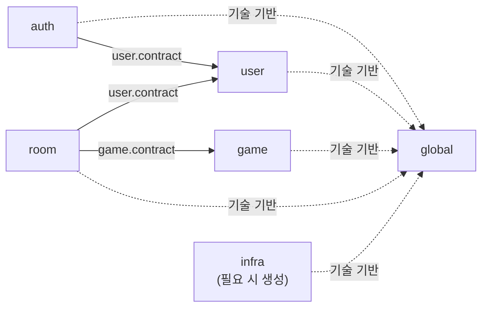
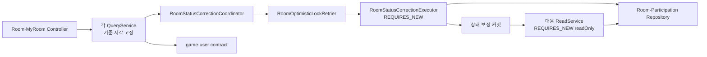
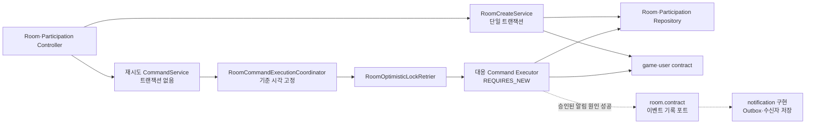
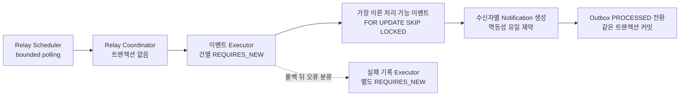

# Albam Mate Architecture

이 문서는 Albam Mate 백엔드 코드의 안정적인 구조 규칙을 설명하는 정본이다. 개별 파일·클래스·엔드포인트 목록은 관리하지 않으며, 같은 경계 안에서 기능을 추가하는 것만으로는 이 문서를 갱신하지 않는다.

본문에서 `후속` 또는 `필요 시 생성`으로 표시한 항목은 승인된 경계이지만 아직 생성되거나 자동 검증되지 않은 상태다. 그 밖의 내용은 현재 구현이 따라야 하는 구조다. 기능별 구현·검증 상태는 [README의 현재 개발 상태](../README.md#현재-개발-상태)에서 확인한다.

- 모듈러 모놀리스 선택 근거: [ADR-0007](adr/platform/0007-domain-centered-modular-monolith.md)
- 낙관 락·상태 보정 트랜잭션 근거: [ADR-0005](adr/participation/0005-room-participation-optimistic-locking.md), [ADR-0012](adr/room/0012-room-request-boundary-state-reconciliation.md)
- 알림 통합 이벤트·Outbox·relay 근거: [ADR-0029](adr/notification/0029-room-integration-event-transactional-outbox.md), [ADR-0040](adr/notification/0040-postgresql-notification-relay-recovery-retention.md)
- 알림 표시 투영·조회·읽음 시각 근거: [ADR-0039](adr/notification/0039-notification-presentation-and-bulk-read-snapshot.md)
- 코드 배치·네이밍·트랜잭션 규칙: [CONVENTIONS](CONVENTIONS.md)
- 제품·HTTP·저장 계약: [P1 명세](P1-spec.md), [P1 기능 문서](p1/README.md), [P0 완료 명세](archive/p0/P0-spec.md), [API 명세](API.md), [ERD](ERD.md)

## 이 문서를 읽는 법

| 알고 싶은 것 | 먼저 볼 절 |
| --- | --- |
| 어느 모듈이 책임지는가 | [모듈 관계](#모듈-관계), [모듈 책임](#모듈-책임) |
| 새 코드를 어디에 두는가 | [패키지 구조](#패키지-구조) |
| HTTP 요청이 어디로 들어가는가 | [Controller 진입점](#controller-interface) |
| Service·Coordinator·Executor를 왜 나누는가 | [Service 역할과 분리 기준](#service와-내부-협력자) |
| 조회·변경 트랜잭션이 어떻게 흐르는가 | [트랜잭션 흐름](#트랜잭션-흐름) |
| 변경할 때 무엇을 검사하고 문서를 갱신하는가 | [구조 검증](#구조-검증), [문서 갱신 기준](#문서-갱신-기준) |

현재 클래스와 파일을 찾을 때는 문서에 목록을 추가하지 않고 다음 소스 진입점을 사용한다.

- 전체 업무 코드: [운영 코드 루트](../src/main/java/cloud/bamsongi/albammate/)
- HTTP 진입점: [auth](../src/main/java/cloud/bamsongi/albammate/auth/controller/), [user](../src/main/java/cloud/bamsongi/albammate/user/controller/), [game](../src/main/java/cloud/bamsongi/albammate/game/controller/), [room](../src/main/java/cloud/bamsongi/albammate/room/controller/)
- 복잡한 ROOM 흐름: [query](../src/main/java/cloud/bamsongi/albammate/room/service/query/), [command](../src/main/java/cloud/bamsongi/albammate/room/service/command/), [statuscorrection](../src/main/java/cloud/bamsongi/albammate/room/statuscorrection/)
- 정확한 HTTP 경로와 응답: [API 인덱스](API.md#2-api-인덱스)

## 전체 구조

### 설계 원칙

백엔드는 도메인 중심 모듈러 모놀리스로 구성한다.

- 하나의 Gradle 프로젝트와 Spring Boot 애플리케이션, 데이터베이스를 유지한다.
- `auth`, `user`, `game`, `room`을 논리적 업무 모듈로 유지한다.
- 조회와 상태 변경 유스케이스는 각각 `query`, `command`로 구분하지만 Entity, Repository와 데이터베이스까지 나누는 CQRS는 도입하지 않는다.
- 모듈 간 협력은 상대 모듈의 `contract`만 사용한다.
- 독립 트랜잭션과 재시도가 필요한 Coordinator·Executor 분리는 유지하며, 재시도마다 최신 Entity와 version을 다시 조회한다.
- 코드 수를 줄이기 위한 통합보다 책임, 트랜잭션과 실패 경계를 드러내는 구조를 우선한다.

### 모듈 관계

다음 화살표는 런타임 호출 순서가 아니라 컴파일 시점의 의존 방향을 나타낸다.

허용된 업무 모듈 의존 방향은 `auth → user`, `room → user`, `room → game`이다. 반대 방향의 직접 참조와 순환 의존은 허용하지 않는다.

런타임 호출 방향과 컴파일 의존 방향이 다를 수 있다. 예를 들어 `game`이 예정 모임 수를 조회할 때는 [`game.contract.UpcomingRoomCountQuery`](../src/main/java/cloud/bamsongi/albammate/game/contract/UpcomingRoomCountQuery.java)를 [`room.service.query.RoomUpcomingRoomCountQuery`](../src/main/java/cloud/bamsongi/albammate/room/service/query/RoomUpcomingRoomCountQuery.java)가 구현한다. 런타임 호출은 game에서 room으로 이어지지만, 컴파일 의존은 `room → game.contract`로 유지된다.

업무 모듈이 외부 시스템에 요청하는 포트는 이를 소유한 `<module>/contract`에 둔다. `infra`는 이 포트를 구현하고 필요한 업무 모듈의 `contract`와 `global`만 참조한다. 현재 운영 코드에는 `infra` 패키지가 없으며, 첫 외부 어댑터가 필요할 때 생성한다. 업무 모듈은 `infra`의 구체 구현을 직접 참조하지 않는다.

### 모듈 책임

| 모듈 또는 경계 | 책임 | 소유하지 않는 책임 |
| --- | --- | --- |
| `auth` | 회원가입·로그인·로그아웃·CSRF와 인증 요청 보호 | 사용자 프로필 HTTP 흐름 |
| `user` | 사용자 계정·자격증명·프로필·공개 사용자 조회 | 세션 생성·폐기 |
| `game` | 게임 목록·검색·상세와 게임 요약 계약 | 방 데이터 직접 조회 |
| `room` | 방·참가 관계·정원·상태 전이·재시도·상태 보정 | 사용자·게임 내부 구현 |
| `global` | 공통 응답·예외·보안·설정·UTC 시간 기반 | 업무 Entity·DTO·규칙 |
| `infra` | 필요 시 생성하는 외부 시스템 연동·기술 어댑터 경계 | 업무 규칙·Entity·HTTP DTO |

참가 관계는 방의 정원과 상태 불변식을 같은 트랜잭션에서 변경하므로 별도 모듈이 아니라 `room`이 소유한다. URL 경로보다 데이터와 불변식을 소유한 모듈을 우선한다.
### P1 알림 모듈 계약

> 현재 생산 코드·자동 검증·운영 상태는 [P1 기능 상태 정본의 `NOTI-01`~`NOTI-03`](p1/README.md#기능별-현재-상태)을 따른다.

`notification`은 서비스 내 웹 알림 조회·읽음, Outbox·수신자 스냅샷·Notification 저장, relay·재시도·운영 복구·보존 정리를 소유한다. 방 상태 전이와 수신자 재계산, 이메일·모바일 푸시·Web Push·SMS 전달은 소유하지 않는다.

`room.contract`가 승인된 방 변경 이벤트와 기록 포트를 소유하고 `notification`이 포트를 구현한다. 최종 성공한 Room Command Executor가 런타임에 기록 포트를 호출하더라도 `room`은 자기 계약만 알고, 컴파일 의존은 `notification → room.contract`로 유지한다. `room`은 알림 문구·Outbox·relay·읽음 정책을 참조하지 않는다.

알림 코드는 `notification/service/query`, `notification/service/command`, `notification/relay`, `notification/recovery`, `notification/cleanup`의 책임 경계에 배치한다. `/api/users/me/notifications` 하위 조회·읽음은 URL 접두사가 아니라 데이터와 불변식 소유권에 따라 P1 `NotificationController`가 담당한다.

### 패키지 구조

패키지는 파일 목록이 아니라 책임 경계로 관리한다. 다음 패턴 안에서 클래스나 하위 구현을 추가할 때는 이 문서를 갱신하지 않는다.

| 경로 패턴 | 책임 |
| --- | --- |
| `<module>/contract` | 다른 모듈에 공개하는 호출 계약, 값 타입과 외부 포트 |
| `<module>/controller` | HTTP 요청·응답 경계 |
| `<module>/dto` | 해당 모듈의 HTTP 요청·응답 타입 |
| `<module>/entity`, `<module>/repository` | 영속 Aggregate와 저장·조회 계약 |
| `<module>/service` | 유스케이스와 트랜잭션 조정 |
| 기존 `<module>/exception`, `validation`, `security`, `enums` | 예외·입력 검증·보안·도메인 타입처럼 모듈 내부에서만 쓰는 보조 책임 |
| `room/service/query` | ROOM 조회 유스케이스와 조회 전용 내부 협력자 |
| `room/service/command` | ROOM 변경 유스케이스, Coordinator와 Executor |
| `room/enums` | ROOM Entity·DTO가 공유하는 방·참가 도메인 타입 |
| `room/statuscorrection` | Query·Scheduler가 공유하는 자동 상태 보정 |
| `global` | 업무 의미가 없는 공통 기술 기반 |
| `infra` | 필요 시 생성하는 외부 시스템 어댑터 구현 |

필요한 구현만 만들며 빈 폴더를 미리 생성하지 않는다. `contract`도 다른 모듈에 공개할 계약이나 `infra`가 구현할 포트가 생길 때만 추가한다. 표는 모든 모듈에 모든 패키지를 허용한다는 뜻이 아니다. 기존 패키지에 파일을 추가할 때는 갱신하지 않지만, 모듈에 새로운 최상위 책임 패키지를 만들 때는 이 절과 구조 검사를 함께 확인한다.

## 요청 처리 구조

### Controller Interface

여기서 Interface는 Java `interface` 선언이 아니라 외부 요청에 노출하는 HTTP 진입 경계를 뜻한다. 전체 Controller와 엔드포인트 목록은 코드와 [API 인덱스](API.md#2-api-인덱스)가 소유한다.

- Controller는 엔드포인트 수가 아니라 HTTP 리소스와 책임으로 나눈다.
- 각 엔드포인트는 하나의 유스케이스 Service에 업무 처리를 위임한다. 한 Controller가 여러 Service를 주입받는다는 이유만으로 Facade를 추가하지 않는다.
- Controller는 Request 검증, 인증 사용자 식별, Service 호출과 HTTP 응답 변환만 담당한다.
- Repository, ReadService, Executor와 상태 전이 규칙을 Controller에서 직접 사용하지 않는다.
- URL 접두사보다 데이터와 불변식을 소유한 모듈에 배치한다.

다음은 전체 목록이 아니라 모듈 소유권을 설명하는 대표 예시다.

| 요청 성격 | 배치 원칙 | 현재 예시 |
| --- | --- | --- |
| CSRF·가입·로그인·로그아웃 | 인증 HTTP 경계이므로 `auth`가 소유 | `AuthController` |
| 내 프로필 조회·수정 | 인증 기능이 아니라 사용자 리소스이므로 `user`가 소유 | `UserProfileController` |
| 방 조회·생성·상태 변경·참가 | 방과 참가 불변식을 다루므로 `room`이 소유 | `RoomController`, `RoomParticipationController` |
| `/api/users/me/rooms` 조회 | URL에 `users`가 있어도 방과 참가 관계를 조회하므로 `room`이 소유 | `MyRoomController` |

기존 책임 안에서 Controller나 엔드포인트를 추가하는 것은 아키텍처 변경이 아니다. Controller의 분리 기준이나 모듈 소유권이 바뀔 때만 이 절을 갱신한다.

### Service와 내부 협력자

유스케이스마다 필요한 Service는 소스 코드가 소유하며, 이 문서는 클래스 목록 대신 역할과 분리 조건을 정한다.

| 역할 | 책임과 경계 |
| --- | --- |
| Controller-facing Service | 하나의 유스케이스를 조정하고 Controller가 호출하는 진입점을 제공한다. |
| QueryService | 기준 시각을 고정하고 필요하면 상태 보정을 완료한 뒤 최신 상태를 읽어 응답을 조립한다. |
| ReadService | 상태 보정 커밋 뒤 별도의 읽기 전용 트랜잭션에서 최신 상태를 조회한다. |
| CommandService | 변경 유스케이스 입력을 받고 기준 시각·재시도 실행을 조정한다. |
| Command Executor | 독립 트랜잭션에서 최신 Entity 조회, 규칙 검증과 상태 변경을 수행한다. |
| Coordinator | 트랜잭션 밖에서 기준 시각, 실행 순서와 재시도를 조정한다. |
| Retrier | 낙관 락 충돌의 재시도·로그·오류 변환만 담당한다. |
| StatusCorrection Coordinator·Executor | Query·Scheduler가 공유하는 자동 상태 보정을 트랜잭션 밖 조정과 독립 트랜잭션 실행으로 나눈다. |
| Integration Event Recorder | `room.contract`의 기록 포트를 구현하고 호출한 Room Command Executor의 트랜잭션에 참여해 Outbox 이벤트와 수신자 스냅샷만 저장한다. |
| Notification Relay Coordinator·Executor | polling과 최대 처리 수는 트랜잭션 밖에서 조정하고, 선점·Notification 생성·완료 전환은 이벤트별 독립 트랜잭션에서 수행한다. |
| Notification Recovery·Cleanup | 운영 명령 adapter와 Scheduler는 Repository를 직접 사용하지 않으며, application service·Executor가 제한된 묶음의 상태 전환과 물리 삭제 트랜잭션을 소유한다. |

클래스 가시성은 호출 범위에서 가장 좁게 둔다. 같은 패키지에서만 쓰는 ReadService·Executor·Coordinator는 package-private으로 두고, 다른 패키지에서 호출해야 하는 Coordinator와 Retrier만 `public`으로 공개한다. Spring Proxy가 트랜잭션을 적용하거나 다른 패키지에서 호출하는 진입 메서드는 클래스 가시성과 별개로 `public`일 수 있다.

Service, ReadService, Executor와 Coordinator를 이름이나 클래스 수만 보고 합치지 않는다. 트랜잭션, 재시도, 최신 상태 재조회 또는 여러 호출자가 공유하는 실행 순서가 실제 분리 근거다. 이 근거가 사라지거나 새 역할이 생길 때만 이 절을 갱신한다.

### 트랜잭션 흐름

#### 방 조회

방 조회는 [ADR-0012](adr/room/0012-room-request-boundary-state-reconciliation.md)의 요청 경계 상태 보정 규칙을 따른다.

QueryService는 기준 시각을 고정하고 상태 보정 커밋을 기다린 뒤 ReadService로 최신 상태를 읽는다. ReadService는 별도의 `REQUIRES_NEW`, `readOnly = true` 트랜잭션을 사용한다.

#### 방 변경

재시도하는 방 변경은 [ADR-0005](adr/participation/0005-room-participation-optimistic-locking.md)의 낙관 락 규칙을 따른다.

Coordinator는 기준 시각을 고정하고 낙관 락 충돌만 재시도한다. 각 Executor 시도는 Spring Proxy를 거친 `REQUIRES_NEW` 트랜잭션에서 최신 Entity와 version을 다시 조회한다.

상태 의존 Command는 같은 트랜잭션에서 시간 기반 상태를 먼저 보정한 뒤 유스케이스 규칙을 적용한다. Query·Scheduler용 상태 보정 Coordinator는 호출하지 않는다.

시간 기반 상태 전이 규칙은 `Room` Entity의 단일 보정 메서드가 소유한다. statuscorrection Executor와 상태 의존 Command Executor는 이 메서드를 호출만 하며 전이 조건을 복제하지 않는다.

참가·재참가, 참가 취소와 방 취소의 최종 성공 Executor는 기존 `REQUIRES_NEW` 트랜잭션 안에서 `room.contract`의 기록 포트를 호출한다. 포트 구현은 새 트랜잭션을 열지 않고 호출자 트랜잭션에 반드시 참여해 원인 이벤트와 확정 수신자만 저장한다. Outbox 기록 실패, 업무 실패와 낙관 락 충돌 시도는 Room 변경과 함께 롤백된다. 방 취소 수신자는 같은 트랜잭션의 현재 `ACTIVE` 참가자로 고정하며 relay가 다시 계산하지 않는다. 수신자가 없는 방 취소는 Outbox 없이 방 변경만 커밋한다.

이 흐름은 기존 Command Coordinator·Retrier·Executor 경계를 바꾸지 않는다. 알림 원인이 아닌 방 수정·종료·자동 종료·상태 보정은 기록 포트를 호출하지 않으며, 재시도 밖에서 별도의 best-effort 이벤트를 만들지 않는다.

일괄 보정 대상 선별 쿼리는 전이 경계에서 파생된 후보 축소 조건이며 Entity의 전이 대상을 빠뜨리지 않아야 한다. 쿼리가 더 넓은 후보를 반환할 수 있지만 최종 전이 여부는 `Room` Entity가 판단한다. Entity의 전이 경계를 바꿀 때는 선별 쿼리와 경계 테스트를 함께 갱신한다.

재시도하지 않는 단일 트랜잭션 유스케이스에는 Coordinator와 Executor를 추가하지 않는다. 재시도가 필요할 때만 Spring Proxy가 독립 트랜잭션을 적용할 수 있도록 Service와 Executor를 분리한다.

#### 기준 시각과 재시도

하나의 유스케이스 실행은 하나의 기준 시각만 사용한다.

| 실행 유형 | 기준 시각 결정 위치 |
| --- | --- |
| 재시도하는 Command | Command Coordinator |
| Query | 각 QueryService 실행 시작 지점 |
| Scheduler | 스케줄 실행 시작 지점 |
| Notification 목록·미확인 개수의 만료 판정 | 각 QueryService 읽기 트랜잭션의 PostgreSQL `transaction_timestamp()` |
| Outbox 최초·재시도·수동 재처리 `availableAt`과 relay due·oldest 판정 | 각 DB 쓰기·조회가 PostgreSQL에서 한 번 고정한 `operationTime` |
| Notification 기록 | relay 이벤트 Executor가 PostgreSQL에서 한 번 조회한 `operationTime` |
| Notification 단건·일괄 읽음 | 읽음 SQL 내부에서 한 번 평가한 PostgreSQL `clock_timestamp()` |
| Notification·Outbox cleanup due 판정 | cleanup Executor가 batch 트랜잭션 안에서 한 번 조회한 PostgreSQL `clock_timestamp()` |
| Executor·Entity | 시각을 생성하지 않고 전달받아 사용 |

- 모든 재시도는 최초에 고정한 같은 `Instant`를 사용한다.
- Executor와 Entity는 `Instant.now()`를 직접 호출하지 않는다.
- Notification 조회 `queryTime`, Outbox·Notification의 `recordedAt`과 Notification의 `readAt`은 [ADR-0039](adr/notification/0039-notification-presentation-and-bulk-read-snapshot.md)에 따라 PostgreSQL 시각을 사용한다. `queryTime`은 읽기 트랜잭션의 `transaction_timestamp()`, 기록·읽음 작업 시각은 SQL에서 고정한 `clock_timestamp()`다. 애플리케이션 `Clock`의 업무 시각인 `occurredAt`·`createdAt`과는 상대 순서를 보장하지 않는다.
- Retrier는 [ADR-0005](adr/participation/0005-room-participation-optimistic-locking.md)가 정한 대상 예외·상한·로그·재시도 전 hook과 소진 오류 변환을 관리한다.
- 각 시도에는 필요한 Aggregate만 조회하고 Request DTO와 최초 기준 시각은 재사용한다.
- 재시도 안에서 비멱등 외부 부수효과를 실행하지 않는다.
- 재시도 로그로 충돌과 소진을 추적하며, 충돌이 빈번하면 특정 방에 쓰기가 집중되는 hot spot으로 보고 별도 동시성 전략을 검토한다.

#### 알림 relay·복구·정리

> 이 절은 P1 아키텍처 계약이다. 현재 생산 코드·자동 검증·운영 상태는 [P1 기능 상태 정본의 `NOTI-01`~`NOTI-03`](p1/README.md#기능별-현재-상태)을 따른다.

알림 생성은 원인 업무 커밋 뒤 모든 애플리케이션 인스턴스가 실행하는 PostgreSQL polling relay가 담당한다.

이 절은 모듈·트랜잭션 책임과 호출 흐름만 소유한다. relay 주기·처리 상한·재시도·보존·복구·cleanup의 현재 수치는 [알림 운영 파라미터 정본](guides/NOTIFICATION_OPERATIONS.md#현재-운영-파라미터-정본), 결정 이유는 [ADR-0040](adr/notification/0040-postgresql-notification-relay-recovery-retention.md), 저장 필드·제약은 [ERD의 P1 알림 저장 계약](ERD.md#p1-알림-저장-계약)을 따른다. 이 문서에는 운영 수치나 아직 ERD에 반영되지 않은 물리 구조를 다시 정의하지 않는다.

- Coordinator는 batch 전체 트랜잭션이나 무제한 drain loop를 만들지 않고 이벤트마다 Spring Proxy를 거쳐 Executor를 호출한다.
- 이벤트 Executor는 SQL의 `MATERIALIZED operation` CTE에서 PostgreSQL `clock_timestamp()`를 한 번 고정하고 `availableAt`이 그 `operationTime` 이하인 이벤트를 `SKIP LOCKED`로 한 건 선점한다. Notification 생성과 `PROCESSED` 전환은 함께 커밋하거나 함께 롤백한다.
- 이벤트 Executor는 PostgreSQL `clock_timestamp()`를 한 번 조회해 `operationTime`으로 고정하고 같은 이벤트에서 새로 만드는 모든 Notification의 `recordedAt`에 전달한다. 알림 목록·페이지 count와 미확인 개수는 각 QueryService가 소유한 짧은 읽기 트랜잭션의 `transaction_timestamp()`로 만료를 판정하며, 단건·일괄 읽음 SQL은 내부에서 `clock_timestamp()`를 한 번 평가한 `operationTime`을 `readAt`과 만료 판정에 사용한다.
- 처리 트랜잭션이 롤백되면 Coordinator가 별도 독립 트랜잭션으로 PostgreSQL `operationTime`을 고정해 재시도 `availableAt` 또는 `FAILED` 상태를 조건부 기록한다. 이미 다른 worker가 `PROCESSED`로 끝낸 이벤트를 뒤늦은 실패 기록이 덮어쓰지 않는다.
- relay 트랜잭션에는 외부 네트워크 호출을 넣지 않는다. 재시도 간격·상한과 상태별 보존 수치는 [운영 파라미터 정본](guides/NOTIFICATION_OPERATIONS.md#현재-운영-파라미터-정본)을 따른다.

운영 복구와 정리는 relay 처리와 패키지·진입점을 분리한다.

- `notification/recovery`의 일회성 운영 명령 adapter는 트랜잭션을 시작하거나 Repository·직접 SQL을 사용하지 않고 `NotificationOutboxRecoveryService`에 위임한다. Service는 `OPS_MAX_EVENT_IDS` 이하의 `FAILED` 이벤트 ID를 오름차순 정규화하고 하나의 `ORDER BY id FOR UPDATE` 조회로 잠근 뒤 전체 검증하여 재처리 대기 또는 폐기로 전환하는 짧은 상태 변경 트랜잭션을 소유한다. 공개 HTTP API는 두지 않는다.
- `notification/cleanup`의 Scheduler·Coordinator는 트랜잭션 밖에서 실행 주기와 bounded 반복만 조정하고 만료 판정 시각을 만들지 않는다. Executor는 각 batch 독립 트랜잭션 안에서 PostgreSQL `clock_timestamp()`를 한 번 조회해 `measurementTime`으로 고정하고, due 선점·삭제 조건과 완료·실패 로그에 같은 값을 사용한다. 한 트랜잭션에서 전체 보존 데이터를 비우지 않는다.
- cleanup은 `PROCESSED`·`DISCARDED` Outbox의 `cleanupAt`과 Notification의 `expiresAt`만 사용한다. `PENDING`, `RETRY_WAIT`, `FAILED` 이벤트는 자동 삭제하지 않는다. 각 시각을 계산하는 보존 파라미터는 운영 정본이 소유한다.

## 유지 규칙

### 공통화 경계

여러 유스케이스에서 실패 의미와 실행 방식이 동일한 정책만 공통화한다.

- 낙관 락 재시도 정책
- Command의 기준 시각 고정과 재시도 실행 순서
- 조회와 Scheduler가 공유하는 자동 상태 보정
- 여러 유스케이스에 동일하게 적용되는 Entity 불변식

다음 책임은 클래스 수를 줄이기 위해 합치지 않는다.

- 유스케이스별 Service와 Executor
- 참가·취소·수정·종료의 업무 규칙
- 권한 검증과 오류 우선순위
- API별 Request·Response DTO
- 모든 Command를 모은 Facade
- 트랜잭션 추상 부모 클래스
- 클래스 수 감축 자체를 위한 통합

### Repository Projection과 DTO

Repository Projection은 쿼리가 선택한 열을 담는 저장소 계층 타입이며 `repository`에 둔다. HTTP 응답을 표현하는 타입은 각 모듈의 `dto`에 둔다. Entity와 Repository Projection을 Controller에서 직접 반환하지 않는다.

예를 들어 `GameListRow`는 Repository Projection이고, `GameListItem`, `GameDetail`, `UserProfileResponse`는 외부 응답 DTO다. 이 예시와 같은 타입이 추가되는 것만으로는 문서를 갱신하지 않는다.

### 구조 검증

[ModuleArchitectureTest](../src/test/java/cloud/bamsongi/albammate/architecture/ModuleArchitectureTest.java)는 현재 다음 구조 규칙을 검사한다.

- 업무 모듈 사이의 순환 의존 금지
- 다른 업무 모듈의 `contract` 외 내부 구현 참조 금지
- `auth → user`, `room → user·game`, `notification → room` 외 업무 모듈 의존 금지
- `global`의 업무 모듈 의존 금지
- 생산 코드의 `@Autowired` 필드·생성자·메서드 주입 금지
- ROOM 코드를 `contract`를 포함해 이 문서가 허용한 패키지에만 배치
- P1 Notification 코드를 조회·변경·relay·recovery·cleanup 책임에 맞는 허용 패키지에만 배치
- Retrier 직접 사용자를 `RoomCommandExecutionCoordinator`, `RoomStatusCorrectionCoordinator`로 제한

현재 `infra` 패키지가 없으므로 다음 규칙은 [FND-07의 후속 범위](archive/p0/foundation.md#fnd-07-모듈-구조-검증)다. 첫 외부 어댑터를 추가할 때 같은 변경에서 ArchUnit 규칙을 구현하고 위의 현재 목록으로 옮긴다.

- `infra`가 업무 모듈의 `contract` 밖 내부 구현에 의존하지 않는다.
- 업무 모듈이 `infra`의 구체 구현을 참조하지 않는다.

`notification` 모듈의 현재 구현·검증 여부는 [P1 기능 상태 정본](p1/README.md#기능별-현재-상태)으로 판정한다. 구조 테스트에 모듈·허용 의존·패키지 규칙을 먼저 등록하거나 빈 패키지를 추가한 사실만으로 생산 코드·자동 검증 상태를 완료로 바꾸지 않는다. ADR-0029·ADR-0039·ADR-0040의 트랜잭션·잠금·복구·정리·표시·읽음 결정은 요구된 생산 코드와 PostgreSQL 검증 증거를 모두 갖춰야 한다.

트랜잭션과 상태 보정은 다음 테스트에서 구현 규칙을 확인할 수 있다.

- 재시도와 소진: [RoomOptimisticLockRetrierTest](../src/test/java/cloud/bamsongi/albammate/room/service/RoomOptimisticLockRetrierTest.java)
- 동일 기준 시각과 상태 보정 재시도: [RoomStatusCorrectionCoordinatorTest](../src/test/java/cloud/bamsongi/albammate/room/statuscorrection/RoomStatusCorrectionCoordinatorTest.java)
- 상태 보정 독립 트랜잭션: [RoomStatusCorrectionExecutorTest](../src/test/java/cloud/bamsongi/albammate/room/statuscorrection/RoomStatusCorrectionExecutorTest.java)
- 보정 뒤 최신 상태 조회: [ROOM query 테스트](../src/test/java/cloud/bamsongi/albammate/room/service/query/)
- 일괄 보정 후보 선별: [RoomRepositoryTest](../src/test/java/cloud/bamsongi/albammate/room/repository/RoomRepositoryTest.java)

파일 개수가 아니라 변경한 책임, 의존 방향과 트랜잭션 경계를 문서와 테스트에 대조한다.

### 트레이드오프

- 유스케이스별 Service를 유지하므로 클래스 수는 줄지 않지만, 정확한 목록은 소스 코드가 소유해 문서 갱신 부담을 늘리지 않는다.
- query·command·statuscorrection 하위 패키지가 늘지만 한 유스케이스의 Service와 내부 협력자를 가까이 찾을 수 있다.
- notification의 relay·recovery·cleanup 패키지가 늘지만 자동 처리, 운영자 조치와 보존 정리의 진입점·트랜잭션을 서로 격리한다.
- 파일 소유권이 분리되어 병렬 작업 충돌이 줄어드는 대신 여러 유스케이스에 걸친 변경은 여러 파일을 수정해야 한다.
- 문서가 모든 클래스를 일대일로 설명하지 않는 대신 소스 진입점과 자동 검증으로 현재 구현을 확인한다.

### 문서 갱신 기준

같은 아키텍처 안에서 기능을 추가하는 일과 아키텍처 자체를 바꾸는 일을 구분한다.

| 변경 | 이 문서 갱신 | 함께 확인할 정본 |
| --- | --- | --- |
| 기존 책임·패키지 안에 클래스나 파일 추가·삭제 | 하지 않음 | 코드와 테스트 |
| 기존 Controller 책임 안에 엔드포인트 추가 | 하지 않음 | [API 명세](API.md), 기능 명세 |
| 기존 역할 패턴으로 Service·ReadService·Executor 추가 | 하지 않음 | 코드와 트랜잭션 테스트 |
| 모듈 책임, 공개 `contract` 소유권 또는 의존 방향 변경 | 필요 | ADR, ModuleArchitectureTest |
| 기존 패턴으로 설명할 수 없는 패키지 책임 추가 | 필요 | [CONVENTIONS](CONVENTIONS.md), ModuleArchitectureTest |
| Controller 분리 기준 또는 모듈 소유권 변경 | 필요 | [API 명세](API.md), Controller 테스트 |
| 트랜잭션·재시도·상태 보정 흐름 변경 | 필요 | ADR, 관련 단위·통합 테스트 |
| 구조 규칙의 자동 검증 상태 변경 | 필요 | ModuleArchitectureTest, CI |

중요한 구조 선택의 근거나 대안이 바뀌면 ADR을 추가하거나 기존 ADR을 대체한다. 코드 작성 규칙은 [CONVENTIONS](CONVENTIONS.md), HTTP 계약은 [API 명세](API.md), 저장 계약은 [ERD](ERD.md)가 각각 소유한다.
