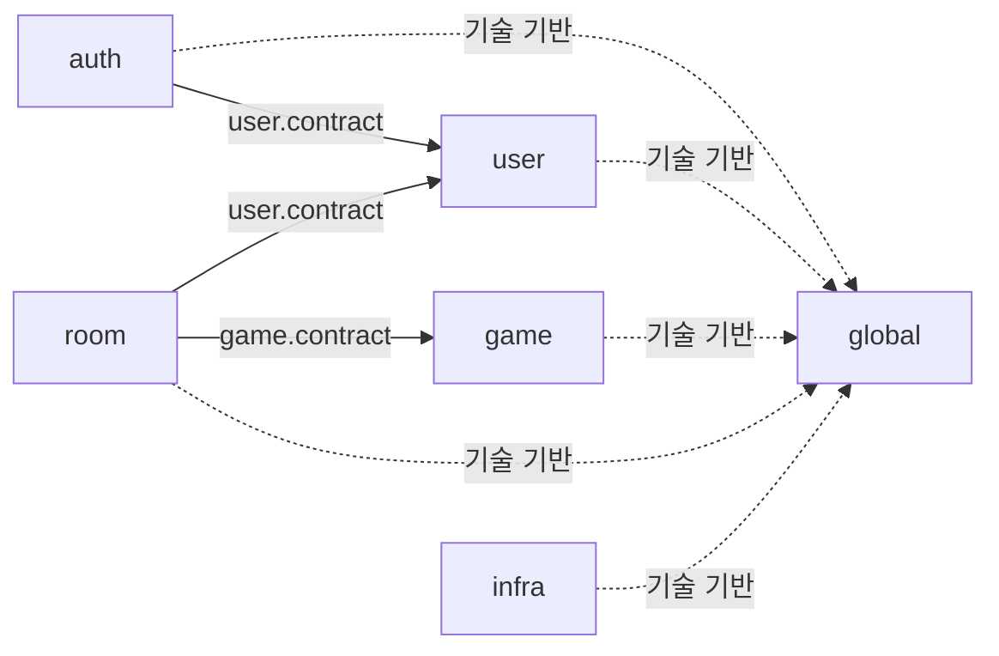
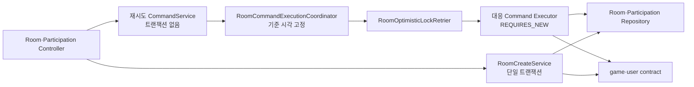

# Albam Mate Architecture

이 문서는 백엔드 모듈, 폴더, Interface와 주요 호출 흐름의 구조 정본이다. 구조 변경은 문서를 먼저 승인하고 후속 구현 이슈에서 적용한다. 각 이슈는 아래 구조 검증 기준을 따른다.

- 모듈러 모놀리스 선택 근거: [ADR-0007](adr/platform/0007-domain-centered-modular-monolith.md)
- 낙관 락·상태 보정 트랜잭션 근거: [ADR-0005](adr/participation/0005-room-participation-optimistic-locking.md), [ADR-0012](adr/room/0012-room-request-boundary-state-reconciliation.md)
- 코드 배치·네이밍·트랜잭션 규칙: [CONVENTIONS](CONVENTIONS.md)
- 제품·HTTP·저장 계약: [P0 명세](P0-spec.md), [API 명세](API.md), [ERD](ERD.md)

## 설계 원칙

백엔드는 도메인 중심 모듈러 모놀리스로 구성한다.

- 하나의 Gradle 프로젝트와 Spring Boot 애플리케이션, 데이터베이스를 유지한다.
- `auth`, `user`, `game`, `room`을 논리적 업무 모듈로 유지한다.
- 조회와 상태 변경 유스케이스는 각각 `query`, `command`로 구분하지만 Entity, Repository와 데이터베이스까지 나누는 CQRS는 도입하지 않는다.
- 모듈 간 협력은 상대 모듈의 `contract`만 사용한다.
- 독립 트랜잭션과 재시도가 필요한 Coordinator·Executor 분리는 유지하며, 재시도마다 최신 Entity와 version을 다시 조회한다.

## 모듈 관계



위 다이어그램은 고정된 업무 모듈 간 의존과 공통 기술 기반만 표시한다. 포트마다 달라지는 `infra → <module>.contract` 의존은 고정 엣지로 그리지 않고 아래 규칙으로 관리한다.

허용된 업무 모듈 의존 방향은 `auth → user`, `room → user`, `room → game`이다. 반대 방향의 직접 참조와 순환 의존은 허용하지 않는다.

`game`이 예정 모임 수를 필요로 할 때는 `game.contract.UpcomingRoomCountQuery`를 `room.service.query.RoomUpcomingRoomCountQuery`가 구현한다. 따라서 런타임 호출은 game에서 room으로 향해도 컴파일 시점 의존은 `room → game.contract`로 유지된다.

업무 모듈이 외부 시스템에 요청하는 포트 인터페이스는 이를 소유한 `<module>/contract`에 둔다. `infra`는 이 포트를 구현하고 Albam Mate 내부에서는 필요한 업무 모듈의 `contract`와 `global`만 참조한다. 한 업무 모듈에서만 사용하는 경우에도 외부 시스템 어댑터 구현은 `infra`에 두며, 업무 모듈은 `infra`의 구체 구현을 직접 참조하지 않는다.

## 모듈 책임

| 모듈 | 책임 | 소유하지 않는 책임 |
| --- | --- | --- |
| `auth` | 회원가입·로그인·로그아웃·CSRF와 인증 요청 보호 | 사용자 프로필 HTTP 흐름 |
| `user` | 사용자 계정·자격증명·프로필·공개 사용자 조회와 `/api/users/me` | 세션 생성·폐기 |
| `game` | 게임 목록·검색·상세와 게임 요약 계약 | 방 데이터 직접 조회 |
| `room` | 방·참가 관계·정원·상태 전이·재시도·상태 보정 | 사용자·게임 내부 구현 |
| `global` | 공통 응답·예외·보안·설정·UTC 시간 기반 | 업무 Entity·DTO·규칙 |
| `infra` | 외부 시스템 연동·기술 어댑터 | 업무 규칙·Entity·HTTP DTO |

참가 관계는 방의 정원과 상태 불변식을 같은 트랜잭션에서 변경하므로 별도 모듈이 아니라 `room`이 소유한다.

## 패키지 구조

아래 트리는 패키지 경계만 고정하며 파일 목록은 관리하지 않는다. 새 파일은 책임에 맞는 기존 폴더에 추가하고, 폴더의 책임이나 의존 방향이 바뀔 때만 이 문서를 갱신한다.

```text
cloud.bamsongi.albammate/
├─ auth/
│  ├─ controller/
│  ├─ dto/
│  ├─ exception/
│  ├─ security/
│  ├─ service/
│  └─ validation/
├─ user/
│  ├─ contract/
│  ├─ controller/
│  ├─ dto/
│  ├─ entity/
│  ├─ exception/
│  ├─ repository/
│  ├─ service/
│  └─ validation/
├─ game/
│  ├─ contract/
│  ├─ controller/
│  ├─ dto/
│  ├─ entity/
│  ├─ repository/
│  └─ service/
├─ room/
│  ├─ controller/
│  ├─ dto/
│  ├─ entity/
│  ├─ enums/
│  ├─ repository/
│  ├─ service/
│  │  ├─ query/
│  │  └─ command/
│  └─ statuscorrection/
├─ global/
│  ├─ config/
│  ├─ entity/
│  ├─ exception/
│  ├─ response/
│  ├─ security/
│  └─ time/
└─ infra/
```

`contract`는 다른 모듈에 공개할 계약이나 `infra`가 구현할 포트가 생길 때 추가한다. `assembler` 같은 내부 폴더는 실제 책임이 생길 때 추가한다. `statuscorrection`은 기존 `reconciliation`과 같은 자동 상태 보정 책임을 뜻한다.

## Controller Interface

Controller는 엔드포인트 수가 아니라 HTTP 리소스와 책임으로 나눈다.

| Controller | 담당 요청 | 주입받는 업무 Service |
| --- | --- | --- |
| `AuthController` | CSRF, 회원가입, 로그인, 로그아웃 | `SignupService`, `LoginService` |
| `UserProfileController` | 내 프로필 조회·수정 | `UserProfileService` |
| `GameController` | 게임 목록·상세 | `GameQueryService` |
| `RoomController` | 방 목록·상세·생성·수정·취소·종료 | `RoomListQueryService`, `RoomDetailService`, `RoomCreateService`, `RoomUpdateService`, `RoomStatusChangeService` |
| `RoomParticipationController` | 방 참가·참가 취소 | `RoomParticipationService`, `RoomParticipationCancelService` |
| `MyRoomController` | 내 모임 목록 | `MyRoomQueryService` |

`UserProfileController`는 인증 기능이 아니라 사용자 프로필 리소스를 다루므로 `AuthController`에 합치지 않고 `user/controller`에 둔다. API 경로와 응답 계약은 기존 `/api/users/me`를 유지한다.

프로필 유스케이스는 외부 모듈 호출자가 없으므로 `UserProfileService`를 `user/service`에 둔다. 프로필 DTO는 `user.validation`을 사용하고, 회원가입·프로필의 닉네임 검증은 `user.contract.UserNickname` 불변식에 위임한다.

`MyRoomController`는 URL에 `/users/me`가 포함돼도 방 목록과 참가 관계를 조회하므로 `room/controller`에 유지한다. URL 접두사가 아니라 데이터와 불변식의 소유 모듈을 기준으로 배치한다.

상세 조회는 `RoomController`, 참가·참가 취소는 `RoomParticipationController`가 담당한다. 기존 `RoomQueryParameterValidator`는 책임을 드러내는 `RoomQueryParameterAllowlistValidator`로 이름을 바꾼다. 이 package-private helper는 허용 목록 밖의 query parameter 이름을 거부한다.

## Service와 내부 협력자

| 구분 | 클래스 가시성 | 책임 |
| --- | --- | --- |
| `GameQueryService` | public | 게임 목록·상세·`GameQuery` 계약 구현 |
| room QueryService | public | 조회 조정·업무 판단·응답 조립 |
| room ReadService | package-private | 상태 보정 후 최신 상태 조회 |
| room CommandService | public | 변경 유스케이스 조정 |
| room Command Executor | package-private | 독립 트랜잭션에서 최신 Entity 조회·규칙 검증·상태 변경 |
| `RoomCommandExecutionCoordinator` | package-private | 기준 시각 고정과 재시도 순서 조정 |
| `RoomOptimisticLockRetrier` | public | 낙관 락 재시도와 오류 변환만 담당하며 직접 사용자는 두 Coordinator로 제한 |
| `RoomStatusCorrectionCoordinator` | public | 트랜잭션 밖에서 QueryService·Scheduler의 자동 상태 보정 조정 |
| `RoomStatusCorrectionExecutor` | package-private | 독립 트랜잭션에서 자동 상태 보정 |

표의 가시성은 클래스 기준이다. ReadService·Executor의 트랜잭션 진입 메서드와 Coordinator의 재시도 진입 메서드는 `public`으로 둔다.

## 트랜잭션 흐름

### 방 조회

```mermaid
flowchart LR
    controller["Room·MyRoom Controller"] --> query["각 QueryService<br/>기준 시각 고정"]
    query --> coordinator["RoomStatusCorrectionCoordinator"]
    coordinator --> retrier["RoomOptimisticLockRetrier"]
    retrier --> correctionExecutor["RoomStatusCorrectionExecutor<br/>REQUIRES_NEW"]
    correctionExecutor --> repositories["Room·Participation Repository"]
    correctionExecutor --> committed["상태 보정 커밋"]
    committed --> read["대응 ReadService<br/>REQUIRES_NEW readOnly"]
    read --> repositories
    query --> contracts["game·user contract"]
```

QueryService는 기준 시각을 고정하고 상태 보정 커밋을 기다린 뒤 ReadService로 최신 상태를 읽는다. ReadService는 별도의 `REQUIRES_NEW`, `readOnly = true` 트랜잭션을 사용한다.

### 방 변경



`RoomCommandExecutionCoordinator`는 기준 시각을 고정하고 낙관 락 충돌만 재시도한다. 각 Executor 시도는 Spring Proxy를 거친 `REQUIRES_NEW` 트랜잭션에서 최신 Entity와 version을 다시 조회한다.

상태 의존 Command는 같은 트랜잭션에서 시간 기반 상태를 먼저 보정한 뒤 유스케이스 규칙을 적용한다. Query·Scheduler용 상태 보정 Coordinator는 호출하지 않는다.

시간 기반 상태 전이 규칙은 `Room` Entity의 단일 보정 메서드가 소유한다. statuscorrection Executor와 상태 의존 Command Executor는 이 메서드를 호출만 하며 전이 조건을 복제하지 않는다.

일괄 보정 대상 선별 쿼리는 전이 경계에서 파생된 후보 축소 조건이며 Entity의 전이 대상을 빠뜨리지 않아야 한다. 쿼리가 더 넓은 후보를 반환할 수 있지만 최종 전이 여부는 `Room` Entity가 판단한다. Entity의 전이 경계를 바꿀 때는 선별 쿼리와 경계 테스트를 함께 갱신한다.

재시도하지 않는 `RoomCreateService`에는 Coordinator와 Executor를 추가하지 않는다. 재시도하는 CommandService와 Executor는 Spring Proxy가 `REQUIRES_NEW`를 적용할 수 있도록 분리한다.

### 기준 시각과 재시도

하나의 유스케이스 실행은 하나의 기준 시각만 사용한다.

| 실행 유형 | 기준 시각 결정 위치 |
| --- | --- |
| 재시도하는 Command | `RoomCommandExecutionCoordinator` |
| Query | 각 QueryService 실행 시작 지점 |
| Scheduler | 스케줄 실행 시작 지점 |
| Executor·Entity | 시각을 생성하지 않고 전달받아 사용 |

- 모든 재시도는 최초에 고정한 같은 `Instant`를 사용한다.
- Executor와 Entity는 `Instant.now()`를 직접 호출하지 않는다.
- Retrier는 대상 예외·최대 3회·로그·재시도 전 hook을 관리하고, 소진 시 `ROOM_CONCURRENT_MODIFICATION`으로 변환한다.
- 충돌 없음은 Entity 조회 1회, 충돌 1회는 2회, 충돌 2회는 3회다.
- 각 시도에는 필요한 Aggregate만 조회하고 Request DTO와 최초 기준 시각은 재사용한다.
- 재시도 안에서 비멱등 외부 부수효과를 실행하지 않는다.
- 재시도 횟수와 소진율을 관찰한다. 충돌이 빈번하면 특정 방에 쓰기가 집중되는 hot spot으로 보고 별도 동시성 전략을 검토한다.

## 공통화 경계

다음처럼 여러 유스케이스에 실패 의미와 실행 방식이 동일한 정책만 공통화한다.

- 낙관 락 재시도 정책
- Command의 기준 시각 고정과 재시도 실행 순서
- 조회와 Scheduler가 공유하는 자동 상태 보정
- query parameter 허용 목록 검사 방식
- 여러 유스케이스에 동일하게 적용되는 Entity 불변식

다음 책임은 클래스 수를 줄이기 위해 합치지 않는다.

- 유스케이스별 Service와 Executor
- 참가·취소·수정·종료의 업무 규칙
- 권한 검증과 오류 우선순위
- API별 Request·Response DTO
- 모든 Command를 모은 Facade
- 트랜잭션 추상 부모 클래스
- 클래스 수 감축 자체를 위한 통합

## Repository Projection과 DTO

`GameListRow`는 HTTP 응답 DTO가 아니라 게임 목록 쿼리가 선택한 열을 담는 Repository Projection이다. 따라서 `game.repository`에 유지한다.

`GameListItem`, `GameDetail`, `UserProfileResponse`처럼 외부 응답을 표현하는 타입은 각 모듈의 `dto`에 둔다. Entity와 Repository Projection을 Controller에서 직접 반환하지 않는다.

## 구조 검증

[ModuleArchitectureTest](../src/test/java/cloud/bamsongi/albammate/architecture/ModuleArchitectureTest.java)는 다음 공통 구조 규칙을 검사한다.

- 업무 모듈 사이의 순환 의존 금지
- 다른 업무 모듈의 `contract` 외 내부 구현 참조 금지
- `auth → user`, `room → user·game` 외 업무 모듈 의존 금지
- `global`의 업무 모듈 의존 금지
- 생산 코드의 `@Autowired` 필드·생성자·메서드 주입 금지

후속 구조 리팩터링에서는 다음 ArchUnit 규칙을 추가한다.

- `infra`가 업무 모듈의 `contract` 밖 내부 구현에 의존하지 않는다.
- 업무 모듈이 `infra`의 구체 구현을 참조하지 않는다.
- Retrier 직접 사용자를 `RoomCommandExecutionCoordinator`, `RoomStatusCorrectionCoordinator`로 제한한다.

파일 개수가 아니라 변경한 폴더의 책임과 의존 관계를 이 문서와 대조한다.

관련 테스트는 다음 동작을 검증한다.

- 재시도마다 새 트랜잭션에서 최신 Entity를 조회한다.
- 모든 시도에 최초의 `Instant`를 전달한다.
- 상태 보정 커밋 후 최신 상태를 조회한다.
- 일괄 보정 선별 쿼리가 Entity의 전이 대상을 빠뜨리지 않는다.

## 트레이드오프

- 유스케이스별 파일을 유지하므로 Service 수와 Controller의 주입 의존성은 줄지 않는다.
- query·command·statuscorrection 하위 패키지가 늘지만 한 유스케이스의 Service와 내부 협력자를 가까이 찾을 수 있다.
- 파일 소유권이 분리되어 병렬 작업 충돌이 줄어드는 대신 여러 유스케이스에 걸친 변경은 여러 파일을 수정해야 한다.

## 문서 갱신 기준

- 파일 추가·삭제만으로는 이 문서를 수정하지 않는다. 모듈 책임, 폴더 경계, 의존 방향, Controller·Service Interface 또는 트랜잭션 흐름이 바뀔 때 갱신한다.
- 중요한 구조 선택의 근거나 대안이 바뀌면 ADR을 추가하거나 기존 ADR을 대체한다.
- 코드 작성 규칙이 바뀌면 [CONVENTIONS](CONVENTIONS.md)를 수정한다.
- HTTP 또는 저장 계약이 바뀌면 각각 [API 명세](API.md)와 [ERD](ERD.md)를 수정한다.
