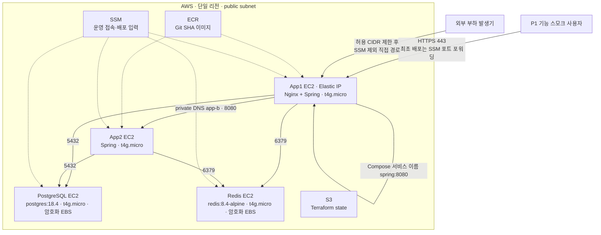
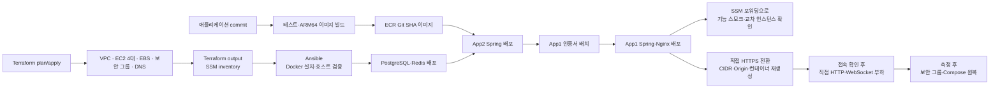

# P1 AWS 저비용 4 EC2 인프라 실행안

이 문서는 Albam Mate P1 검증 환경을 Terraform으로 반복 생성하고 Ansible로 호스트 설정을 적용한 뒤, 실제 사용 흐름을 재현한 부하에서 역할별 병목을 찾기 위한 실행안이다.

기술 선택과 ADR-0038의 부분 대체 범위는 [승인된 ADR-0051](../adr/platform/0051-p1-self-managed-aws-infrastructure.md)이 소유한다. Terraform·Ansible 1차 코드는 별도 `albam-mate-infra` 저장소에 있다. Terraform `fmt`·`validate`는 통과했지만 실제 AWS `plan`·`apply`, Ansible `--syntax-check`·SSM 접속, 애플리케이션 배포, 복구와 부하 검증은 아직 하지 않았다.

> - 문서 상태: **승인·배포 전 실행안**
> - 확인한 P1 방향: **App1 Nginx 단일 진입점, 고정 EC2 4대, 전부 `t4g.micro`, ALB·ASG·NAT Gateway 없음**
> - ADR 상태: **승인됨·미검증**
> - 최초 배포 접근: **외부 공개 없이 SSM 포트 포워딩으로만 접근**
> - 배포·복구·부하 검증: **미검증**

## 먼저 구분할 것

| 구분 | 내용 | 현재 판정 |
| --- | --- | --- |
| 2026-08-06 초기 논의 | RDS·ElastiCache 대신 EC2의 Docker로 PostgreSQL·Redis 운영, Spring 2대·DB 1대·Redis 1대, Terraform과 별도 인프라 저장소 사용 | 결정 논의의 출발점 |
| 2026-08-06 승인된 P1 방향 | App1 Nginx가 App1·App2 Spring에 요청 분산, EC2 4대 전부 `t4g.micro`, public subnet 사용, ALB·자동 확장·NAT Gateway 제외 | 결정 채택 |
| 현재 애플리케이션 계약 | 공용 PostgreSQL·Redis, Spring Session, Redis Pub/Sub, PostgreSQL ShedLock과 Flyway migration | 코드·정본별 상태 확인 필요 |
| Terraform·Ansible 1차 코드 | VPC, 역할별 public subnet, 보안 그룹, 고정 EC2 4대, 데이터 EBS, IAM, private DNS, state S3·ECR과 SSM 기반 Docker 설치·호스트 검증 | Terraform 정적 검증 통과·Ansible 실행 미검증 |
| 아직 구현하지 않은 운영 범위 | 서비스 컨테이너 배포, 비밀값 주입, TLS 인증서 갱신, 백업, CloudWatch 대시보드·경보, 부하 실행 자동화 | 후속 작업 |

이 구성은 최종 용량이나 고가용성 운영 구성이 아니다. 작은 사양에서 먼저 실패하는 역할과 원인을 확인한 뒤 근거가 있는 자원만 수동으로 바꾸는 P1 기준선이다.

## 문서 소유 경계

| 문서·저장소 | 소유 내용 |
| --- | --- |
| 승인된 ADR-0051 | Nginx 진입점, 자체 운영 데이터 서비스, EC2 수와 트레이드오프 |
| 이 가이드 | 생성·배포·측정·확장·철거 순서, 검증 체크리스트와 P1 최소 배포 목표 상태 |
| `docs/P1-spec.md`, `docs/ARCHITECTURE.md` | P1 애플리케이션 실행 계약과 다중 인스턴스 동작 |
| 애플리케이션 실행 파일 | Docker 이미지, Compose, Nginx upstream, Flyway와 환경변수 계약 |
| 별도 인프라 저장소 | 실제 Terraform, cloud-init, Ansible과 AWS 리소스 경계 |

가이드에는 선택 근거를 반복하지 않고 ADR을 참조한다. 별도 저장소에 둔다는 사실만으로 state·plan·비밀값이 안전해지는 것은 아니다.

## P1 초기 토폴로지



App1은 Nginx와 Spring을 함께 실행하고 App2는 Spring만 실행한다. Nginx는 App1 로컬 Spring과 App2 private DNS upstream으로 요청을 분산한다. App1이 더 많은 자원을 사용하므로 부하 결과에서 두 Spring 인스턴스의 CPU·메모리를 따로 기록한다.

App1 장애는 전체 외부 진입점 장애다. App2 장애는 Nginx의 실패 대상 제외 설정으로 일부 요청을 App1에 보낼 수 있지만, 실제 WebSocket 연결과 재시도 결과를 검증하기 전에는 무중단 전환을 보장하지 않는다.

## 구성 요소와 고정 경계

| 영역 | P1 초기 구성 | 고정 경계 |
| --- | --- | --- |
| 외부 진입 | App1 Nginx, App1 Elastic IP | 정적 자산, TLS, WebSocket Upgrade와 App1·App2 Spring 분산을 담당한다. ALB는 사용하지 않는다. |
| 애플리케이션 | 고정 `t4g.micro` EC2 2대, JVM 초기값 `-Xmx256m` | ASG 기반 자동 확장·상태 기반 자동 대체 없이 서로 다른 AZ에 한 대씩 둔다. 운영자가 Terraform을 적용하면 구성 변경이나 리소스 유실에 따라 교체·재생성될 수 있다. 초기 heap은 측정값이 아니며 GC·OOM과 함께 조정한다. |
| PostgreSQL | `t4g.micro` 한 대, `postgres:18.4`, 별도 EBS | 업무 데이터와 ShedLock 정본이다. 컨테이너와 데이터 수명을 분리한다. |
| Redis | `t4g.micro` 한 대, `redis:8.4-alpine`, AOF와 별도 EBS | Spring Session, Rate Limit과 Pub/Sub 신호를 공유하며 업무 데이터 정본으로 사용하지 않는다. |
| 내부 주소 | Route 53 private hosted zone | 고정하지 않은 private IP 대신 `app-a`, `app-b`, `postgres`, `redis` 이름을 사용한다. |
| 이미지 | ECR의 변경 불가 Git SHA tag | `linux/arm64` 이미지나 ARM64를 포함한 multi-arch manifest를 사용한다. |
| 운영 접근 | Systems Manager Session Manager | SSH 22, bastion과 장기 SSH key를 사용하지 않는다. |
| Terraform state | versioning·암호화·public access block을 적용한 S3 | 애플리케이션 비밀값과 데이터 백업을 state bucket에 저장하지 않는다. |
| Ansible 전송 | 공개 차단·암호화·1일 만료를 적용한 별도 S3 | `amazon.aws.aws_ssm` 연결용 임시 객체만 두며 state bucket과 섞지 않는다. |

네 EC2의 T 계열 CPU credit 모드는 추가 credit 과금을 막기 위해 `standard`로 시작한다. 지속 부하에서는 credit 소진 뒤 CPU가 baseline으로 제한될 수 있으므로 `CPUCreditBalance`를 병목 지표로 함께 기록한다.

## 네트워크와 보안 그룹

네 EC2는 인터넷을 통한 패키지·ECR·SSM 접근에 NAT Gateway를 사용하지 않도록 public subnet과 Public IPv4를 가진다. public subnet과 Public IPv4가 있다는 사실만으로 애플리케이션 포트가 공개되는 것은 아니며, 보안 그룹 인바운드는 다음처럼 제한한다.

| 보안 그룹 | 부착 대상 | 허용 인바운드 |
| --- | --- | --- |
| `sg-nginx` | App1만 | 허용 CIDR의 TCP 80, TLS를 켠 경우 TCP 443 |
| `sg-app` | App1·App2 | 같은 `sg-app`에서 오는 Spring TCP 8080 |
| `sg-postgres` | PostgreSQL | `sg-app`에서 오는 TCP 5432 |
| `sg-redis` | Redis | `sg-app`에서 오는 TCP 6379 |

App2·PostgreSQL·Redis의 Public IPv4에는 인터넷 인바운드를 열지 않는다. 어떤 EC2에도 SSH 22를 허용하지 않는다. PostgreSQL·Redis 포트를 CIDR 전체나 `0.0.0.0/0`에 열지 않고 보안 그룹 참조를 사용한다.

인프라 저장소의 `terraform.tfvars.example`은 `public_ingress_cidrs`를 `0.0.0.0/0`으로 두지만, 최소 배포는 [최초 배포 접근과 인증서 순서](#최초-배포-접근과-인증서-순서)에 따라 `public_ingress_cidrs=[]`·`enable_https=false`로 고정해 공개 인바운드를 아예 만들지 않는다. 공인 DNS와 인증서를 확정한 뒤에 허용 CIDR을 좁혀 열고 TCP 443을 추가한다.

App1 Elastic IP는 외부 DNS가 가리킬 안정적인 진입 주소다. 실제 도메인 A record와 TLS 인증서는 이 1차 Terraform 범위 밖이며 배포 전에 별도로 연결한다.

## 데이터 서비스 운영 경계

### PostgreSQL

- Terraform은 EC2와 암호화한 별도 EBS를 생성·연결한다.
- cloud-init은 파일시스템과 `/srv/postgresql` 마운트까지만 준비한다.
- PostgreSQL 컨테이너, 사용자·비밀번호, TLS와 백업 timer는 별도 배포 작업이 소유한다.
- 스키마는 Terraform이나 JPA 자동 생성이 아니라 기존 Flyway migration으로 관리한다.
- `pg_dump`와 EBS snapshot은 실제 복원 검증을 통과해야 백업 근거로 인정한다.

### Redis

- 로컬 다중 인스턴스 검증과 같은 `redis:8.4-alpine`을 출발점으로 사용한다.
- AOF는 세션·Rate Limit 상태의 불필요한 전량 손실을 줄이지만 단일 Redis의 고가용성을 제공하지 않는다.
- Pub/Sub 신호 유실은 PostgreSQL `messageId` 기반 catch-up으로 복구하고 Redis를 업무 정본으로 승격하지 않는다.
- 인증·TLS와 AOF 복구는 아직 구현·검증하지 않았다.

## P1 최소 배포 목표 상태

이 절은 App1·App2·PostgreSQL·Redis 네 노드의 최소 배포가 성립하는 목표 상태를 확정한다. 후속 구현 이슈는 이 절만 근거로 착수하며, 여기에 없는 계약을 구현에서 새로 정하지 않는다. 이 저장소가 소유하는 항목은 [albam-mate#494](https://github.com/bamsongi-club/albam-mate/issues/494)가, [albam-mate-infra#1](https://github.com/bamsongi-club/albam-mate-infra/issues/1)은 ECR 저장소 이름과 Docker Compose 플러그인 설치·검증만 소유한다. 실제 ARM64 이미지 게시·노드별 환경 전달·배포·분산·복구·부하 증거의 소유자는 별도 인프라 후속 이슈가 확정하기 전까지 미배정이다.

### 최초 배포 접근과 인증서 순서

공인 DNS와 인증서 자동화는 이번 범위 밖이므로, 최초 배포는 외부 공개 없이 다음 값으로 고정해 검증한다.

| 입력 | 최초 배포 값 | 이유 |
| --- | --- | --- |
| `public_ingress_cidrs` | `[]` | 공개 인바운드를 만들지 않는다. |
| `enable_https` | `false` | 공개 TCP 443 리스너를 만들지 않는다. |
| `ALBAM_MATE_HTTPS_BIND_ADDRESS` | `127.0.0.1` | web의 443 게시를 App1 호스트 루프백으로 제한한다. |
| 기능 스모크 경로 | SSM 포트 포워딩 | 인터넷 노출 없이 App1의 HTTPS에 접근한다. |
| 부하 측정 경로 | 최초 배포에서는 실행하지 않음. 이후 SSM을 거치지 않는 제한된 직접 경로 | SSM 터널의 지연·처리량을 App1·App2 병목과 섞지 않는다. |

web의 Nginx는 `ssl_certificate`와 `ssl_certificate_key` 파일이 없으면 기동하지 못한다. 따라서 기존 "App1 기동 후 TLS 연결" 순서가 아니라 **임시 또는 유효 인증서를 App1에 배치한 뒤 web을 기동한다**. 임시 인증서는 SSM 포트 포워딩 클라이언트에서만 신뢰하면 되고 공개 신뢰 체인을 요구하지 않는다.

외부 DNS A record, 공인 인증서, HTTP 80 리스너와 80→443 전환은 후속 범위로 유지한다. 따라서 이 최초 배포 상태에서는 직접 HTTPS 부하를 실행하지 않으며, 측정이 필요할 때만 아래 전환 절차를 수행한다.

### 직접 부하 전환과 원복

최초 배포의 `public_ingress_cidrs=[]`, `enable_https=false`, `ALBAM_MATE_HTTPS_BIND_ADDRESS=127.0.0.1` 조합은 SSM 기능 스모크 전용이다. 이 상태에서는 외부 부하 발생기가 App1의 443에 연결할 수 없고, SSM 포워딩용 Origin을 그대로 사용하면 직접 WebSocket handshake도 거절된다. 따라서 `public_ingress_cidrs`만 변경해서는 측정 상태가 되지 않는다.

#### 측정 경로로 전환

측정 전환은 부하 발생기에서 App1의 외부 HTTPS endpoint로 직접 접속할 때만 수행한다.

1. 부하 발생기의 고정 source CIDR을 먼저 정한다. `0.0.0.0/0`은 사용하지 않으며, `DIRECT_HOST`는 실제 HTTPS URL의 hostname이면서 배치한 인증서의 SAN에 포함된 값으로 고정한다.
2. Terraform 입력과 App1·App2에 전달하는 `/etc/albam-mate/app1.env`, `/etc/albam-mate/app2.env`를 다음처럼 바꾼다. `ALBAM_MATE_CHAT_WEBSOCKET_ALLOWED_ORIGIN`에는 SSM용 `https://127.0.0.1:<포워딩 포트>`가 아니라 직접 접속 URL의 정확한 Origin을 넣는다. 기본 HTTPS 포트 443이면 포트를 생략하고, 비표준 포트면 포트까지 포함한다.

   ```hcl
   # Terraform 입력
   public_ingress_cidrs = ["<load-generator-cidr>"]
   enable_https        = true
   ```

   ```dotenv
   # /etc/albam-mate/app1.env
   ALBAM_MATE_HTTPS_BIND_ADDRESS=0.0.0.0
   ALBAM_MATE_CHAT_WEBSOCKET_ALLOWED_ORIGIN=https://<direct-host>
   ```

3. Terraform을 적용한 뒤 App1 보안 그룹의 TCP 443이 `<load-generator-cidr>`에서만 허용되는지 확인한다. App2·PostgreSQL·Redis에는 공개 인바운드를 추가하지 않는다.
4. `<direct-host>`로 검증 가능한 인증서를 App1의 `ALBAM_MATE_TLS_PATH`에 배치한다. 임시 인증서를 사용할 때는 부하 발생기가 해당 발급자 체인을 신뢰하도록 준비해야 하며, `-k`로 인증서 검증을 우회한 결과는 HTTPS 운영 부하 증거로 기록하지 않는다.
5. bind address와 Origin은 컨테이너 시작 시 읽으므로 설정 파일만 바꾸지 말고 web·spring을 반드시 재생성한다.

   ```sh
   docker compose --env-file /etc/albam-mate/app1.env -f compose.production.yml config --quiet
   docker compose --env-file /etc/albam-mate/app1.env -f compose.production.yml up -d --force-recreate --wait
   docker compose --env-file /etc/albam-mate/app1.env -f compose.production.yml ps
   docker compose --env-file /etc/albam-mate/app1.env -f compose.production.yml logs --tail 200 web spring
   ```

6. 부하 발생기에서 먼저 연결을 확인한다. HTTP는 `https://<direct-host>/`에 인증서 검증을 포함해 성공해야 하며, WebSocket은 기존 로그인 `JSESSIONID`와 같은 방의 권한을 사용해 다음 endpoint에 `Origin: https://<direct-host>`로 접속하고 `101 Switching Protocols`를 확인한다.

   ```text
   wss://<direct-host>/api/rooms/<roomId>/chat/ws
   ```

   App1 Nginx access log에 해당 요청과 WebSocket `101`이 남고, `/api/` HTTP 응답의 `X-Albam-Mate-Upstream` 또는 upstream 로그로 App1·App2 분산을 확인한 뒤에만 부하를 시작한다. 이 접속 확인과 부하 모두 SSM 포워딩이 아닌 동일한 직접 경로에서 수행한다.
7. 측정 시작 시각, release SHA·이미지 digest, Terraform commit, 허용 CIDR, `DIRECT_HOST`, 두 Origin 값과 전환·원복 시각을 함께 기록한다.

#### 측정 후 원복

측정이 끝나면 외부 경로를 먼저 닫고, 컨테이너 설정도 최초 배포 상태로 되돌린다.

1. 부하 발생기를 중지하고 로그·지표·결과를 보존한다.
2. Terraform 입력과 `/etc/albam-mate/app1.env`, `/etc/albam-mate/app2.env`를 다음 값으로 되돌린다.

   ```hcl
   public_ingress_cidrs = []
   enable_https        = false
   ```

   ```dotenv
   ALBAM_MATE_HTTPS_BIND_ADDRESS=127.0.0.1
   ALBAM_MATE_CHAT_WEBSOCKET_ALLOWED_ORIGIN=https://<ssm-local-host>:<ssm-local-port>
   ```

   SSM 클라이언트가 실제로 사용하는 host·포트와 Origin을 일치시키며, SSM WebSocket 스모크를 사용하지 않으면 Origin을 비워 모든 handshake를 거절하는 기본 보안 상태로 둘 수 있다.
3. Terraform을 적용해 App1 TCP 443의 직접 허용 규칙을 제거한 뒤, 다음 명령으로 web·spring을 다시 재생성한다.

   ```sh
   docker compose --env-file /etc/albam-mate/app1.env -f compose.production.yml config --quiet
   docker compose --env-file /etc/albam-mate/app1.env -f compose.production.yml up -d --force-recreate --wait
   ```

4. 부하 발생기의 직접 HTTPS 접속이 더 이상 성공하지 않고, SSM 포트 포워딩을 통한 기능 스모크만 성공하는지 확인한다. 직접 443이 닫히고 SSM 경로가 복구된 뒤에야 원복 완료로 기록한다.

### 1. web 컨테이너 기동 계약

- 운영 web 컨테이너는 읽기 전용 루트 파일시스템(`read_only: true`)을 유지한다.
- App2 주소 치환 결과는 쓰기 가능한 경로에 두고, Nginx를 그 설정 파일로 기동한다.
- 이미지에 포함된 `/etc/nginx/nginx.conf`를 실행 시점에 덮어쓰지 않는다. 읽기 전용 루트에서 이 쓰기는 실패하고 컨테이너가 종료 코드 1로 죽는다.
- 치환·설정 오류는 기동 실패로 드러나야 하며, 치환하지 않은 원본 설정으로 조용히 기동하지 않는다.

### 2. Nginx upstream 구성

- App1 로컬 Spring은 같은 Compose 네트워크의 서비스 이름(`spring:8080`)으로 지정한다.
- App2는 private DNS hostname(`app-b.<internal_zone_name>`)에 `:8080`을 붙인 endpoint로 지정한다. `internal_zone_name`은 인프라 저장소가 소유하는 Route 53 private hosted zone 이름이며, 설정 파일 주석의 예시도 실제 zone 이름 규칙과 일치시킨다.
- App1 Nginx는 Spring의 유일한 신뢰 프록시다. HTTP와 WebSocket proxy는 외부 `X-Forwarded-For`를 이어 붙이지 않고 폐기한 뒤, Nginx가 직접 관찰한 `$remote_addr`로 `X-Forwarded-For`를 덮어쓴다. 인증 요청 제한은 이 주소만 원격 IP로 사용한다.
- 루프백 주소는 upstream에 쓰지 않는다. web 컨테이너 안의 `127.0.0.1:8080`은 App1 Spring이 아니라 web 컨테이너 자신이고, 같은 포트를 듣는 healthz 서버 블록이 `/api/` 요청에 404를 반환한다.
- 실제 응답한 upstream을 응답 헤더나 접근 로그로 확인할 수 있어야 한다.

### 3. `ALBAM_MATE_APP2_HOST` 필수값

- 운영 배포에서 필수값이며 누락 시 기동을 거부한다. Compose 변수 해석과 컨테이너 entrypoint 어느 쪽도 기본값으로 대체하지 않는다.
- `ALBAM_MATE_APP2_HOST`는 포트 없는 private DNS hostname만 받는다(예: `app-b.<internal_zone_name>`). Nginx 템플릿이 `:8080`을 붙이므로 값에 포트 `:8080`을 포함하지 않는다.
- 미설정 시 App1 자신(`127.0.0.1`)을 App2로 사용하던 폴백 계약은 폐기한다.
- P1의 목적이 2대 분산 측정이므로, 값 누락이 조용히 1대 운영으로 축소되면 안 된다.

### 4. Spring 컨테이너 메모리

- App1·App2 Spring 컨테이너의 `mem_limit`을 `512m`으로 한다.
- JVM 최대 heap은 [ADR-0051](../adr/platform/0051-p1-self-managed-aws-infrastructure.md)이 정한 `-Xmx256m`를 그대로 따른다. 이 문서는 heap 값을 바꾸지 않는다.
- heap은 `JAVA_TOOL_OPTIONS`가 아니라 `JDK_JAVA_OPTIONS`로 주입한다. 이미지의 `JAVA_TOOL_OPTIONS`에는 `-XX:+ExitOnOutOfMemoryError`, `-Duser.timezone=UTC`, `-Dfile.encoding=UTF-8`이 함께 들어 있어 같은 변수로 주입하면 통째로 덮어써진다. `JDK_JAVA_OPTIONS`는 `JAVA_TOOL_OPTIONS`보다 뒤에 적용되므로 `-Xmx256m`가 이미지의 `-XX:MaxRAMPercentage` 값을 이긴다.
- `512m`은 heap `256m`과 non-heap 약 `200m`를 기준으로 잡은 출발값이다. 측정값이 아니므로 P1 부하에서 GC·OOM과 함께 재측정한다.

### 5. ECR 저장소 이름과 수동 이미지 릴리스

- ECR 저장소 이름은 `albam-mate/backend`와 `albam-mate/web`으로 한다.
- `ALBAM_MATE_IMAGE_NAMESPACE`는 `<계정ID>.dkr.ecr.<region>.amazonaws.com/albam-mate` 형태로 한다. 이 저장소의 이미지 참조 방식(`<namespace>/backend:<release>`, `<namespace>/web:<release>`)은 바꾸지 않는다.
- 태그는 40자리 Git SHA다. 저장소가 immutable이므로 같은 SHA로 다시 push할 수 없다.

최초 배포는 CI 자동 게시가 아니라 수동 릴리스로 수행하며 다음 계약을 따른다.

- 기준은 병합된 하나의 40자리 Git SHA다. backend와 web이 서로 다른 SHA를 쓰지 않는다.
- backend·web 모두 `docker buildx build --platform linux/arm64 --push`로 게시한다.
- 게시 후 두 이미지의 manifest와 digest를 기록한다.
- 배포 노드에서는 태그뿐 아니라 실제 pull된 digest와 컨테이너의 release SHA를 함께 확인한다.
- 게시가 실패하면 같은 SHA를 재게시하지 않고 새 커밋 SHA로 다시 만든다.

### 6. 노드별 필수 환경변수

각 노드에는 그 역할에 필요한 값만 전달한다. RDS를 쓰지 않으므로 RDS CA 경로는 어느 노드에도 필요하지 않다.

| 노드 | 필수 환경변수 | 비고 |
| --- | --- | --- |
| App1 | `ALBAM_MATE_IMAGE_NAMESPACE`, `ALBAM_MATE_RELEASE`, `ALBAM_MATE_DB_HOST`·`ALBAM_MATE_DB_NAME`·`ALBAM_MATE_DB_USER`·`ALBAM_MATE_DB_PASSWORD`, `ALBAM_MATE_REDIS_HOST`, `JDK_JAVA_OPTIONS=-Xmx256m`, `ALBAM_MATE_APP2_HOST`, `ALBAM_MATE_HTTPS_BIND_ADDRESS`, `ALBAM_MATE_TLS_PATH` | App1에만 App2 주소·HTTPS bind 주소·TLS 경로가 필요하다. |
| App2 | `ALBAM_MATE_IMAGE_NAMESPACE`, `ALBAM_MATE_RELEASE`, `ALBAM_MATE_DB_HOST`·`ALBAM_MATE_DB_NAME`·`ALBAM_MATE_DB_USER`·`ALBAM_MATE_DB_PASSWORD`, `ALBAM_MATE_REDIS_HOST`, `JDK_JAVA_OPTIONS=-Xmx256m` | web을 실행하지 않으므로 TLS 경로와 HTTPS bind 주소를 두지 않는다. |
| PostgreSQL | `ALBAM_MATE_DB_NAME`, `ALBAM_MATE_DB_USER`, `ALBAM_MATE_DB_PASSWORD` | 애플리케이션·Redis 접속값을 두지 않는다. |
| Redis | 없음 | 현재 Compose 기준으로 필수값도 비밀값도 없다. DB 비밀값을 전달하지 않는다. |

- 선택값은 App1·App2에만 둔다. 소셜 로그인 ID·secret은 쌍이 모두 있을 때만 해당 제공자가 활성화되고, `ALBAM_MATE_CHAT_WEBSOCKET_ALLOWED_ORIGIN`은 비우면 모든 WebSocket handshake를 거절한다.
- 최초 배포는 SSM 포트 포워딩으로 접근하므로 채팅을 검증하려면 허용 Origin을 포워딩 주소로 맞춘다.
- DB·Redis 포트, 커넥션 풀 값과 메모리·로그 한도는 기본값이 있으므로 바꿔야 할 때만 전달한다.

### 7. 데이터 노드 healthcheck 계약

- PostgreSQL 노드의 healthcheck는 사용자·데이터베이스 이름을 **컨테이너 안에서** 해석한다. Compose 파일에서 `$` 하나로 쓰면 호스트에서 먼저 치환되는데, 호스트 환경에는 `ALBAM_MATE_DB_*`만 있으므로 `POSTGRES_USER`·`POSTGRES_DB`가 빈 문자열이 된다.
- 위험을 정확히 적는다. `pg_isready`는 올바른 사용자·데이터베이스 값이 없어도 서버가 연결을 수락하는 상태만으로 성공할 수 있으므로, 빈 값이 곧 영구 실패를 보장하지는 않는다. 핵심 위험은 **의도한 사용자·데이터베이스를 검사하지 않은 채 서버에 실패 접속 로그를 남기고, `--wait` 통과가 실제 계약을 증명하지 못한다**는 점이다.
- 데이터 노드도 [COMMANDS의 운영 Compose](../COMMANDS.md#운영-compose) 절과 같은 `docker compose up -d --wait` 패턴으로 올릴 수 있어야 하며, `--wait`이 healthy로 완료해야 한다.
- Redis 노드는 현재의 `redis-cli ping` healthcheck를 유지한다.

### 8. 운영 배포 검증기가 확인할 계약

- production Compose 검증에서 RDS CA 마운트를 요구하지 않는다. 자체 운영 PostgreSQL로 전환하면서 해당 마운트가 제거됐고, 지금은 검증기만 옛 계약을 단언해 실패한다.
- 검증기는 위 1~4·6·7을 회귀로 고정한다. 읽기 전용 루트에서의 web 기동, upstream 두 대상 구성, `ALBAM_MATE_APP2_HOST` 누락 시 기동 거부, Spring `mem_limit`과 heap 주입 변수, 데이터 노드의 `--wait` healthy가 대상이다.
- 검증기 통과는 로컬 계약 회귀 증거이며 실제 AWS 배포 증거가 아니다.

### 최소 배포에서 제외하는 기능

- App1·App2의 `profile-images`는 호스트별 로컬 named volume이다. 두 노드가 서로 다른 저장소를 쓰므로 한쪽이 저장한 이미지를 다른 쪽이 서빙하지 못한다.
- 최초 인프라 스모크에서는 프로필 이미지 업로드·조회를 검증 대상에서 제외한다.
- 실제 사용자 배포 전에 공유 객체 스토리지로 옮기는 후속 이슈가 필요하다. 이 문서는 그 전환 없이 다중 노드 프로필 이미지가 정상 동작한다고 보지 않는다.

### 계약 소유와 검증 증거

| 소유 | 범위 | 증거 |
| --- | --- | --- |
| [albam-mate#494](https://github.com/bamsongi-club/albam-mate/issues/494) | 목표 상태 1·2·3·4·6·7·8과 아래 [현재 구현과의 차이](#현재-구현과의-차이) 표 정정 | 로컬에서 Compose·Nginx·healthcheck 회귀를 막는 검증 통과 |
| [albam-mate-infra#1](https://github.com/bamsongi-club/albam-mate-infra/issues/1) | 목표 상태 5(ECR 저장소 이름)와 Docker Compose 플러그인 설치·검증 | ECR 저장소 이름, 네 노드의 `docker compose version`, `verify.yml`의 플러그인 검증 |
| 미배정 인프라 후속 이슈 | ARM64 이미지 게시·digest, SSM 기반 파일·환경값 전달, 역할별 기동, 실제 App1·App2 분산·복구·부하 증거 | 소유 이슈와 실제 배포 실행 기록이 확정된 뒤 검증 |

로컬 검증 통과를 실제 AWS 4노드 배포 증거로 표현하지 않는다. 위 미배정 범위는 소유 이슈가 확정되기 전까지 완료된 것으로 보지 않으며, 두 Spring에 요청이 실제로 분산됐다는 근거도 이 문서나 [albam-mate-infra#1](https://github.com/bamsongi-club/albam-mate-infra/issues/1)이 대신하지 않는다.

## 현재 구현과의 차이

위 목표 상태로 확정된 계약은 후속 구현이 해소한다. 아래 표는 확정된 계약과 그 소유를 정리한다.

| 경계 | 확정 전 구현 | 확정된 계약 | 소유 |
| --- | --- | --- | --- |
| web 기동 | 읽기 전용 루트에서 원본 설정을 유지하고 /tmp 렌더링 설정으로 Nginx를 기동한다. | 목표 상태 1 | albam-mate#494 반영 완료 |
| Nginx upstream | App1 `spring:8080`과 App2 private DNS `:8080`을 upstream으로 사용한다. | 목표 상태 2 | albam-mate#494 반영 완료 |
| App2 주소 | 누락 시 Compose와 entrypoint가 기동을 거부한다. | 목표 상태 3 | albam-mate#494 반영 완료 |
| Spring 메모리 | App1·App2 Spring은 `mem_limit: 512m`, `JDK_JAVA_OPTIONS=-Xmx256m`을 사용한다. | 목표 상태 4 | albam-mate#494 반영 완료 |
| 이미지 참조 | ECR 저장소 이름과 namespace 형태가 확정되지 않았다. | 목표 상태 5 | albam-mate-infra#1 |
| 노드별 입력 | App1·App2·PostgreSQL·Redis별 최소 권한 환경변수 예시를 분리한다. | 목표 상태 6 | albam-mate#494 반영 완료 |
| 데이터 노드 healthcheck | 컨테이너 내부의 `POSTGRES_USER`·`POSTGRES_DB`로 readiness를 검사한다. | 목표 상태 7 | albam-mate#494 반영 완료 |
| 검증기 계약 | RDS CA 없이 App2·read-only web·두 upstream·메모리·healthcheck를 검증한다. | 목표 상태 8 | albam-mate#494 반영 완료 |
| App2 노출 | — | `compose.app2.yml`이 App2 host 8080에 게시하고 `sg-app` 안에서만 접근한다. | 반영 완료 |
| PostgreSQL 접속 | production 설정이 RDS CA 경로를 전제로 했다. | 자체 운영 PostgreSQL에 private DNS 이름으로 접속하고 RDS CA를 쓰지 않는다. | 반영 완료 |

최소 배포 범위 밖에 남은 후속 작업은 다음과 같다. Terraform만 수정해서 해결되지 않는 경계다.

| 경계 | 현재 구현 | 필요한 후속 작업 |
| --- | --- | --- |
| WebSocket | 운영 Nginx의 `/api/`에 Upgrade·Connection 헤더와 timeout이 있다. | 실제 AWS 배포에서 교차 인스턴스 handshake와 연결 종료 동작을 검증한다. |
| TLS | web 컨테이너가 인증서를 직접 마운트하고 최초 배포는 임시 인증서를 쓴다. | 공인 인증서의 발급·저장·갱신 주체와 HTTP 80 리스너·80→443 전환 절차를 확정한다. |
| PostgreSQL TLS | production 접속이 TLS를 쓰지 않는다. | 자체 운영 PostgreSQL의 서버 인증서와 Spring 접속 검증 수준을 확정한다. |
| Redis 보안 | production 설정은 host와 port만 받는다. | password·TLS 사용 여부와 Spring 환경변수 계약을 확정한다. |
| Flyway | production Spring 기동마다 Flyway가 자동 실행된다. | 두 Spring 동시 기동 방식을 검증하거나 별도 1회 migration 작업을 구현한다. |
| 프로필 이미지 | App1·App2가 각자 로컬 named volume을 쓴다. | 공유 객체 스토리지로 옮기고 다중 노드에서 업로드·조회를 검증한다. |

## Terraform 저장소 구성

현재 1차 구현은 다음 구조다.

```text
albam-mate-infra/
├─ bootstrap/aws/             # state S3, ECR
├─ modules/aws/
│  ├─ network/               # VPC, app/data public subnet, Internet Gateway
│  ├─ security/              # Nginx/app/PostgreSQL/Redis 보안 그룹
│  ├─ identity/              # 역할별 instance profile
│  ├─ app-ec2/               # 고정 App1·App2 EC2
│  └─ data-ec2/              # PostgreSQL·Redis EC2와 EBS
├─ stacks/aws/p1/            # P1 root module, App1 Elastic IP, private DNS, Ansible inventory
├─ cloud-init/               # SSM 준비와 데이터 볼륨 마운트
└─ ansible/                  # SSM 기반 Docker 설치와 호스트 검증
```

Terraform은 AWS 리소스를 만들고 EC2 instance ID 기반 Ansible inventory를 출력한다. cloud-init은 SSM Agent 시작과 데이터 볼륨 마운트처럼 최초 부팅에 필요한 작업만 맡고, Ansible은 SSM으로 Docker와 공통 호스트 설정을 반복 적용한다. 애플리케이션 이미지 빌드, Compose 실행, Flyway 데이터, 비밀값, 백업과 부하 테스트는 아직 자동으로 수행하지 않는다.

Ansible을 Terraform `apply`의 provisioner로 호출하지 않는다. plan·apply를 검토한 뒤 inventory를 생성하고 playbook의 `--syntax-check`, `--check`, 실제 실행을 분리한다. 따라서 인프라 생성과 호스트 설정 중 어느 단계가 실패했는지 구분할 수 있고, 같은 playbook을 설정 변경 뒤 다시 적용할 수 있다.

## Terraform state와 계정 분리

1. 각 AWS 계정에서 `bootstrap/aws`를 로컬 state로 한 번 적용한다.
2. versioning, 서버 측 암호화와 public access block이 적용된 S3 bucket을 만든다.
3. P1 stack은 S3 lockfile을 사용하는 별도 key에 저장한다.
4. `backend.hcl`, 실제 `*.tfvars`, `*.tfplan`, `.tfstate`, 인증서와 비밀값은 Git에 커밋하지 않는다.
5. AWS SSO profile이나 짧은 수명의 역할로 `init`·`plan`·`apply`를 실행한다.
6. 계정을 바꾸면 새 backend와 새 state로 같은 stack을 적용한다. 기존 계정 state를 복사해 소유권을 바꾸지 않는다.

## 배포 흐름



1. 기준 commit의 테스트와 문서 검사를 통과시킨다.
2. backend와 web을 `docker buildx build --platform linux/arm64 --push`로 같은 40자리 Git SHA로 ECR에 게시하고 두 이미지의 manifest와 digest를 기록한다.
3. `terraform fmt -check`, `terraform validate`, 저장한 `plan`의 계정·리전·리소스와 비용을 검토한 뒤 적용한다. 최초 배포는 `public_ingress_cidrs=[]`·`enable_https=false`로 적용한다.
4. `terraform output -raw ansible_inventory_yaml`로 inventory를 생성하고 계정·리전·instance ID를 검토한다.
5. Linux 제어 노드에서 Ansible syntax·check mode를 거쳐 Docker 설치와 호스트 검증 playbook을 실행한다. SSH는 사용하지 않는다.
6. 노드별 환경변수 파일을 SSM으로 전달하고 PostgreSQL·Redis를 `--wait`으로 배포해 private DNS 연결을 확인한다. PostgreSQL은 `/etc/albam-mate/postgres.env`를 사용한다.

   ```sh
   docker compose --env-file /etc/albam-mate/postgres.env -f compose.db.yml config --quiet
   docker compose --env-file /etc/albam-mate/postgres.env -f compose.db.yml up -d --wait
   ```

7. App2 Spring을 먼저 배포해 host 8080 상태를 App1에서 확인한다. App2는 `/etc/albam-mate/app2.env`를 사용한다.

   ```sh
   docker compose --env-file /etc/albam-mate/app2.env -f compose.app2.yml config --quiet
   docker compose --env-file /etc/albam-mate/app2.env -f compose.app2.yml up -d --wait
   ```

8. App1에 임시 또는 유효 인증서를 배치한 뒤 App1 Spring과 Nginx를 배포하고, pull된 digest와 App1·App2 upstream 응답을 각각 확인한다. App1은 `/etc/albam-mate/app1.env`를 사용한다.

   ```sh
   docker compose --env-file /etc/albam-mate/app1.env -f compose.production.yml config --quiet
   docker compose --env-file /etc/albam-mate/app1.env -f compose.production.yml up -d --wait
   ```
9. SSM 포트 포워딩으로 HTTPS에 접근해 기능 스모크와 HTTP·WebSocket 교차 인스턴스 시나리오를 실행한다.
10. 부하 측정이 필요하면 [직접 부하 전환과 원복](#직접-부하-전환과-원복) 절차에 따라 `enable_https=true`, 외부 수신 bind address, 직접 HTTPS Origin, 제한 CIDR을 적용하고 컨테이너를 재생성한다. 직접 HTTP와 WebSocket 접속 확인 뒤에만 측정하고, 종료 후 같은 절차의 원복을 완료한다.

App1을 갱신하면 단일 진입점이 중단될 수 있다. 이 구성에서 무중단 순차 배포를 보장한다고 표현하지 않는다.

## 병목 측정과 단계적 확장

SSM 포트 포워딩은 최초 배포의 기능 스모크와 교차 인스턴스 확인에만 사용한다. 부하 발생기는 네 EC2 밖의 별도 환경에서 실행하고, [직접 부하 전환과 원복](#직접-부하-전환과-원복)의 `enable_https=true`·외부 수신 bind·직접 HTTPS Origin·제한 CIDR을 적용한 뒤 SSM을 거치지 않는 직접 경로로 연결한다. 직접 HTTP·WebSocket 접속 확인과 전환 기록이 없는 결과는 부하 증거로 인정하지 않는다. 같은 EC2에서 부하를 만들거나 SSM 터널을 거치면 측정 대상의 CPU·네트워크·터널 지연을 함께 소비해 결과를 왜곡한다.

| 역할 | 함께 기록할 지표와 증상 | 해석 경계 |
| --- | --- | --- |
| App1 Nginx·Spring | CPU credit, 메모리, 연결 수, upstream별 요청·오류·지연, JVM GC·OOM | Nginx와 Spring 자원 경합을 App2와 비교한다. |
| App2 Spring | CPU credit, 메모리, JVM GC·OOM, 요청·오류·지연 | App1과 같은 요청 비율인지 upstream 로그로 먼저 확인한다. |
| PostgreSQL | CPU credit, 메모리, 연결 수, slow query, lock, EBS queue·지연 | 쿼리·연결·EC2·EBS 병목을 구분한다. |
| Redis | CPU credit, `used_memory`, `evicted_keys`, 명령 지연, 연결 수, AOF 시간 | 메모리·CPU·영속화 I/O 병목을 구분한다. |

1. release SHA, Terraform commit, 테스트 데이터와 부하 시나리오를 고정한다.
2. 단순 HTTP 조회와 로그인 세션·WebSocket·채팅 시나리오를 분리해 점진적으로 부하를 올린다.
3. 최초 오류 시점과 직전 역할별 지표를 같은 시간축으로 기록한다.
4. 병목 원인이 확인된 역할의 변수나 애플리케이션 동작 하나만 바꾼다.
5. 같은 시나리오를 다시 실행해 처리량, p95·p99 지연, 오류율과 비용 변화를 비교한다.

## 필수 검증

### Terraform과 보안

- `terraform fmt -check`와 `terraform validate` 통과
- 실제 `plan`에서 EC2 4대가 모두 `t4g.micro`, CPU credit mode가 `standard`인지 확인
- ALB, ASG와 NAT Gateway가 생성되지 않는지 확인
- 최초 배포에서는 `public_ingress_cidrs=[]`·`enable_https=false`로 네 EC2 어디에도 공개 인바운드가 없는지 확인
- 허용 CIDR을 좁혀 연 이후 단계에서는 App1만 그 CIDR에서 TCP 80에 접근되고, `enable_https=true`일 때에만 TCP 443이 추가되며 App2·PostgreSQL·Redis에는 공개 인바운드가 없는지 확인
- PostgreSQL 5432와 Redis 6379가 `sg-app`에서만 연결되는지 확인
- SSH 22가 모든 보안 그룹에서 닫혀 있는지 확인
- state·plan·cloud-init과 로그에 비밀값이 없는지 확인
- 생성한 Ansible inventory가 현재 state의 EC2 instance ID 4개와 대상 리전을 가리키는지 확인
- Ansible 전송 버킷이 state 버킷과 분리되고 공개 차단·암호화·1일 만료를 적용하는지 확인
- `ansible-playbook playbooks/site.yml --syntax-check`와 `--check`를 통과한 뒤 실제 실행에서 Docker·노드 식별 파일·데이터 마운트를 확인

### 애플리케이션

아래 항목은 실제 AWS 배포에서 확인해야 하지만 현재 [albam-mate-infra#1](https://github.com/bamsongi-club/albam-mate-infra/issues/1)의 확정 범위에는 포함되지 않는다. 실제 실행·증거의 소유는 별도 인프라 후속 이슈가 확정한 뒤 따른다. 로컬 계약 회귀는 [albam-mate#494](https://github.com/bamsongi-club/albam-mate/issues/494)가 소유하며 이 검증을 대신하지 않는다. 프로필 이미지 업로드·조회는 [최소 배포에서 제외하는 기능](#최소-배포에서-제외하는-기능)에 따라 검증 대상에서 제외한다.

- 게시한 manifest·digest와 App1·App2가 실제로 pull한 digest가 같은지 확인
- App1·App2 Spring이 같은 release digest로 실행되는지 확인
- `ALBAM_MATE_APP2_HOST`를 비운 배포가 기동을 거부하는지 확인
- upstream 식별 헤더나 로그로 두 Spring에 요청이 분산되는지 확인
- [직접 부하 전환과 원복](#직접-부하-전환과-원복)의 `enable_https=true`, `ALBAM_MATE_HTTPS_BIND_ADDRESS=0.0.0.0`, 직접 HTTPS Origin, 컨테이너 재생성과 제한 CIDR을 적용했는지 확인
- 직접 HTTP 응답과 WebSocket `101 Switching Protocols`를 부하 발생기에서 확인한 뒤 측정했는지, 종료 후 443·Compose 설정을 원복했는지 확인
- HTTP 세션과 WebSocket handshake가 다른 Spring에 도달해도 동일 세션을 사용하는지 확인
- Pub/Sub 신호 유실 뒤 PostgreSQL catch-up으로 메시지를 복구하는지 확인
- Scheduler가 PostgreSQL ShedLock으로 한 인스턴스에서만 실행되는지 확인
- App2 종료 시 Nginx 실패 제외와 기존 WebSocket 영향을 기록
- App1 종료 시 전체 외부 진입점 장애와 수동 복구 시간을 기록

### 데이터와 복구

- PostgreSQL 컨테이너와 EC2 재시작 뒤 데이터 유지 확인
- Redis 재시작 뒤 AOF 복구와 애플리케이션 재연결 확인
- `pg_dump`를 새 PostgreSQL EC2에 복원하고 핵심 HTTP 흐름 확인
- EBS snapshot 생성·복원과 volume attachment 확인

## 운영 순서

### 최초 측정 전

1. AWS 계정, 리전, 도메인, 비용 한도와 철거일을 기록한다.
2. Terraform state 접근자와 `apply` 담당자를 정한다.
3. 기준 release SHA, 두 이미지의 digest, Terraform commit과 부하 시나리오를 함께 기록한다.
4. App1 Elastic IP, 기능 스모크용 SSM 포트 포워딩 경로, [직접 부하 전환과 원복](#직접-부하-전환과-원복)에 따른 부하 경로·배치 인증서·네 upstream 경계를 확인한다.
5. PostgreSQL 논리 백업과 복원 절차를 확인한다.

### 측정 반복마다

1. 예상하지 않은 Terraform 변경이 없는지 확인한다.
2. Nginx upstream, Spring·PostgreSQL·Redis 상태와 지표 수집을 확인한다.
3. 합의한 시나리오를 실행하고 최초 오류 시점과 역할별 지표를 기록한다.
4. 한 번에 한 원인만 바꾼 뒤 같은 시나리오로 전후 결과를 비교한다.

### 검증 종료 후

1. 비밀값을 제외한 로그·지표·부하 결과를 보존한다.
2. `pg_dump`, snapshot과 EBS 보존 여부를 확인한다.
3. 담당자 확인 없이 state bucket과 데이터 EBS를 삭제하지 않는다.
4. 보존 확인 후 P1 stack과 Elastic IP를 포함한 잔여 과금 리소스를 제거한다.

## 아직 고정하지 않는 값

- AWS 계정·리전·도메인과 DNS 소유권
- 역할별 `t4g.micro` 이후 인스턴스 유형과 EBS 용량
- Nginx 분산 방식의 세부 weight·timeout·실패 제외 값
- PostgreSQL·Redis와 App1 TLS 인증서 발급·갱신 주체
- 백업 보존 기간, snapshot 삭제 권한과 복구 담당자
- 부하 도구, 시나리오별 목표 동시 사용자와 성공 기준
- P1 검증 외 상시 가동 여부와 비용 한도

월 예상 비용은 계정·리전·가동 시간·Public IPv4·EBS·S3·CloudWatch 조건이 고정되지 않았으므로 확정 수치로 사용하지 않는다. 실제 Terraform plan의 리소스 목록과 해당 계정의 비용 계산 결과로 확인한다.

## 참고 자료

- [ADR-0051](../adr/platform/0051-p1-self-managed-aws-infrastructure.md)
- [Terraform S3 backend](https://developer.hashicorp.com/terraform/language/backend/s3)
- [Terraform 민감 데이터 관리](https://developer.hashicorp.com/terraform/language/manage-sensitive-data)
- [Amazon EC2 user data](https://docs.aws.amazon.com/AWSEC2/latest/UserGuide/user-data.html)
- [Amazon EC2 버스트 CPU credit](https://docs.aws.amazon.com/AWSEC2/latest/UserGuide/burstable-credits-baseline-concepts.html)
- [AWS Systems Manager Session Manager](https://docs.aws.amazon.com/systems-manager/latest/userguide/session-manager.html)
- [Ansible inventory](https://docs.ansible.com/projects/ansible/latest/inventory_guide/intro_inventory.html)
- [Ansible `amazon.aws.aws_ssm` connection](https://docs.ansible.com/projects/ansible/latest/collections/amazon/aws/aws_ssm_connection.html)
- [NGINX upstream module](https://nginx.org/en/docs/http/ngx_http_upstream_module.html)
