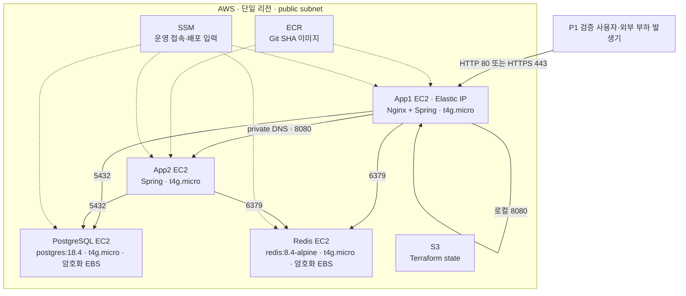
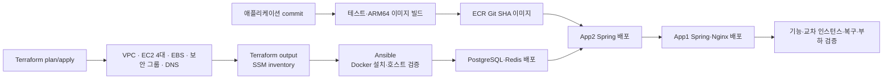

# P1 AWS 저비용 4 EC2 인프라 실행안

이 문서는 Albam Mate P1 검증 환경을 Terraform으로 반복 생성하고 Ansible로 호스트 설정을 적용한 뒤, 실제 사용 흐름을 재현한 부하에서 역할별 병목을 찾기 위한 실행안이다.

기술 선택과 ADR-0038의 부분 대체 범위는 [승인된 ADR-0051](../adr/platform/0051-p1-self-managed-aws-infrastructure.md)이 소유한다. Terraform·Ansible 1차 코드는 별도 `albam-mate-infra` 저장소에 있다. Terraform `fmt`·`validate`는 통과했지만 실제 AWS `plan`·`apply`, Ansible `--syntax-check`·SSM 접속, 애플리케이션 배포, 복구와 부하 검증은 아직 하지 않았다.

> - 문서 상태: **승인·배포 전 실행안**
> - 확인한 P1 방향: **App1 Nginx 단일 진입점, 고정 EC2 4대, 전부 `t4g.micro`, ALB·ASG·NAT Gateway 없음**
> - ADR 상태: **승인됨·미검증**
> - 배포·복구·부하 검증: **미검증**

## 먼저 구분할 것

| 구분 | 내용 | 현재 판정 |
| --- | --- | --- |
| 2026-08-06 초기 논의 | RDS·ElastiCache 대신 EC2의 Docker로 PostgreSQL·Redis 운영, Spring 2대·DB 1대·Redis 1대, Terraform과 별도 인프라 저장소 사용 | 결정 논의의 출발점 |
| 2026-08-06 승인된 P1 방향 | App1 Nginx가 App1·App2 Spring에 요청 분산, EC2 4대 전부 `t4g.micro`, public subnet 사용, ALB·자동 확장·NAT Gateway 제외 | 결정 채택 |
| 현재 애플리케이션 계약 | 공용 PostgreSQL·Redis, Spring Session, Redis Pub/Sub, PostgreSQL ShedLock과 Flyway migration | 코드·정본별 상태 확인 필요 |
| Terraform·Ansible 1차 코드 | VPC, 역할별 public subnet, 보안 그룹, 고정 EC2 4대, 데이터 EBS, IAM, private DNS, state S3·ECR과 SSM 기반 Docker 설치·호스트 검증 | Terraform 정적 검증 통과·Ansible 실행 미검증 |
| 아직 구현하지 않은 운영 범위 | 서비스 컨테이너 배포, 비밀값 주입, TLS 인증서 갱신, 백업, CloudWatch 대시보드·경보, 부하 실행 자동화 | 후속 작업 |

이 구성은 최종 용량이나 고가용성 운영 구성이 아니다. 작은 사양에서 먼저 실패하는 역할과 원인을 확인한 뒤 근거가 있는 자원만 수동으로 바꾸는 P1 기준선이다.

## 문서 소유 경계

| 문서·저장소 | 소유 내용 |
| --- | --- |
| 승인된 ADR-0051 | Nginx 진입점, 자체 운영 데이터 서비스, EC2 수와 트레이드오프 |
| 이 가이드 | 생성·배포·측정·확장·철거 순서와 검증 체크리스트 |
| `docs/P1-spec.md`, `docs/ARCHITECTURE.md` | P1 애플리케이션 실행 계약과 다중 인스턴스 동작 |
| 애플리케이션 실행 파일 | Docker 이미지, Compose, Nginx upstream, Flyway와 환경변수 계약 |
| 별도 인프라 저장소 | 실제 Terraform, cloud-init, Ansible과 AWS 리소스 경계 |

가이드에는 선택 근거를 반복하지 않고 ADR을 참조한다. 별도 저장소에 둔다는 사실만으로 state·plan·비밀값이 안전해지는 것은 아니다.

## P1 초기 토폴로지



App1은 Nginx와 Spring을 함께 실행하고 App2는 Spring만 실행한다. Nginx는 App1 로컬 Spring과 App2 private DNS upstream으로 요청을 분산한다. App1이 더 많은 자원을 사용하므로 부하 결과에서 두 Spring 인스턴스의 CPU·메모리를 따로 기록한다.

App1 장애는 전체 외부 진입점 장애다. App2 장애는 Nginx의 실패 대상 제외 설정으로 일부 요청을 App1에 보낼 수 있지만, 실제 WebSocket 연결과 재시도 결과를 검증하기 전에는 무중단 전환을 보장하지 않는다.

## 구성 요소와 고정 경계

| 영역 | P1 초기 구성 | 고정 경계 |
| --- | --- | --- |
| 외부 진입 | App1 Nginx, App1 Elastic IP | 정적 자산, TLS, WebSocket Upgrade와 App1·App2 Spring 분산을 담당한다. ALB는 사용하지 않는다. |
| 애플리케이션 | 고정 `t4g.micro` EC2 2대, JVM 초기값 `-Xmx256m` | ASG 기반 자동 확장·상태 기반 자동 대체 없이 서로 다른 AZ에 한 대씩 둔다. 운영자가 Terraform을 적용하면 구성 변경이나 리소스 유실에 따라 교체·재생성될 수 있다. 초기 heap은 측정값이 아니며 GC·OOM과 함께 조정한다. |
| PostgreSQL | `t4g.micro` 한 대, `postgres:18.4`, 별도 EBS | 업무 데이터와 ShedLock 정본이다. 컨테이너와 데이터 수명을 분리한다. |
| Redis | `t4g.micro` 한 대, `redis:8.4-alpine`, AOF와 별도 EBS | Spring Session, Rate Limit과 Pub/Sub 신호를 공유하며 업무 데이터 정본으로 사용하지 않는다. |
| 내부 주소 | Route 53 private hosted zone | 고정하지 않은 private IP 대신 `app-a`, `app-b`, `postgres`, `redis` 이름을 사용한다. |
| 이미지 | ECR의 변경 불가 Git SHA tag | `linux/arm64` 이미지나 ARM64를 포함한 multi-arch manifest를 사용한다. |
| 운영 접근 | Systems Manager Session Manager | SSH 22, bastion과 장기 SSH key를 사용하지 않는다. |
| Terraform state | versioning·암호화·public access block을 적용한 S3 | 애플리케이션 비밀값과 데이터 백업을 state bucket에 저장하지 않는다. |
| Ansible 전송 | 공개 차단·암호화·1일 만료를 적용한 별도 S3 | `amazon.aws.aws_ssm` 연결용 임시 객체만 두며 state bucket과 섞지 않는다. |

네 EC2의 T 계열 CPU credit 모드는 추가 credit 과금을 막기 위해 `standard`로 시작한다. 지속 부하에서는 credit 소진 뒤 CPU가 baseline으로 제한될 수 있으므로 `CPUCreditBalance`를 병목 지표로 함께 기록한다.

## 네트워크와 보안 그룹

네 EC2는 인터넷을 통한 패키지·ECR·SSM 접근에 NAT Gateway를 사용하지 않도록 public subnet과 Public IPv4를 가진다. public subnet과 Public IPv4가 있다는 사실만으로 애플리케이션 포트가 공개되는 것은 아니며, 보안 그룹 인바운드는 다음처럼 제한한다.

| 보안 그룹 | 부착 대상 | 허용 인바운드 |
| --- | --- | --- |
| `sg-nginx` | App1만 | 허용 CIDR의 TCP 80, TLS를 켠 경우 TCP 443 |
| `sg-app` | App1·App2 | 같은 `sg-app`에서 오는 Spring TCP 8080 |
| `sg-postgres` | PostgreSQL | `sg-app`에서 오는 TCP 5432 |
| `sg-redis` | Redis | `sg-app`에서 오는 TCP 6379 |

App2·PostgreSQL·Redis의 Public IPv4에는 인터넷 인바운드를 열지 않는다. 어떤 EC2에도 SSH 22를 허용하지 않는다. PostgreSQL·Redis 포트를 CIDR 전체나 `0.0.0.0/0`에 열지 않고 보안 그룹 참조를 사용한다.

현재 `terraform.tfvars.example`의 `public_ingress_cidrs`는 외부 검증을 위해 `0.0.0.0/0`으로 시작한다. 고정된 부하 발생기나 팀 네트워크만 사용할 수 있으면 적용 전에 CIDR을 좁힌다. `enable_https=false`가 기본이므로 초기 공개 포트는 TCP 80뿐이며, 인증서와 Nginx TLS 설정을 준비한 뒤에만 443을 연다.

App1 Elastic IP는 외부 DNS가 가리킬 안정적인 진입 주소다. 실제 도메인 A record와 TLS 인증서는 이 1차 Terraform 범위 밖이며 배포 전에 별도로 연결한다.

## 데이터 서비스 운영 경계

### PostgreSQL

- Terraform은 EC2와 암호화한 별도 EBS를 생성·연결한다.
- cloud-init은 파일시스템과 `/srv/postgresql` 마운트까지만 준비한다.
- PostgreSQL 컨테이너, 사용자·비밀번호, TLS와 백업 timer는 별도 배포 작업이 소유한다.
- 스키마는 Terraform이나 JPA 자동 생성이 아니라 기존 Flyway migration으로 관리한다.
- `pg_dump`와 EBS snapshot은 실제 복원 검증을 통과해야 백업 근거로 인정한다.

### Redis

- 로컬 다중 인스턴스 검증과 같은 `redis:8.4-alpine`을 출발점으로 사용한다.
- AOF는 세션·Rate Limit 상태의 불필요한 전량 손실을 줄이지만 단일 Redis의 고가용성을 제공하지 않는다.
- Pub/Sub 신호 유실은 PostgreSQL `messageId` 기반 catch-up으로 복구하고 Redis를 업무 정본으로 승격하지 않는다.
- 인증·TLS와 AOF 복구는 아직 구현·검증하지 않았다.

## 현재 구현과의 차이

Terraform만 수정해서 해결되지 않는 경계다.

| 경계 | 현재 구현 | 필요한 후속 작업 |
| --- | --- | --- |
| Nginx upstream | `nginx.production.conf`는 같은 Compose의 `spring:8080` 하나만 사용한다. | App1 로컬 Spring과 App2 private DNS를 upstream으로 묶고 실제 upstream을 응답 헤더나 로그에 남긴다. |
| App2 노출 | `compose.production.yml`의 Spring은 Compose 내부 `expose: 8080`만 사용한다. | App2 host 8080에 게시하되 `sg-app` 안에서만 접근되게 한다. |
| WebSocket | 로컬 다중 인스턴스 Nginx에는 Upgrade 헤더가 있지만 운영 Nginx는 연결 헤더를 비운다. | 운영 경로에 Upgrade·Connection, timeout과 연결 종료 동작을 명시한다. |
| TLS | web 컨테이너가 인증서를 직접 마운트한다. | App1 인증서의 발급·저장·갱신과 HTTP→HTTPS 전환 절차를 확정한다. |
| PostgreSQL TLS | production 설정이 RDS CA 경로를 전제로 한다. | 자체 운영 PostgreSQL CA와 private DNS 이름 검증으로 일반화한다. |
| Redis 보안 | production 설정은 host와 port만 받는다. | password·TLS 사용 여부와 Spring 환경변수 계약을 확정한다. |
| Flyway | production Spring 기동마다 Flyway가 자동 실행된다. | 현재 동시 기동 방식을 검증하거나 별도 1회 migration 작업을 구현한다. |

## Terraform 저장소 구성

현재 1차 구현은 다음 구조다.

```text
albam-mate-infra/
├─ bootstrap/aws/             # state S3, ECR
├─ modules/aws/
│  ├─ network/               # VPC, app/data public subnet, Internet Gateway
│  ├─ security/              # Nginx/app/PostgreSQL/Redis 보안 그룹
│  ├─ identity/              # 역할별 instance profile
│  ├─ app-ec2/               # 고정 App1·App2 EC2
│  └─ data-ec2/              # PostgreSQL·Redis EC2와 EBS
├─ stacks/aws/p1/            # P1 root module, App1 Elastic IP, private DNS, Ansible inventory
├─ cloud-init/               # SSM 준비와 데이터 볼륨 마운트
└─ ansible/                  # SSM 기반 Docker 설치와 호스트 검증
```

Terraform은 AWS 리소스를 만들고 EC2 instance ID 기반 Ansible inventory를 출력한다. cloud-init은 SSM Agent 시작과 데이터 볼륨 마운트처럼 최초 부팅에 필요한 작업만 맡고, Ansible은 SSM으로 Docker와 공통 호스트 설정을 반복 적용한다. 애플리케이션 이미지 빌드, Compose 실행, Flyway 데이터, 비밀값, 백업과 부하 테스트는 아직 자동으로 수행하지 않는다.

Ansible을 Terraform `apply`의 provisioner로 호출하지 않는다. plan·apply를 검토한 뒤 inventory를 생성하고 playbook의 `--syntax-check`, `--check`, 실제 실행을 분리한다. 따라서 인프라 생성과 호스트 설정 중 어느 단계가 실패했는지 구분할 수 있고, 같은 playbook을 설정 변경 뒤 다시 적용할 수 있다.

## Terraform state와 계정 분리

1. 각 AWS 계정에서 `bootstrap/aws`를 로컬 state로 한 번 적용한다.
2. versioning, 서버 측 암호화와 public access block이 적용된 S3 bucket을 만든다.
3. P1 stack은 S3 lockfile을 사용하는 별도 key에 저장한다.
4. `backend.hcl`, 실제 `*.tfvars`, `*.tfplan`, `.tfstate`, 인증서와 비밀값은 Git에 커밋하지 않는다.
5. AWS SSO profile이나 짧은 수명의 역할로 `init`·`plan`·`apply`를 실행한다.
6. 계정을 바꾸면 새 backend와 새 state로 같은 stack을 적용한다. 기존 계정 state를 복사해 소유권을 바꾸지 않는다.

## 배포 흐름



1. 기준 commit의 테스트와 문서 검사를 통과시킨다.
2. backend와 web의 `linux/arm64` 이미지를 같은 40자리 Git SHA로 ECR에 게시한다.
3. `terraform fmt -check`, `terraform validate`, 저장한 `plan`의 계정·리전·리소스와 비용을 검토한 뒤 적용한다.
4. `terraform output -raw ansible_inventory_yaml`로 inventory를 생성하고 계정·리전·instance ID를 검토한다.
5. Linux 제어 노드에서 Ansible syntax·check mode를 거쳐 Docker 설치와 호스트 검증 playbook을 실행한다. SSH는 사용하지 않는다.
6. PostgreSQL·Redis를 배포하고 private DNS 연결을 확인한다.
7. App2 Spring을 먼저 배포해 host 8080 상태를 App1에서 확인한다.
8. App1 Spring과 Nginx를 배포하고 App1·App2 upstream 응답을 각각 확인한다.
9. 외부 DNS와 TLS를 연결한 뒤 HTTP·WebSocket 교차 인스턴스 시나리오를 실행한다.

App1을 갱신하면 단일 진입점이 중단될 수 있다. 이 구성에서 무중단 순차 배포를 보장한다고 표현하지 않는다.

## 병목 측정과 단계적 확장

부하 발생기는 네 EC2 밖의 별도 환경에서 실행한다. 같은 EC2에서 부하를 만들면 측정 대상의 CPU·네트워크를 함께 소비해 결과를 왜곡한다.

| 역할 | 함께 기록할 지표와 증상 | 해석 경계 |
| --- | --- | --- |
| App1 Nginx·Spring | CPU credit, 메모리, 연결 수, upstream별 요청·오류·지연, JVM GC·OOM | Nginx와 Spring 자원 경합을 App2와 비교한다. |
| App2 Spring | CPU credit, 메모리, JVM GC·OOM, 요청·오류·지연 | App1과 같은 요청 비율인지 upstream 로그로 먼저 확인한다. |
| PostgreSQL | CPU credit, 메모리, 연결 수, slow query, lock, EBS queue·지연 | 쿼리·연결·EC2·EBS 병목을 구분한다. |
| Redis | CPU credit, `used_memory`, `evicted_keys`, 명령 지연, 연결 수, AOF 시간 | 메모리·CPU·영속화 I/O 병목을 구분한다. |

1. release SHA, Terraform commit, 테스트 데이터와 부하 시나리오를 고정한다.
2. 단순 HTTP 조회와 로그인 세션·WebSocket·채팅 시나리오를 분리해 점진적으로 부하를 올린다.
3. 최초 오류 시점과 직전 역할별 지표를 같은 시간축으로 기록한다.
4. 병목 원인이 확인된 역할의 변수나 애플리케이션 동작 하나만 바꾼다.
5. 같은 시나리오를 다시 실행해 처리량, p95·p99 지연, 오류율과 비용 변화를 비교한다.

## 필수 검증

### Terraform과 보안

- `terraform fmt -check`와 `terraform validate` 통과
- 실제 `plan`에서 EC2 4대가 모두 `t4g.micro`, CPU credit mode가 `standard`인지 확인
- ALB, ASG와 NAT Gateway가 생성되지 않는지 확인
- App1만 인터넷에서 TCP 80에 접근되고, `enable_https=true`일 때에만 TCP 443이 추가되며 App2·PostgreSQL·Redis에는 공개 인바운드가 없는지 확인
- PostgreSQL 5432와 Redis 6379가 `sg-app`에서만 연결되는지 확인
- SSH 22가 모든 보안 그룹에서 닫혀 있는지 확인
- state·plan·cloud-init과 로그에 비밀값이 없는지 확인
- 생성한 Ansible inventory가 현재 state의 EC2 instance ID 4개와 대상 리전을 가리키는지 확인
- Ansible 전송 버킷이 state 버킷과 분리되고 공개 차단·암호화·1일 만료를 적용하는지 확인
- `ansible-playbook playbooks/site.yml --syntax-check`와 `--check`를 통과한 뒤 실제 실행에서 Docker·노드 식별 파일·데이터 마운트를 확인

### 애플리케이션

- App1·App2 Spring이 같은 release digest로 실행되는지 확인
- upstream 식별 헤더나 로그로 두 Spring에 요청이 분산되는지 확인
- HTTP 세션과 WebSocket handshake가 다른 Spring에 도달해도 동일 세션을 사용하는지 확인
- Pub/Sub 신호 유실 뒤 PostgreSQL catch-up으로 메시지를 복구하는지 확인
- Scheduler가 PostgreSQL ShedLock으로 한 인스턴스에서만 실행되는지 확인
- App2 종료 시 Nginx 실패 제외와 기존 WebSocket 영향을 기록
- App1 종료 시 전체 외부 진입점 장애와 수동 복구 시간을 기록

### 데이터와 복구

- PostgreSQL 컨테이너와 EC2 재시작 뒤 데이터 유지 확인
- Redis 재시작 뒤 AOF 복구와 애플리케이션 재연결 확인
- `pg_dump`를 새 PostgreSQL EC2에 복원하고 핵심 HTTP 흐름 확인
- EBS snapshot 생성·복원과 volume attachment 확인

## 운영 순서

### 최초 측정 전

1. AWS 계정, 리전, 도메인, 비용 한도와 철거일을 기록한다.
2. Terraform state 접근자와 `apply` 담당자를 정한다.
3. 기준 release SHA, Terraform commit과 부하 시나리오를 함께 기록한다.
4. App1 Elastic IP, DNS, TLS와 네 upstream 경계를 확인한다.
5. PostgreSQL 논리 백업과 복원 절차를 확인한다.

### 측정 반복마다

1. 예상하지 않은 Terraform 변경이 없는지 확인한다.
2. Nginx upstream, Spring·PostgreSQL·Redis 상태와 지표 수집을 확인한다.
3. 합의한 시나리오를 실행하고 최초 오류 시점과 역할별 지표를 기록한다.
4. 한 번에 한 원인만 바꾼 뒤 같은 시나리오로 전후 결과를 비교한다.

### 검증 종료 후

1. 비밀값을 제외한 로그·지표·부하 결과를 보존한다.
2. `pg_dump`, snapshot과 EBS 보존 여부를 확인한다.
3. 담당자 확인 없이 state bucket과 데이터 EBS를 삭제하지 않는다.
4. 보존 확인 후 P1 stack과 Elastic IP를 포함한 잔여 과금 리소스를 제거한다.

## 아직 고정하지 않는 값

- AWS 계정·리전·도메인과 DNS 소유권
- 역할별 `t4g.micro` 이후 인스턴스 유형과 EBS 용량
- Nginx 분산 방식의 세부 weight·timeout·실패 제외 값
- PostgreSQL·Redis와 App1 TLS 인증서 발급·갱신 주체
- 백업 보존 기간, snapshot 삭제 권한과 복구 담당자
- 부하 도구, 시나리오별 목표 동시 사용자와 성공 기준
- P1 검증 외 상시 가동 여부와 비용 한도

월 예상 비용은 계정·리전·가동 시간·Public IPv4·EBS·S3·CloudWatch 조건이 고정되지 않았으므로 확정 수치로 사용하지 않는다. 실제 Terraform plan의 리소스 목록과 해당 계정의 비용 계산 결과로 확인한다.

## 참고 자료

- [ADR-0051](../adr/platform/0051-p1-self-managed-aws-infrastructure.md)
- [Terraform S3 backend](https://developer.hashicorp.com/terraform/language/backend/s3)
- [Terraform 민감 데이터 관리](https://developer.hashicorp.com/terraform/language/manage-sensitive-data)
- [Amazon EC2 user data](https://docs.aws.amazon.com/AWSEC2/latest/UserGuide/user-data.html)
- [Amazon EC2 버스트 CPU credit](https://docs.aws.amazon.com/AWSEC2/latest/UserGuide/burstable-credits-baseline-concepts.html)
- [AWS Systems Manager Session Manager](https://docs.aws.amazon.com/systems-manager/latest/userguide/session-manager.html)
- [Ansible inventory](https://docs.ansible.com/projects/ansible/latest/inventory_guide/intro_inventory.html)
- [Ansible `amazon.aws.aws_ssm` connection](https://docs.ansible.com/projects/ansible/latest/collections/amazon/aws/aws_ssm_connection.html)
- [NGINX upstream module](https://nginx.org/en/docs/http/ngx_http_upstream_module.html)
