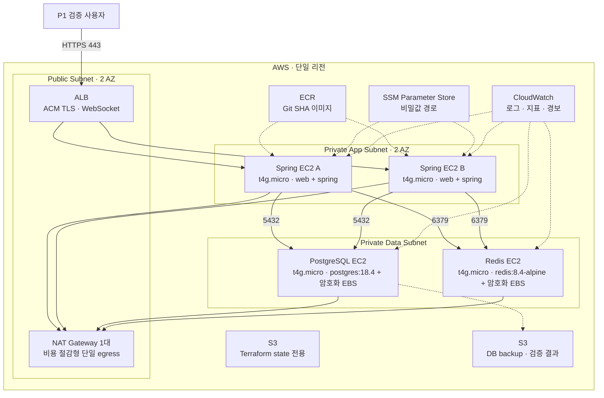
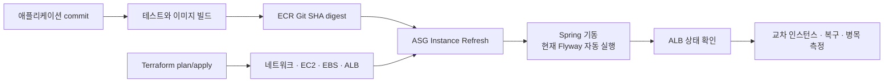

# P1 AWS 자체 운영 인프라 제안 실행안

이 문서는 Albam Mate의 P1 검증 환경을 Terraform으로 반복 생성하고 역할별 병목을 측정하기 위한 제안 실행안이다.

기술 선택과 기존 운영 기준의 대체 여부는 [제안 ADR-0051](../adr/platform/0051-p1-self-managed-aws-infrastructure.md)이 소유한다.

실제 Terraform 코드는 아직 작성되지 않았다.

> - 상태: **제안 실행안**
> - 목표 범위: **P1 부하·장애 검증과 단계적 용량 확장**
> - 현재 정본: [ADR-0021](../adr/platform/0021-p0-aws-ec2-rds-deployment-baseline.md)과 [P1 실행 환경](../P1-spec.md#실행-환경과-공용-인프라)
> - 구현·배포·검증: **미착수·미검증**

이 문서가 구체적이라는 이유만으로 팀 채택이나 배포 완료로 읽지 않는다. 팀 승인 전에는 기존 RDS 기준과 P1 목표 토폴로지를 바꾸지 않으며, 애플리케이션 설정도 수정하지 않는다.

## 먼저 구분할 것

이 문서는 대화 내용을 그대로 옮긴 회의록이 아니다. 대화에서 나온 방향, 현재 프로젝트 계약, 실행을 위해 보강한 설계를 다음처럼 구분한다.

| 구분 | 내용 | 현재 판정 |
| --- | --- | --- |
| 2026-08-06 초기 논의에서 직접 제시 | RDS·ElastiCache 대신 EC2에서 PostgreSQL·Redis를 Docker로 운영, Spring 2대·DB 1대·Redis 1대, 단순 시연에서는 Spring 1대도 가능, Terraform으로 팀원 계정에 재현, 인프라 저장소 분리 | 제안 |
| 2026-08-06 이후 구체화한 P1 기준선 | Spring 2대를 유지한 EC2 4대 모두 `t4g.micro`로 시작하고, 역할별 병목을 확인한 뒤 필요한 자원만 단계적으로 확장 | 제안 |
| 현재 프로젝트 계약 | ALB·ASG와 공용 RDS PostgreSQL·Redis 목표 토폴로지, 채팅 세션·전송 제한 경로의 Redis fallback 금지, PostgreSQL 업무 데이터 정본, Flyway migration | 승인·구현 상태는 연결된 정본에서 별도 확인 |
| 이 문서가 보강한 설계 | 비공개 서브넷과 NAT Gateway, EBS, private DNS, SSM, S3 백업, CloudWatch | 팀 미승인 제안 |
| 조건이 확정되지 않은 내용 | 관리형 서비스 비용 배수, 월 예상 비용, 크레딧 사용 기간, EBS 용량, `t4g.micro` 이후의 확장 유형 | 실제 계정과 측정 결과로 재계산·결정 필요 |

따라서 “네 EC2를 `t4g.micro`로 시작하고 Terraform으로 재현한 뒤 병목에 따라 확장한다”는 대화 맥락을 반영한다. ALB·ASG는 기존 P1 목표에서 이어받았고 NAT·백업 방식은 이 문서의 보강 제안이다.

## 문서 소유 경계

| 문서·저장소 | 소유 내용 |
| --- | --- |
| 제안 ADR-0051 | 자체 운영 PostgreSQL·Redis, Spring EC2 수, Terraform 도입의 선택과 트레이드오프 |
| 이 가이드 | P1 검증 환경의 Terraform 구조, 생성·배포·측정·확장·철거 절차 |
| `docs/P1-spec.md`, `docs/ARCHITECTURE.md` | 승인 후 반영할 애플리케이션 실행 계약과 목표 토폴로지 |
| 애플리케이션 저장소 | Docker 이미지, Flyway 마이그레이션, 실행 환경변수 계약 |
| 별도 인프라 저장소 | 실제 `.tf`, cloud-init, 역할별 Compose와 배포 자동화 |

가이드에는 선택 근거를 복제하지 않고 ADR을 참조한다. 실제 Terraform 코드는 애플리케이션 저장소와 분리한 인프라 저장소에서 관리하되, 저장소 분리 자체를 비밀 보호 수단으로 간주하지 않는다.

## 승인 시 P1 초기 구성

승인되면 Spring 애플리케이션 두 대, PostgreSQL 한 대, Redis 한 대의 EC2 네 대를 모두 `t4g.micro`로 시작한다. Spring JVM 최대 heap은 `-Xmx256m`를 초기값으로 둔다. 이 사양은 P1의 최종 용량이 아니라 병목을 찾기 위한 공통 기준선이다. 검증하지 않을 때에는 환경을 상시 유지하지 않고 필요할 때 같은 Terraform stack으로 다시 만든다.

Spring 한 대 구성은 단순 시연에는 사용할 수 있지만 교차 인스턴스 검증 근거로 사용하지 않는다.



이 구성은 P1의 초기 검증 환경이며 최종 용량이나 고가용성 운영 구성이 아니다. Spring 한 대 장애는 ALB로 격리할 수 있지만 PostgreSQL과 Redis는 각각 단일 장애 지점이다. 데이터 서비스의 자동 장애 조치, Multi-AZ와 무중단 복구를 보장하지 않는다.

## 구성 요소와 고정 경계

| 영역 | P1 초기 구성 | 고정 경계 |
| --- | --- | --- |
| 외부 진입 | Internet-facing ALB, ACM 인증서 | HTTPS와 WebSocket Upgrade를 처리하고 정상 Spring 대상에만 전달한다. 현재 Compose와의 연결 방식은 별도 구현이 필요하다. |
| 애플리케이션 | `t4g.micro`, Launch Template와 ASG `desired=2`, JVM `-Xmx256m` | 동일한 Git SHA 이미지 두 대를 서로 다른 AZ에 배치한다. 컨테이너 메모리 한도와 실제 사용량, OOM 동작을 함께 측정한다. |
| PostgreSQL | `t4g.micro` 한 대, `postgres:18.4`, 별도 EBS | 방·채팅·알림과 ShedLock의 업무 데이터 정본이다. 컨테이너 삭제와 데이터 볼륨 수명을 분리한다. |
| Redis | `t4g.micro` 한 대, `redis:8.4-alpine`, AOF와 별도 EBS | Spring Session, Rate Limit, Pub/Sub 신호를 공유한다. 업무 데이터 정본으로 사용하지 않는다. |
| 내부 주소 | Route 53 private hosted zone | 애플리케이션은 IP가 아니라 `db.albam.internal`, `redis.albam.internal` 같은 이름을 사용한다. |
| 이미지 | ECR의 변경 불가 Git SHA tag | Terraform은 이미지를 빌드하지 않고 배포할 digest만 입력받는다. `t4g`에서 실행할 `linux/arm64` 이미지 또는 해당 아키텍처를 포함한 multi-arch manifest를 사용한다. |
| 비밀값 | SSM Parameter Store `SecureString` | Terraform에는 parameter 이름만 전달하고 실제 값은 EC2 역할로 기동 시 조회한다. |
| 운영 접근 | Systems Manager Session Manager | Public SSH 22, bastion host와 장기 SSH key를 두지 않는다. |
| 백업 | 논리 백업 S3와 EBS snapshot | `terraform destroy` 전에 복구 가능한 산출물을 확인한다. snapshot만으로 PostgreSQL 복구를 보장하지 않는다. |
| 관측 | CloudWatch와 실제 수신 SNS | EC2·Docker·JVM·PostgreSQL·Redis와 애플리케이션 지표를 구분한다. |

## 네트워크와 보안 그룹

ALB만 인터넷 인바운드를 받는다. 네 EC2는 비공개 서브넷에 두고 공인 IP를 할당하지 않는다. P1 검증 비용을 제한하기 위해 NAT Gateway는 한 AZ에 한 대만 두며, 그 장애가 전체 외부 통신을 막을 수 있음을 수용한다.

| 보안 그룹 | 허용 인바운드 | 주요 아웃바운드 |
| --- | --- | --- |
| `sg-alb` | 인터넷의 TCP 443 | `sg-app`의 애플리케이션 포트 |
| `sg-app` | `sg-alb`의 애플리케이션 포트 | `sg-db:5432`, `sg-redis:6379`, 필요한 HTTPS |
| `sg-db` | `sg-app`의 TCP 5432 | 백업·패치에 필요한 제한된 HTTPS |
| `sg-redis` | `sg-app`의 TCP 6379 | 패치·관측에 필요한 제한된 HTTPS |

PostgreSQL·Redis 포트를 CIDR 전체나 `0.0.0.0/0`에 열지 않는다. 보안 그룹 참조를 사용하고, EC2 역할은 자기 역할에 필요한 ECR 이미지 다운로드, SSM parameter 조회, S3 백업과 CloudWatch 전송 권한만 가진다.

## 데이터 서비스 운영 경계

### PostgreSQL

- Terraform은 EC2와 암호화한 별도 EBS를 생성·연결한다.
- cloud-init은 파일시스템과 `/srv/postgresql` 마운트를 준비한 뒤 PostgreSQL Compose를 시작한다.
- 목표 구성에서는 PostgreSQL이 private DNS 이름에 맞는 서버 인증서로 TLS를 제공한다.
- 애플리케이션은 `sslmode=verify-full`을 유지하고 RDS 전용 CA 경로를 자체 운영 PostgreSQL CA 경로로 바꾼다. 이 실행 설정 변경은 ADR 승인 뒤 별도 구현 작업에서 수행한다.
- 스키마는 Terraform이나 JPA 자동 생성이 아니라 기존 Flyway migration으로 관리한다.
- 매일 `pg_dump`를 S3에 올리고 EBS snapshot을 별도로 만든다. P1 장애 검증 전에 빈 EC2와 새 EBS로 논리 백업 복구를 한 번 확인한다.

### Redis

- 현재 로컬 멀티 인스턴스 검증과 같은 `redis:8.4-alpine`을 기준 이미지로 사용한다.
- AOF `appendfsync everysec`와 암호화 EBS를 사용해 재기동 시 세션·Rate Limit 상태의 불필요한 전량 손실을 줄이는 안을 적용한다.
- Redis는 단일 노드이므로 장애 중 세션·Rate Limit·실시간 신호가 실패할 수 있다. 현재 API 정본에 명시된 채팅 API 범위의 fallback 금지와 `503` 계약을 유지한다.
- Pub/Sub 유실은 PostgreSQL의 `messageId` 기반 catch-up으로 복구하고 Redis 데이터를 업무 정본으로 승격하지 않는다.

## 현재 구현과의 차이

아래 항목은 Terraform만 작성해서 해결되지 않는다. ADR 승인 뒤 애플리케이션이나 실행 구성을 함께 바꿔야 한다.

| 경계 | 현재 구현 | 제안 구성에 필요한 후속 작업 |
| --- | --- | --- |
| ALB와 TLS | `compose.production.yml`의 web 컨테이너가 인증서를 직접 마운트하고 호스트 443을 연다. | ALB에서 TLS를 종료한 뒤 대상 그룹을 내부 HTTP로 연결할지, ALB부터 web까지 HTTPS를 유지할지 정한다. |
| 상태 확인 | Spring health check는 `/api/games?size=1`, web은 `/healthz`를 사용하며 전용 readiness endpoint는 없다. | ALB 대상 그룹이 사용할 엔드포인트와 필수 의존성 판정 범위를 정하고 구현한다. |
| PostgreSQL TLS | `application-production.yml`과 Compose가 RDS CA 경로를 고정한다. | 자체 운영 PostgreSQL 인증서와 CA 경로를 일반화하고 private DNS 이름 검증을 확인한다. |
| Redis 보안 | production 설정은 host와 port만 받으며 password·TLS 설정이 없다. | 보안 그룹만 사용할지 인증·TLS까지 추가할지 정한다. 인증·TLS를 선택하면 Spring 설정과 환경변수도 함께 구현한다. |
| 비밀값 주입 | Compose는 저장소 밖 `production.env`를 입력으로 받는다. | cloud-init이 SSM 값을 파일로 만들지, 애플리케이션이 직접 조회할지 정하고 파일 권한과 갱신 절차를 검증한다. |
| Flyway | `production` Spring 기동마다 Flyway가 자동 실행된다. | 현재 자동 실행을 유지할지 별도 1회 migration 작업으로 분리할지 정한다. 후자를 선택하기 전에는 독립 마이그레이션 단계가 있다고 표현하지 않는다. |

## Terraform 저장소 구성

실제 Terraform 구현은 다음 구조를 출발점으로 한다. 폴더가 있다는 사실만으로 해당 모듈이 구현됐다고 판단하지 않는다.

```text
infra/
├─ bootstrap/aws/                # state S3, ECR, GitHub OIDC
├─ modules/aws/
│  ├─ network/                   # VPC, subnet, route, NAT
│  ├─ security/                  # 역할별 security group
│  ├─ edge/                      # ALB, target group, ACM, public DNS
│  ├─ app-asg/                   # Launch Template, ASG, target attachment
│  ├─ postgres-ec2/              # EC2, EBS, private DNS, backup role
│  ├─ redis-ec2/                 # EC2, EBS, private DNS
│  ├─ identity/                  # instance profile, OIDC apply role
│  └─ observability/             # log group, dashboard, alarm, SNS
├─ stacks/aws/p1/                # P1 검증 환경 root module
├─ stacks/aws/perf/              # 부하 측정 후 제거하는 별도 state
├─ cloud-init/
│  ├─ app.yaml.tftpl
│  ├─ postgres.yaml.tftpl
│  └─ redis.yaml.tftpl
└─ compose/
   ├─ app.yml
   ├─ postgres.yml
   └─ redis.yml
```

AWS와 GCP는 같은 Terraform 언어를 사용해도 리소스와 네트워크 모델이 다르다. 향후 GCP로 이동할 때는 `modules/gcp/**`와 `stacks/gcp/p1`을 별도로 구현하고, 공통 입력 이름·Docker 이미지·cloud-init 역할 계약만 맞춘다.

AWS provider 이름만 바꿔 같은 상태 파일을 재사용하지 않는다.

## Terraform state와 계정 분리

1. 각 AWS 계정에서 `bootstrap/aws`를 로컬 상태 파일로 한 번 적용한다.
2. 버전 관리, 서버 측 암호화와 public access block을 켠 S3 bucket을 만든다.
3. p1과 perf의 state key를 분리하고 S3 lockfile을 사용한다.
4. backend bucket·key만 담은 `backend.hcl`은 Git에 커밋하지 않는다.
5. AWS SSO profile 또는 짧은 수명의 역할로 `terraform init`·`plan`·`apply`를 실행한다.
6. 계정을 바꾸면 새 계정의 backend와 새 상태 파일로 같은 stack을 적용한다. 다른 계정의 상태 파일을 복사해 소유권을 바꾸지 않는다.

Terraform state bucket은 DB 백업·검증 결과 bucket과 분리하고 서로 다른 IAM 권한을 적용한다.

`.tfstate`, `.tfstate.*`, `.terraform/`, 실제 `*.tfvars`, `*.tfplan`, 비밀값, 개인 계정 ID와 생성된 IP는 Git에서 제외한다. `sensitive = true`는 CLI 출력을 가릴 뿐 상태 파일 저장을 막는 기능으로 간주하지 않는다.

## 역할별 cloud-init 부트스트랩

Terraform user data에는 비밀값을 넣지 않고 역할과 parameter 경로만 전달한다.

| 역할 | 최초 기동 작업 |
| --- | --- |
| Spring | Docker·Compose 설치, ECR 로그인, SSM parameter 조회, ARM64 release digest와 JVM `-Xmx256m` 확인, `app.yml` 실행 |
| PostgreSQL | Docker·Compose 설치, EBS 포맷·마운트, TLS·DB parameter 조회, `postgres.yml` 실행, 백업 timer 등록 |
| Redis | Docker·Compose 설치, EBS 포맷·마운트, Redis 설정 parameter 조회, `redis.yml` 실행 |

user data는 최초 부트스트랩만 담당한다. 이후 릴리스는 Launch Template 버전과 ASG Instance Refresh로 교체한다. DB·Redis 설정 변경은 SSM Automation 또는 검토된 운영 절차로 수행한다.

Terraform `remote-exec`와 공개 SSH를 기본 배포 경로로 사용하지 않는다.

## 배포 흐름



1. 고정된 애플리케이션 commit의 테스트와 문서 검사를 통과시킨다.
2. 백엔드와 웹의 `linux/arm64` 이미지 또는 multi-arch manifest를 같은 40자리 Git SHA로 ECR에 게시한다.
3. `terraform fmt -check`, `terraform validate`, `terraform plan`을 검토한 뒤 인프라를 적용한다.
4. PostgreSQL·Redis 상태와 private DNS 연결을 먼저 확인한다. TLS·인증을 선택했다면 해당 연결도 함께 확인한다.
5. Spring Launch Template에 image digest와 parameter 경로를 반영하고 Instance Refresh를 수행한다.
6. 현재 구현대로 각 Spring 기동에서 Flyway와 Hibernate `validate`가 성공하는지 확인한다. 별도 1회 migration 작업은 구현된 뒤에만 배포 gate로 사용한다.
7. 두 Spring 대상이 합의한 ALB 상태 확인을 통과한 뒤에만 P1 검증 URL을 사용한다. 전용 readiness endpoint는 아직 구현되지 않았다.

Terraform은 애플리케이션 이미지 빌드, DB schema 정의와 테스트 데이터 원본을 소유하지 않는다.

## 병목 측정과 단계적 확장

`t4g.micro` 네 대는 비용표의 최종 선택이 아니라 P1 기준 부하에서 처음 한계가 나타나는 위치를 찾기 위한 기준선이다. 인스턴스 유형을 먼저 키운 뒤 결과를 추정하지 않는다.

| 역할 | 함께 기록할 지표와 증상 | 확장 판단 예시 |
| --- | --- | --- |
| Spring | CPU와 CPU credit, 컨테이너·JVM 메모리, GC, OOM·재시작, ALB 지연과 5xx | 초기 `-Xmx256m`, 컨테이너 한도와 인스턴스 자원 중 원인을 구분한다. 단일 인스턴스 자원이 부족하면 인스턴스 유형을, 요청 분산이 필요하면 인스턴스 수를 검토한다. |
| PostgreSQL | CPU와 CPU credit, 메모리, 연결 수, slow query, lock, EBS queue·지연·처리량 | 쿼리·연결 설정, EC2 자원과 EBS 성능 중 병목 원인을 구분한 뒤 해당 자원만 조정한다. |
| Redis | CPU와 CPU credit, `used_memory`, `evicted_keys`, 명령 지연, 연결 수, AOF 저장 시간 | 메모리 부족, CPU 병목과 영속화 I/O 병목을 구분한 뒤 인스턴스 또는 EBS를 조정한다. |

확장은 다음 순서로 반복한다.

1. release SHA, 테스트 데이터, 부하 시나리오와 실행 시간을 고정하고 네 EC2를 모두 `t4g.micro`로 생성한다.
2. 정상 흐름과 장애 시나리오를 실행해 최초 오류 시점과 직전 지표를 같은 시간축으로 기록한다.
3. 병목 원인이 확인된 역할의 변수 하나만 한 단계 변경한다. 다음 인스턴스 유형과 EBS 용량은 이 측정 결과로 정한다.
4. 같은 시나리오를 다시 실행해 처리량, 지연, 오류율과 비용 변화를 이전 결과와 비교한다.
5. 개선 근거가 없으면 변경을 되돌리고 다른 원인을 검토한다. 근거 없이 네 인스턴스를 한꺼번에 상향하지 않는다.

## 필수 검증

### Terraform과 보안

- `terraform fmt -check`, `terraform validate`와 저장한 plan 검토
- 실제 AWS 계정·리전이 목표와 일치하는지 확인
- 네 EC2가 모두 `t4g.micro`이고 배포 이미지가 `linux/arm64`에서 기동하는지 확인
- ALB 외 EC2 공인 IP·공개 인바운드가 없는지 확인
- PostgreSQL 5432와 Redis 6379가 Spring 보안 그룹에서만 연결되는지 확인
- state bucket 암호화·versioning·public access block·lockfile과 백업 bucket의 권한 분리 확인
- plan, state, cloud-init과 로그에 비밀값이 노출되지 않았는지 확인

### 애플리케이션

- 두 Spring 인스턴스가 같은 release digest로 실행되는지 확인
- HTTP 저장 인스턴스와 WebSocket 연결 인스턴스가 달라도 같은 세션을 사용하는지 확인
- 채팅 Pub/Sub 신호 유실 뒤 PostgreSQL catch-up으로 누락 메시지를 복구하는지 확인
- ROOM Scheduler가 PostgreSQL ShedLock으로 한 인스턴스에서만 실행되는지 확인
- 알림 relay가 두 인스턴스에서 `SKIP LOCKED`로 중복 처리 없이 나뉘는지 확인
- Spring 한 대를 종료했을 때 ALB가 정상 대상만 사용하고 ASG가 대체하는지 확인

### 데이터와 복구

- PostgreSQL 컨테이너와 EC2 재시작 뒤 데이터가 유지되는지 확인
- Redis 재시작 뒤 AOF 복구와 애플리케이션 재연결을 확인
- S3 `pg_dump`를 새 PostgreSQL EC2에 복원하고 핵심 HTTP 흐름을 확인
- EBS snapshot 생성·복원과 volume attachment 절차를 확인
- Redis 단일 장애 때 세션·Rate Limit·채팅 신호의 실제 실패 결과를 기록

## P1 검증 환경 운영 순서

### 최초 측정 전

1. 사용할 AWS 계정, 리전, 도메인과 비용 한도를 확정한다.
2. Terraform state 접근자와 실제 apply 담당자를 확정한다.
3. `p1` stack의 네 EC2 instance type이 모두 `t4g.micro`인지 plan에서 확인한다.
4. 기준 release SHA, Terraform commit, 적용한 plan과 부하 시나리오를 함께 기록한다.
5. PostgreSQL 논리 백업과 복구 절차를 확인한다.

### 측정 반복마다

1. 같은 plan에서 예상하지 않은 변경이 없는지 확인한다.
2. ALB target, Spring·PostgreSQL·Redis health와 CloudWatch alarm 수신을 확인한다.
3. 회원가입·로그인·방 생성·참가·채팅·알림의 P1 시나리오와 합의한 부하를 실행한다.
4. 최초 오류 시점, 역할별 지표, 로그와 재현 조건을 기록한다.
5. 한 번에 한 역할의 변수만 변경한 뒤 같은 시나리오로 전후 결과를 비교한다.

### 검증 종료 후

1. 필요한 로그·지표·부하 테스트 결과를 비밀값 없이 보존한다.
2. `pg_dump`와 snapshot 보존 필요 여부를 확인한다.
3. 담당자 확인 없이 state bucket과 DB EBS를 삭제하지 않는다.
4. 보존 승인이 끝나면 `p1` stack과 잔여 과금 리소스를 제거한다.

## 팀 승인 전 고정하지 않는 값

다음 값은 구현자가 임의로 확정하지 않고 제안 ADR 승인 또는 인프라 작업 착수 시 확인한다.

- AWS 계정·리전·도메인과 DNS 소유권
- 역할별 `t4g.micro` 이후 확장 기준·다음 instance type과 EBS 용량
- P1 검증 외 상시 가동 여부와 비용 한도
- PostgreSQL·Redis 인증서 발급·갱신 주체
- backup 보존 기간, snapshot 삭제 권한과 복구 담당자
- SNS 실제 수신자와 장애 대응 담당자

논의 중 제시된 관리형 서비스 대비 비용 배수와 월 예상 비용은 계정·리전·스토리지·가동 시간 조건이 고정되지 않았으므로 이 설계의 확정 수치로 사용하지 않는다. 실제 Terraform plan의 리소스 목록과 AWS 비용 계산 결과로 다시 확인한다.

## 구현 착수 조건

- 제안 ADR-0051의 승인 또는 명시적인 실험 범위 승인
- 인프라 저장소 공개 범위와 apply 권한 확정
- state backend와 secret 주입 경계 확정
- 애플리케이션의 RDS 전용 CA·endpoint 표현을 자체 운영 PostgreSQL로 전환할 별도 작업 승인
- P1 부하·장애 검증의 성공 기준과 철거·데이터 보존 담당자 확정

## 참고 자료

- [Terraform S3 backend](https://developer.hashicorp.com/terraform/language/backend/s3)
- [Terraform 민감 데이터 관리](https://developer.hashicorp.com/terraform/language/manage-sensitive-data)
- [Terraform provider별 resource 구성](https://developer.hashicorp.com/terraform/language/resources/configure)
- [Amazon EC2 user data](https://docs.aws.amazon.com/AWSEC2/latest/UserGuide/user-data.html)
- [Amazon EBS volume 사용](https://docs.aws.amazon.com/ebs/latest/userguide/ebs-using-volumes.html)
- [AWS Systems Manager Session Manager](https://docs.aws.amazon.com/systems-manager/latest/userguide/session-manager.html)
