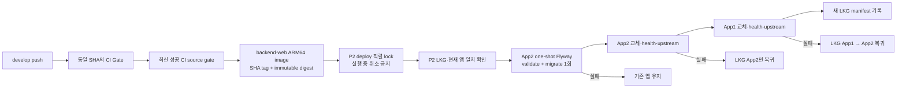

# develop P2 자동 CD 가이드

이 가이드는 [#961](https://github.com/bamsongi-club/albam-mate/issues/961)에서 승인한 T1~T7을 구현 계약으로 삼는 P2 자동 CD의 실행·확인 경계를 설명한다.

> - 문서 상태: **T1~T7 승인·앱 코드/자동 검증 완료, target binding·AWS 실행 보류**
> - 적용 환경: **운영자가 stable CD lifecycle을 승인한 기존 4노드 App1·App2·PostgreSQL·Redis 대상**
> - 트리거: **`develop` push의 같은 SHA가 `CI Gate`를 성공한 뒤 최신 성공 후보로 선택됨**
> - 구현 상태: **GitHub Actions workflow·migrator·앱 설정은 자동 검증했으며, deploy role·고정 SSM runner·host bootstrap은 target 결정 뒤에 구현한다. 실제 AWS execution receipt는 없음**

이 가이드는 별도 P2 Terraform 환경을 만들지 않는다. 기존 4노드 Terraform root는 후보이지만, 현재 `perf` state·`run.sh down` 수명주기를 CD 대상으로 암묵적으로 재사용하지 않는다. CD를 enable하기 전에 운영자는 stable target의 state/key, instance selector, runtime namespace와 teardown 제외를 확정한다. Terraform plan/apply, DNS/TLS 입력, LKG 최초 기록은 운영자 수동 절차이고 workflow가 실행하지 않는다. P1 기준선과 수동 절차는 [P1 AWS 저비용 4 EC2 인프라 실행안](AWS_MULTI_INSTANCE_INFRASTRUCTURE.md)에 보존한다.

## 한눈에 보는 흐름

여기서 배포 실패는 새 release의 실패다. migration 전에 기존 App1·App2를 내리지 않는다. 다만 migration SQL의 lock·실행시간은 데이터베이스 요청에 영향을 줄 수 있으므로 release마다 expand 호환성과 실행시간을 검토한다.

## 배포 입력과 권한

| 항목 | 고정 계약 | 확인할 증거 |
| --- | --- | --- |
| source SHA | same-repository `develop` push의 성공한 `CI Gate`가 검증한 정확히 같은 40자리 `workflow_run.head_sha` | CI run, CD run, image label이 모두 같은 SHA |
| source 선택 | 더 높은 run number의 성공 CI가 있을 때만 이전 성공 후보를 건너뜀 | source-gate 조회 결과와 선택 SHA |
| 이미지 | backend·web 모두 `linux/arm64`, 같은 SHA tag·OCI revision·immutable digest | ECR manifest/digest, OCI label, pull 후 RepoDigest |
| 실행 권한 | GitHub Actions OIDC의 짧은 수명 image-publish role과 deploy role | trust policy, workflow permission, ECR/SSM 실행 결과 |
| 배포 대상 | 운영자가 승인한 기존 4노드의 고정 App2 뒤 App1 | deployment contract의 instance ID와 대상별 release SHA |
| 직렬화 | 한 P2 deploy만 실행하고 실행 중 run은 취소하지 않음 | 겹치지 않는 deployment sequence와 최신 성공 pending |
| last-known-good | `/albam-mate/p2/last-known-good`의 비밀이 아닌 단일 release manifest | Parameter version, source SHA, 두 앱 SHA·digest, health·upstream 성공 기록 |

CD workflow는 PR head, default branch SHA/ref, 배포 직전에 다시 읽은 branch tip을 source input으로 쓰지 않는다. `workflow_run`의 source SHA 하나를 checkout·image build·SSM input으로 고정한다. 아직 성공하지 않았거나 실패한 최신 commit은 마지막 성공 SHA를 건너뛰게 하지 않는다.

image-publish role은 backend·web ECR 저장소에 image를 쓰는 범위만 가진다. deploy role은 ECR image 읽기, P2 고정 SSM document·대상 instance의 명령/결과 조회, 비밀이 아닌 P2 deployment contract와 LKG Parameter의 고정 경로만 읽고 쓴다. Terraform apply, IAM 변경, 장기 access key, SSH, S3, DB/애플리케이션 secret, `GetParametersByPath`, `AWS-RunShellScript`는 두 role의 권한이 아니다.

backend image에는 같은 SHA의 Compose asset을 포함한다. App host의 고정 runner만 input digest를 확인한 뒤 asset을 추출하고, 이미 host에 있는 `/etc/albam-mate/app1.env` 또는 `/etc/albam-mate/app2.env`를 local process에서 조합한다. GitHub runner와 deploy role은 env 파일을 읽지 않는다.

### last-known-good bootstrap

자동 CD를 활성화하기 전에 운영자는 현재 P2 App1·App2가 같은 release SHA·backend/web digest로 동작하고 health·upstream을 통과하는지 확인한 뒤 `/albam-mate/p2/last-known-good` manifest를 수동으로 기록한다. Terraform은 빈 LKG를 만들지 않는다. manifest가 없거나 현재 두 앱의 release·digest와 일치하지 않으면 workflow는 migrator, 앱 교체, LKG 쓰기를 시작하지 않는다.

배포가 성공하면 두 앱의 health·upstream·digest를 모두 확인한 뒤 source SHA, backend·web digest, 두 앱의 검증 SHA, 성공 시각과 Parameter version을 새 manifest로 기록한다. App rollback은 이 manifest의 한 release만 사용하고 DB migration은 rollback하지 않는다.

## 직렬 배포 규칙

배포는 외줄다리와 같다. 한 팀이 건너는 중에는 다른 팀을 중간에 끊어 세우지 않는다.

1. source gate는 concurrency 밖에서 성공 CI run만 비교한다. 더 최신 성공 CI가 있으면 오래된 source는 deploy queue에 넣지 않는다.
2. 실제 P2 deploy가 실행 중이면 그 run은 성공 또는 실패까지 계속한다.
3. 그 사이 새 성공 source가 생기면 실행 중 run을 취소하지 않는다. 대기 중인 예전 성공 source는 최신 성공 source 하나로 교체한다.
4. 다음 run은 직전 run의 결과와 무관하게 자기 source SHA·image digest·LKG 기준으로 처음부터 처리한다.

이는 CI의 빠른 feedback을 위해 run을 취소하는 정책과 다르다. migration이 시작된 뒤 App2/App1 전환 전에 run을 취소하면 어느 image·schema가 실제 환경에 남았는지 판정하기 어렵다.

## 데이터베이스 변경 정책

### one-shot migrator

배포의 첫 상태 변경은 전용 migrator다.

1. deploy role은 App2 EC2의 고정 SSM document를 호출한다. App2 host runner는 새 backend image와 `/etc/albam-mate/app2.env`로 Flyway `validate`를 수행한다.
2. 같은 one-shot 작업에서 `migrate`를 한 번 실행하고 종료한다. GitHub/SSM 실행 주체는 DB secret을 조회하지 않으며 command input·output·receipt에 secret을 남기지 않는다.
3. 성공하기 전에는 App2·App1 image를 바꾸지 않는다.
4. 성공한 뒤 일반 App2·App1 기동에서는 Flyway를 비활성화한다.

현재 production Spring 설정의 Flyway enable 값은 migrator용으로 유지한다. 일반 앱 override와 migrator launch policy가 함께 구현·검증되기 전에는 이 문서만으로 앱 Flyway를 먼저 끄지 않는다.

### expand와 contract

| 분류 | 같은 릴리스에 허용하는 예 | 배포 순서 |
| --- | --- | --- |
| expand | 새 테이블, 구 앱이 무시할 수 있는 nullable/default 컬럼, 구·신 코드 모두 해석할 수 있는 index·값 | migrator → App2 → App1 |
| contract | 삭제·rename, `NOT NULL` 강화, 구 앱이 해석할 수 없는 데이터 형식 전환·대규모 재작성 | 구 앱 0개 확인 → 별도 후속 릴리스 |

Flyway 실패는 데이터베이스가 전혀 바뀌지 않았다는 뜻이 아니다. 앞선 versioned migration이 성공한 뒤 뒤 파일에서 실패하면 앞 변경은 남을 수 있다. migration 실패 뒤 기존 앱을 유지하려면 앞선 변경까지 기존 앱과 호환돼야 한다.

## P2 rollout과 실패 처리

### 정상 순서

1. `/albam-mate/p2/last-known-good` manifest를 읽고 현재 App1·App2의 동일 SHA·digest와 health·upstream 기록을 확인한다. 없거나 불일치하면 migrator 전에 실패시킨다.
2. App2에서 one-shot migrator를 실행한다.
3. App2를 새 digest로 바꾸고, container health·release SHA·App1에서 보이는 upstream 응답을 확인한다.
4. App1을 새 digest로 바꾸고, Nginx를 통한 App1·App2 upstream 응답과 각 release SHA를 확인한다.
5. 성공한 SHA·image digest를 새로운 LKG manifest로 기록한다.

자동 CD는 사용자 계정으로 로그인하는 인증 smoke를 실행하지 않는다. 배포 성공 조건은 migration과 두 앱의 container health·release SHA·upstream 응답까지이며, 로그인 계정이나 host-local 인증 입력 파일은 CD의 성공 조건이 아니다. 사용자 흐름 확인이 필요하면 배포 뒤 별도 수동 검증으로 남긴다.

### 실패 매트릭스

| 실패 지점 | 기존 서비스 | 새 release 처리 | DB 처리 |
| --- | --- | --- | --- |
| CI·source gate·image build | 그대로 유지 | 배포를 시작하지 않음 | 변경 없음 |
| LKG 없음·불일치 | 그대로 유지 | bootstrap 또는 일치 검증 전에는 migrator·앱 교체를 시작하지 않음 | 변경 없음 |
| migrator validate/migrate | App1·App2 컨테이너 유지 | 새 release 실패 | 이미 성공한 앞 migration은 남을 수 있음; 자동 rollback 없음 |
| App2 health/upstream | App1과 기존 또는 복귀한 App2가 서빙 | App2만 LKG SHA·digest로 자동 복귀 | expand schema 유지 |
| App1 health/upstream | 복귀 과정 중 짧은 재연결 가능 | App1까지 바뀌었으면 App1 → App2 순서로 모두 LKG로 복귀하고 재검증 | expand schema 유지 |

P2는 traffic drain, standby slot, ALB health cutover를 제공하지 않는다. App1 교체 중 짧은 HTTP 재시도·WebSocket 재연결은 발생할 수 있으나, 무중단 배포라고 표현하지 않는다.

## 배포 증거와 알림

각 배포 run은 다음만 남긴다.

- source SHA, CI run URL, backend·web digest, 시작·종료 시각
- OIDC role과 P2 SSM 대상·command ID(비밀값 제외)
- migrator validate/migrate 판정과 단계별 App2·App1 health/upstream·release SHA
- 각 단계의 성공·실패 판정, 성공한 LKG SHA 또는 rollback SHA와 실패 지점
- LKG Parameter version과 manifest 기록

로그·알림에는 DB 비밀번호, verification credential, session cookie, CSRF, OIDC token, 환경 파일 원문을 남기지 않는다.

## 이 가이드가 하지 않는 일

- `main` 또는 다른 환경의 자동 배포를 정의하지 않는다.
- Terraform apply, P2 인프라 생성·삭제, k6 부하 실행을 deployment workflow에 넣지 않는다.
- P1/perf stack의 배포·원복·지표 수집을 이 workflow가 대신한다고 간주하지 않는다.
- 자동 DB rollback, backup/PITR 복원, 고가용성·무중단 배포를 보장하지 않는다.
- P2 실제 AWS 배포·복구 검증을 구현 PR의 정적·자동 검증으로 대체하지 않는다.

target lifecycle이 승인된 뒤에는 workflow, Dockerfile asset, OIDC trust/IAM, 고정 SSM runner, migrator·앱 설정, 실제 P2 execution receipt를 근거로 이 문서의 상태와 검증 항목을 갱신한다.

> 문서 관리: 소유자 `밤송이클럽 개발·운영 팀` · 최종 검증일 `2026-08-21` · 폐기 조건 `P2 CD가 승인된 다른 환경별 배포 표준으로 대체될 때`
