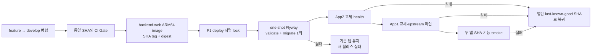

# develop P1 자동 CD 가이드

이 가이드는 [ADR-0083](../adr/platform/0083-github-actions-develop-p1-continuous-deployment.md)에서 승인한 P1 자동 CD의 실행·확인 경계를 설명한다.

> - 문서 상태: **승인·구현 전**
> - 적용 환경: **P1 App1·App2·PostgreSQL·Redis EC2**
> - 트리거: **`develop` 병합 뒤 같은 SHA의 `CI Gate` 성공**
> - 구현 상태: **GitHub Actions CD workflow, OIDC role, migrator, 자동 rollback은 아직 없음**

이 문서는 현재 수동 P1 초기 배포·Terraform·Ansible 절차를 대체하지 않는다. 현재 실행 가능한 인프라 절차는 [P1 AWS 저비용 4 EC2 인프라 실행안](AWS_MULTI_INSTANCE_INFRASTRUCTURE.md)을 따른다. 실제 구현 전에는 이 문서의 단계나 표현을 배포 완료 증거로 사용하지 않는다.

## 한눈에 보는 흐름

여기서 **배포 중단**은 기존 서비스 종료가 아니라 새 릴리스의 실패를 뜻한다. migration 전에 기존 App1·App2를 내리지 않는다. 다만 migration SQL 자체의 lock·실행시간은 데이터베이스 요청에 영향을 줄 수 있으므로, 짧은 실행만 가정하지 말고 변경마다 검토한다.

## 배포 입력과 권한

| 항목 | 고정 계약 | 확인할 증거 |
| --- | --- | --- |
| 트리거 SHA | `develop`에 병합되어 `CI Gate`를 통과한 정확히 같은 40자리 SHA | CI run, deploy run, image label이 모두 같은 SHA |
| 이미지 | backend·web 모두 `linux/arm64`, 같은 SHA tag, immutable digest | ECR manifest/digest, OCI revision label |
| 실행 권한 | GitHub Actions OIDC의 짧은 수명 image-publish role과 deploy role | 두 role의 trust policy, workflow 권한, ECR/SSM 실행 결과 |
| 배포 대상 | P1의 App2 뒤 App1 | instance 식별자와 대상별 release SHA |
| 동시성 | 한 P1 배포만 실행하고 실행 중인 deploy는 취소하지 않음 | 실행 이력에서 겹치지 않는 deployment sequence |

workflow는 PR head나 배포 직전에 다시 읽은 branch tip을 입력으로 쓰지 않는다. CI가 확인한 SHA와 image digest를 배포 시작 시 고정한다. ECR tag가 immutable이므로 실패한 image push를 같은 tag에 덮어써 재시도하지 않는다.

두 OIDC role은 `albam-mate`의 허용 workflow·`develop` 배포로 subject를 제한한다. image-publish role은 backend·web ECR 저장소에 image를 쓰는 범위만, deploy role은 그 image 읽기와 P1 대상 SSM 명령·결과 조회 범위만 가진다. Terraform apply, IAM 변경, 장기 access key, SSH key, DB 비밀값 조회는 두 role 모두의 권한이 아니다.

## 직렬 배포 규칙

배포는 외줄다리와 같다. 한 팀이 건너는 중에는 다른 팀을 중간에 끊어 세우지 않는다.

1. P1 deploy가 실행 중이면 그 run은 성공 또는 실패까지 계속한다.
2. 그 사이 새 `develop` SHA가 생기면 실행 중인 run을 취소하지 않는다.
3. 대기 중인 옛 SHA가 있으면 최신 SHA만 남긴다.
4. 다음 run은 직전 run의 결과와 무관하게 새 SHA를 처음부터 `CI Gate`·image digest 기준으로 처리한다.

이는 CI의 빠른 feedback을 위해 run을 취소하는 정책과 다르다. migration이 시작된 뒤 App2/App1 전환 전에 run을 취소하면, 어느 image·schema가 실제 환경에 남았는지 판단하기 어려워진다.

## 데이터베이스 변경 정책

### 1. one-shot migrator

배포의 첫 상태 변경은 전용 migrator다.

1. 새 backend image로 Flyway `validate`를 수행한다.
2. 같은 one-shot 작업에서 `migrate`를 한 번 실행하고 종료한다.
3. 성공하기 전에는 App2·App1 image를 바꾸지 않는다.
4. 성공한 뒤 일반 App2·App1 기동에서는 Flyway를 비활성화한다.

현재 production Spring은 각 기동 시 Flyway를 실행한다. 위 절차는 migrator와 앱 설정 변경이 함께 구현·테스트된 뒤에만 적용한다. 그 전에는 이 문서를 근거로 앱의 Flyway를 먼저 끄지 않는다.

### 2. expand와 contract

| 분류 | 같은 릴리스에 허용하는 예 | 배포 순서 |
| --- | --- | --- |
| expand | 새 테이블, 구 앱이 무시할 수 있는 nullable/default 컬럼, 구·신 코드 모두 해석할 수 있는 index·값 | migrator → App2 → App1 |
| contract | 삭제·rename, `NOT NULL` 강화, 구 앱이 해석할 수 없는 데이터 형식 전환·대규모 재작성 | 구 앱 0개 확인 → 별도 후속 릴리스 |

`expand`는 이전 앱이 새 schema에서도 동작한다는 약속이다. 데이터 형식을 바꿀 때는 새 reader·writer 또는 feature flag를 먼저 expand 릴리스에 넣고, 모든 구 앱이 사라진 뒤 contract 정리를 한다.

Flyway 실패는 “데이터베이스가 전혀 바뀌지 않았다”는 뜻이 아니다. PostgreSQL에서 실패한 migration 파일은 rollback될 수 있어도, 그보다 앞선 versioned migration이 성공했다면 그 변경은 남는다. migration 실패 뒤 기존 앱을 유지하려면 앞선 변경까지 기존 앱과 호환돼야 한다.

### 3. DB rollback을 하지 않는 이유

새 앱 실패 시 DB를 자동으로 되돌리지 않는다. 이미 적용된 데이터 보정, 외부 요청, 성공한 앞 migration을 일반적으로 안전하게 역순 복구할 수 없기 때문이다. P1의 backup/PITR 및 실제 restore 훈련도 아직 검증된 복구 수단이 아니다.

파괴적 또는 대량 데이터 migration은 별도 복구 계획, lock·실행시간 검토, 검증된 restore 절차가 생긴 뒤에만 실행한다. 그 절차를 갖추기 전의 기본 복구는 **전진 수정과 앱 rollback**이다.

## P1 롤아웃과 실패 처리

### 정상 순서

1. CI가 통과한 SHA의 backend·web digest와 현재 last-known-good SHA를 기록한다.
2. one-shot migrator를 실행한다.
3. App2를 새 SHA로 바꾸고, 컨테이너 health·App1에서 보이는 upstream 응답·release SHA를 확인한다.
4. App1을 새 SHA로 바꾸고, Nginx를 통한 App1·App2 upstream 응답과 각 release SHA를 확인한다.
5. 인증된 기능 smoke를 실행한다. Nginx 자체 `/healthz` 응답만으로는 App1·App2가 새 image로 정상 동작했다는 증거가 아니다.
6. 성공한 SHA와 image digest를 새로운 last-known-good release로 기록한다.

App1은 외부 Nginx와 함께 재생성되므로 이 단계에서 짧은 HTTP 재시도·WebSocket 재연결이 생길 수 있다. 현재 P1은 트래픽 drain, standby slot, ALB health cutover를 제공하지 않으므로 무중단을 약속하지 않는다.

### 실패 매트릭스

| 실패 지점 | 기존 서비스 | 새 릴리스 처리 | DB 처리 |
| --- | --- | --- | --- |
| CI 또는 image build | 그대로 유지 | 배포를 시작하지 않음 | 변경 없음 |
| migrator validate/migrate | App1·App2 컨테이너는 그대로 유지 | 새 릴리스 실패·원인 알림 | 이미 성공한 앞 migration은 남을 수 있음; 자동 rollback 없음 |
| App2 health/upstream | App1과 기존 또는 복귀한 App2가 서빙 | App2만 last-known-good SHA로 자동 복귀 | expand된 schema 유지 |
| App1 health/upstream 또는 기능 smoke | 복귀 과정 중 짧은 재연결 가능 | App1까지 바뀌었으면 App1 → App2 순서로 모두 같은 last-known-good SHA로 복귀하고 두 앱을 재검증 | expand된 schema 유지 |

자동 앱 rollback의 성공 조건은 구 앱과 확장된 schema의 호환성이다. 이 조건을 깨는 migration은 일반 자동 CD에 넣지 않는다. last-known-good release는 App1·App2가 같은 SHA로 검증된 release만 가리킨다.

## 배포 증거와 알림

각 배포 run은 다음을 남긴다.

- source SHA, CI run URL, backend·web digest, 시작·종료 시각
- OIDC role과 SSM 명령의 대상 instance 식별자(비밀값 제외)
- migrator validate/migrate 결과와 적용된 schema history의 요약
- App2·App1별 health/upstream·release SHA와 기능 smoke 결과
- 성공한 last-known-good SHA 또는 rollback된 SHA와 실패 지점

실패 알림은 migration 실패와 앱 롤아웃 실패를 구분한다. 로그·알림에는 DB 비밀번호, session cookie, OIDC token, 환경 파일 원문을 남기지 않는다.

## 이 가이드가 하지 않는 일

- `main` 또는 다른 환경의 자동 배포를 정의하지 않는다.
- Terraform apply, 인프라 생성·삭제, k6 부하 실행을 deployment workflow에 넣지 않는다.
- 자동 DB rollback, backup/PITR 복원, 고가용성·무중단 배포를 보장하지 않는다.
- 현재 수동 배포·P1 AWS 실측을 자동 CD 구현·운영 검증으로 바꾸지 않는다.

구현이 끝난 뒤에는 workflow 파일, OIDC trust policy, SSM playbook, migrator와 앱 설정, P1 실행 기록을 근거로 이 문서의 상태와 검증 항목을 갱신한다.

> 문서 관리: 소유자 `밤송이클럽 개발·운영 팀` · 최종 검증일 `2026-08-20` · 폐기 조건 `P1 CD가 승인된 다른 환경별 배포 표준으로 대체될 때`
